# 0.学习目标

- 使用资料搭建后台系统
- 实现商品分类查询功能(树组件自定义组件)
- 掌握cors解决跨域
- 实现品牌查询功能

## 1.准备工作

## 1.1.前端的准备

### 1.1.1.解压前端初始化模板

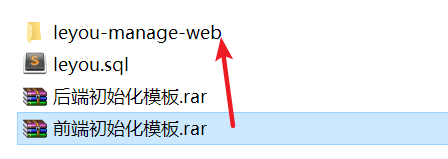

leyou-manage-web是一个基于vue-cli构造前端工程

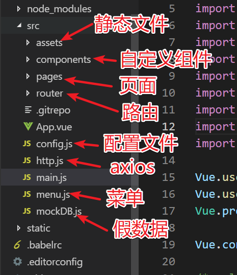

### 1.1.2.执行运行命令

```cmd
npm run dev
```

前端使用的是：`http://localhost:9001地址`

访问大致效果如下:

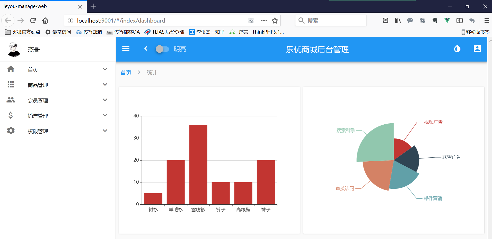

## 1.2.后端的准备

### 1.2.1.创建项目

使用composer下载

```cmd
composer create-project topthink/think leyou-shop
```


在没有网络的情况下, 可以直接使用`后端初始化模板.rar`

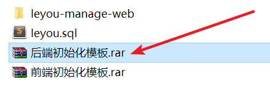

这个压缩包解压出来跟composer下载的内容是一样的

### 1.2.2.配置虚拟主机

1) 修改vhost配置文件

```cmd
<VirtualHost *:80>
    DocumentRoot "D:\leyou-shop\public"
    ServerName local.leyou.com
    ServerAlias
  <Directory "D:\leyou-shop\public">
      Options FollowSymLinks ExecCGI
      AllowOverride All
      Order allow,deny
      Allow from all
      Require all granted
  </Directory>
</VirtualHost>
```

   1) 修改hosts文件

```cmd
127.0.0.1 local.leyou.com
```

   1) 重启Apache

### 1.2.3 常规配置

1) 开启debug模式


   1) 隐藏入口文件


## 2.实现商品分类查询

商城的核心自然是商品，而商品多了以后，肯定要进行分类，并且不同的商品会有不同的品牌信息，其关系如图所示：


- 一个商品分类下有很多商品
- 一个商品分类下有很多品牌
- 而一个品牌，可能属于不同的分类
- 一个品牌下也会有很多商品

因此，我们需要依次去完成：商品分类、品牌、商品的开发。

--------

## 扩展: 表与表之间关系

- 1对1
- 1对多
- 多对多

1) 确定父表与子表

- 父表: 一表示父表
- 子表: 多表示子表

举例:

用户表和文章表

一对多, 在子表(文章表)键立一个字段(外键), 指向父表(用户表)

用户表:

| 字段 | 说明   |
| ---- | ------ |
| id   | 主键   |
| name | 用户名 |

文章表:

| 字段 | 说明                   |
| ---- | ---------------------- |
| id   | 主键                   |
| u_id | 文章属于哪个用户(外键) |

用户表和国家表,

​多对一

用户表:

| 字段 | 说明                     |
| ---- | ------------------------ |
| id   | 主键                     |
| name | 用户名                   |
| c_id | 该用户属于哪个国家(外键) |

国家表:

| 字段 | 说明     |
| ---- | -------- |
| id   | 主键     |
| name | 国家名称 |

  1) 怎么处理多对多关系:　拆分成两个一对多关系

---cmd

## 2.1.导入数据

首先导入课前资料提供的sql文件leyou.sql：

我们先看商品分类表：

```mysql
CREATE TABLE `tb_category` (
  `id` bigint(20) NOT NULL AUTO_INCREMENT COMMENT '类目id',
  `name` varchar(20) NOT NULL COMMENT '类目名称',
  `parent_id` bigint(20) NOT NULL COMMENT '父类目id,顶级类目填0',
  `is_parent` tinyint(1) NOT NULL COMMENT '是否为父节点，0为否，1为是',
  `sort` int(4) NOT NULL COMMENT '排序指数，越小越靠前',
  PRIMARY KEY (`id`),
  KEY `key_parent_id` (`parent_id`) USING BTREE
) ENGINE=InnoDB AUTO_INCREMENT=1424 DEFAULT CHARSET=utf8 COMMENT='商品类目表，类目和商品(spu)是一对多关系，类目与品牌是多对多关系';
```

因为商品分类会有层级关系，因此这里我们加入了`parent_id`字段，对本表中的其它分类进行自关联,

实现所谓的无限级分类

## 2.2.页面实现

### 2.2.1.页面分析

首先我们看下要实现的效果：


商品分类之间是会有层级关系的，采用树结构去展示是最直观的方式。

一起来看页面，对应的是/pages/item/Category.vue：

 

页面模板：

```html
<v-card>
    <v-flex>
        <v-tree :treeData="treeData"
                :isEdit="isEdit"
                @handleAdd="handleAdd"
                @handleEdit="handleEdit"
                @handleDelete="handleDelete"
                @handleClick="handleClick"
                />
    </v-flex>
</v-card>
```

- `v-card`：卡片，是vuetify中提供的组件，提供一个悬浮效果的面板，一般用来展示一组数据。

  

- `v-flex`：布局容器，用来控制响应式布局。与BootStrap的栅格系统类似，整个屏幕被分为12格。我们可以控制所占的格数来控制宽度：

  

- `v-tree`：树组件。Vuetify并没有提供树组件，这个是我自己编写的自定义组件：

  里面涉及一些vue的高级用法，大家暂时不用关注其源码，会用即可, 有兴趣的小伙伴看下面的代码分析

---cmd

### 扩展: Tree组件部分代码分析

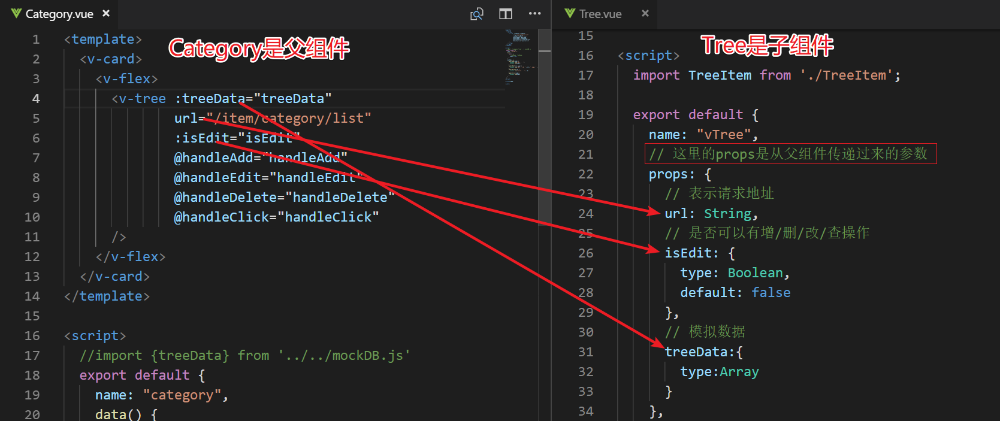

- props里保存的是从父组件(Category)传递过来的参数

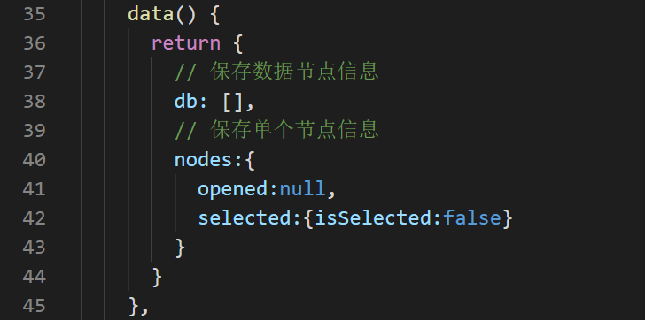

- data是本组件(Tree)的数据

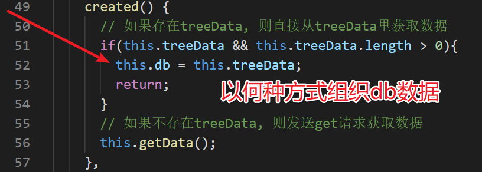

- created: 构造函数, 主要作用是初始化data属性

  当treeData存在时, 直接从treeData里获取数据

  当treeData不存在时, 发送get请求异步获取数据

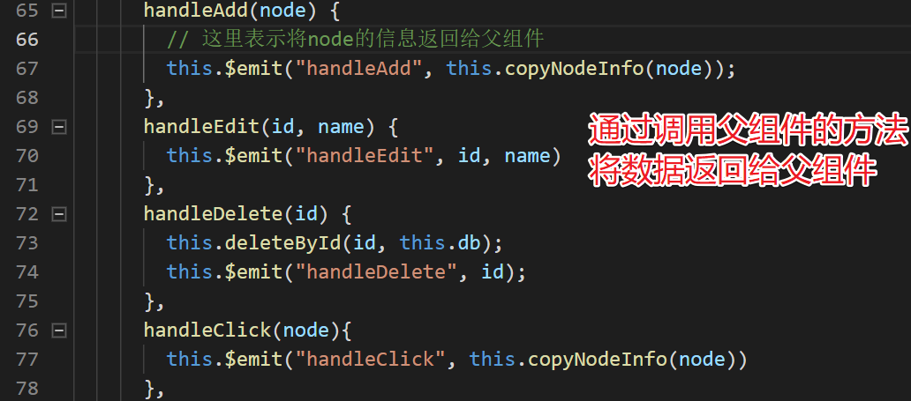

通过`this.$emit`通过父组件的方法, 将数据返回给父组件

---cmd

### 2.2.2.树组件的用法

也可参考课前资料中的：《自定义Vue组件的用法.md》

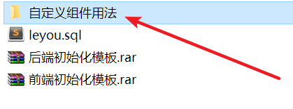

这里我贴出树组件的用法指南。

> 属性列表：

| 属性名称 | 说明                             | 数据类型 | 默认值 |
| -------- | -------------------------------- | -------- | ------ |
| url      | 用来加载数据的地址，即延迟加载   | String   | -      |
| isEdit   | 是否开启树的编辑功能             | boolean  | false  |
| treeData | 整颗树数据，这样就不用远程加载了 | Array    | -      |

这里推荐使用url进行延迟加载，**每当点击父节点时，就会发起请求，根据父节点id查询子节点信息**。

当有treeData属性时，就不会触发url加载

远程请求返回的结果格式：

```json
[
    {
        "id": 74,
        "name": "手机",
        "parentId": 0,
        "isParent": true,
        "sort": 2
},
     {
        "id": 75,
        "name": "家用电器",
        "parentId": 0,
        "isParent": true,
        "sort": 3
}
]
```

> 事件

| 事件名称     | 说明                                       | 回调参数                                         |
| ------------ | ------------------------------------------ | ------------------------------------------------ |
| handleAdd    | 新增节点时触发，isEdit为true时有效         | 新增节点node对象，包含属性：name、parentId和sort |
| handleEdit   | 当某个节点被编辑后触发，isEdit为true时有效 | 被编辑节点的id和name                             |
| handleDelete | 当删除节点时触发，isEdit为true时有效       | 被删除节点的id                                   |
| handleClick  | 点击某节点时触发                           | 被点击节点的node对象,包含全部信息                |

> 完整node的信息

回调函数中返回完整的node节点会包含以下数据：

```json
{
    "id": 76, // 节点id
    "name": "手机", // 节点名称
    "parentId": 75, // 父节点id
    "isParent": false, // 是否是父节点
    "sort": 1, // 顺序
    "path": ["手机", "手机通讯", "手机"] // 所有父节点的名称数组
}
```

模拟假数据

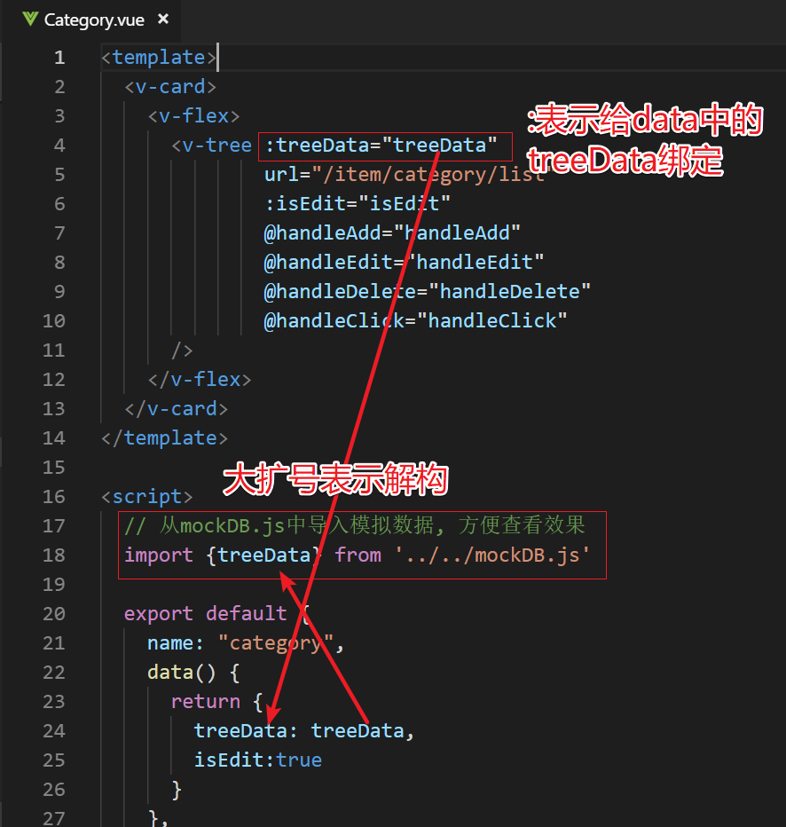

效果:

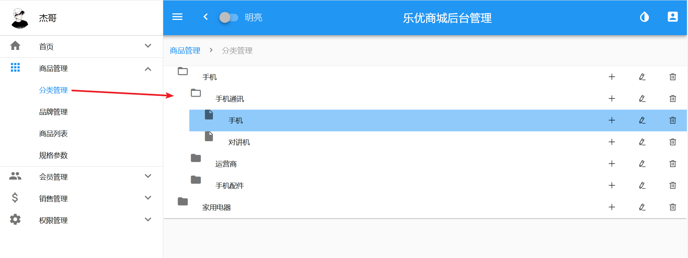

## 2.3.实现功能

### 2.3.1.url异步请求

给大家的页面中，treeData是假数据，我们删除数据treeData属性，只保留url看看会发生什么：

```html
<v-tree url="/item/category/list"
        :isEdit="isEdit"
        @handleAdd="handleAdd"
        @handleEdit="handleEdit"
        @handleDelete="handleDelete"
        @handleClick="handleClick"
        />
```

刷新页面，可以看到：


页面中的树没有了，并且发起了一条请求：`http://local.leyou.com/api/item/category/list?pid=0`

大家可能会觉得很奇怪，我们明明是使用的相对路径，讲道理发起的请求地址应该是：

`http://localhost:9001/item/category/list`

但实际却是：

`http://local.leyou.com/api/item/category/list?pid=0`

这是因为，我们有一个全局的配置文件，对所有的请求路径进行了约定：


相当于我们接口的baseURL是`http://local.leyou.com/api`

而local.leyou.com就是我们用tp框架搭建的后台接口服务器

看下面这张图

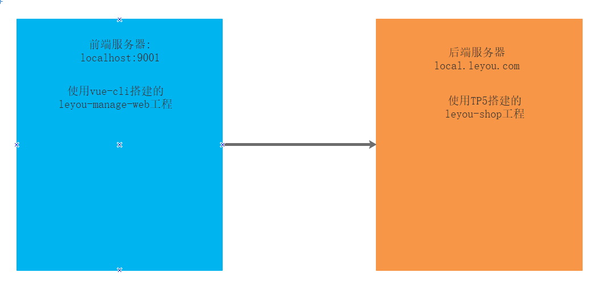

接下来，我们要做的事情就是编写后台接口，返回对应的数据即可。

### 2.3.2.规划路由

在leyou-shop项目的route/route.php中添加一条路由规则


示例代码

```php
// 路由规则
// 第一个参数: url地址
// 第二个参数: 模块/控制器/方法
Route::get('api/item/category/list', 'api/Category/lst');
```

这条路由规则的意思是:

当以get方式请求`http://local.leyou.com/api/item/category/list`时, 交由api模块的Category控制器的lst方法处理

---cmd

### 扩展: TP中的路由

TP中的路由, **建立是URL请求地址与控制器方法的联系**

参考文档

1) 路由规则的定义

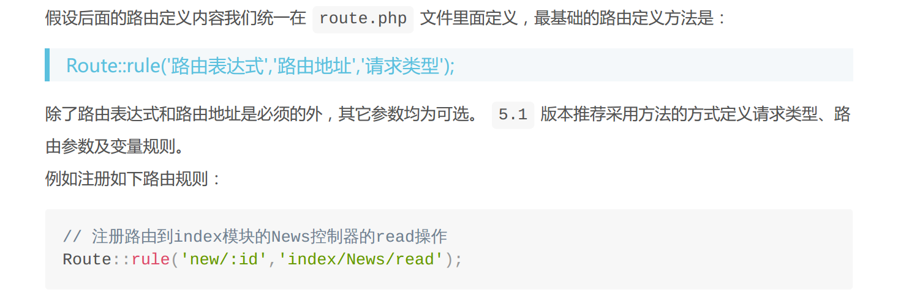

- 第一个参数: new/:id 是一个URL地址
- 第二个参数: index/News/read是index模块的News控制器的read方法

  1) 快捷注册路由

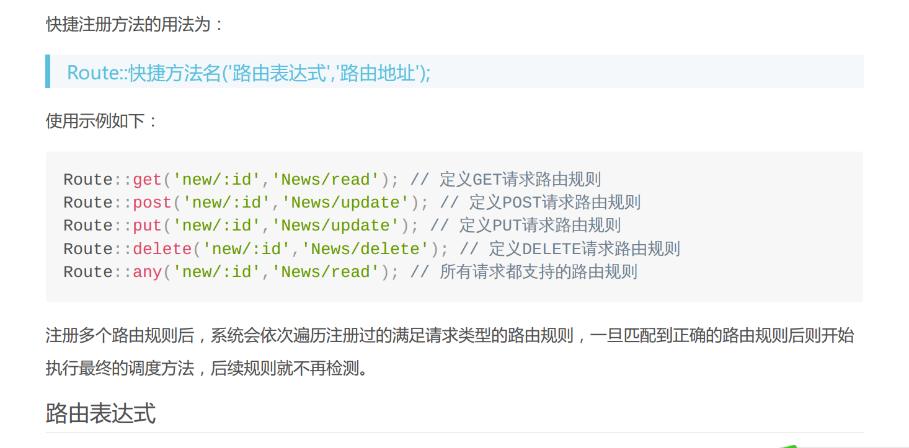

---cmd

### 2.3.3.创建api模块

在TP中, 可以使用命令行工具, 快速的生成一个模块

文档链接: [快速生成一个模块](https://www.kancloud.cn/manual/thinkphp5_1/354139)

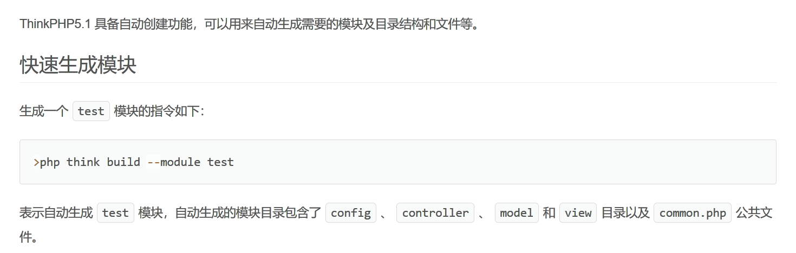

``` php
// php是可执行命令, 需要配置环境变量
// think: 一个php脚本文件
// build: 参数, 用来自动生成目录
// --module: 选项, 表示生成的是模块
// api: 模块名
php think build --module api
```


执行这个命令后, 会在application目录下, 生成一个api目录, 这个目录就是api模块

### 2.3.4 创建控制器

在TP中, 也可以使用命令行工具, 快速的生成一个控制器

文档: [快速生成一个控制器](https://www.kancloud.cn/manual/thinkphp5_1/354140)

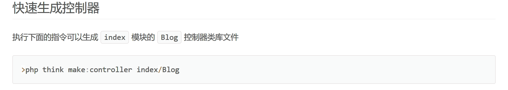

``` php
// make:controller是参数, 表示创建控制器
// api/Category: api是模块名, Category是控制器名
// --plain: 表示创建一个空的控制器
php think make:controller api/Category --plain
```


编写lst方法

- 需要使用依赖注入Request对象, 首先引入think\Request


### 扩展: 如何理解依赖注入

​最直接的理解: 不用实例化对象, 通过参数传递后, 可以直接使用

- 在lst方法中, 调用模型获取数据


### 2.3.5.创建模型

使用命令自动生成模型, 一般模型以复数形式表示

```cmd
php think make:model api/Cates
```


思考题: 为什么模型名和控制器名不一样?

答案:　为了控制器中引入方便

编写模型

在模型中

- 定义主键: 是tp5.1之后必须的
- 定义表名: 是因为我们的模型名需要和数据库表名对应


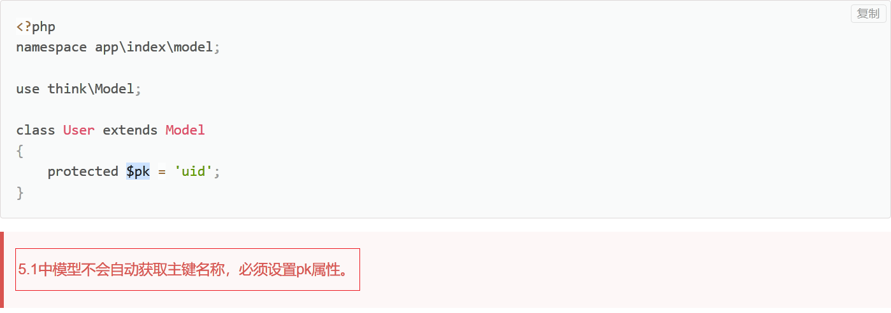

示例代码

```php
<?php

namespace app\api\model;

use think\Model;

class Cates extends Model
{
    // 定义主键
    protected $pk = 'id';

    // 定义表名
    protected $table = 'tb_category';
}
```

### 2.3.6 配置数据库

在config/database.php修改数据库连接信息


### 2.3.7.获取数据

参考文档: `https://www.kancloud.cn/manual/thinkphp5_1/353987`

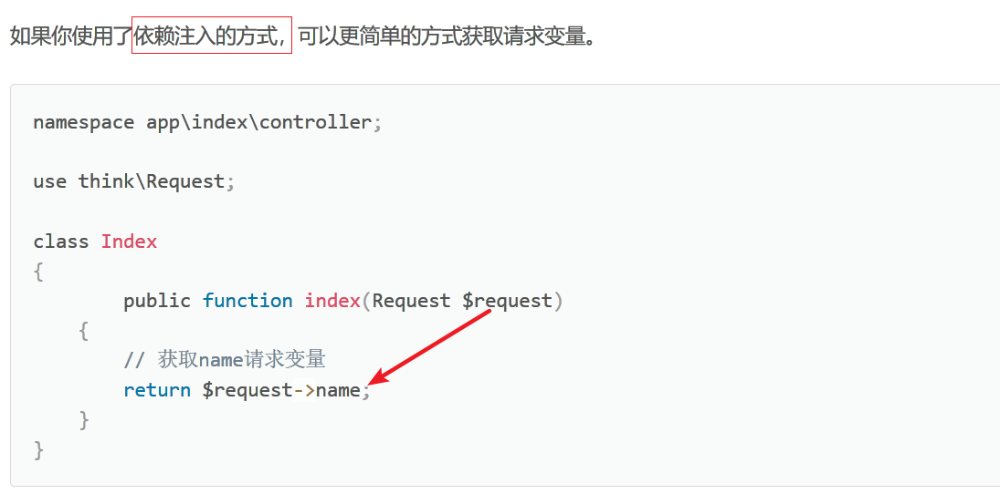

因此, 咱们可以直接使用`$request->pid`获取到请求中的变量


```php
// 编写lst方法
public function lst(Request $request)
{
    // 调用模型获取数据, 根据传递过来的pid返回数据
    $cates = Cates::where('parent_id', $request->pid)
        ->select();

    // 返回json数据
    return json($cates);
}
```

以上操作相当于执行sql语句, 如下

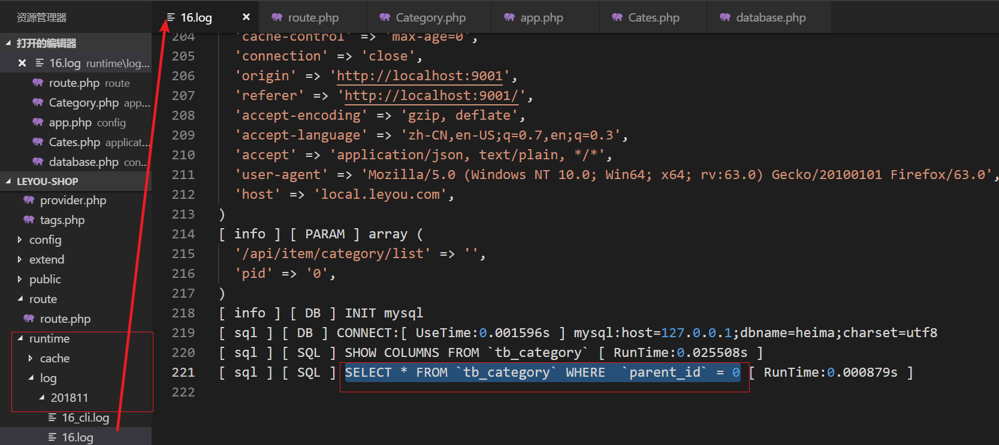

json() : 将数据转换成json格式返回

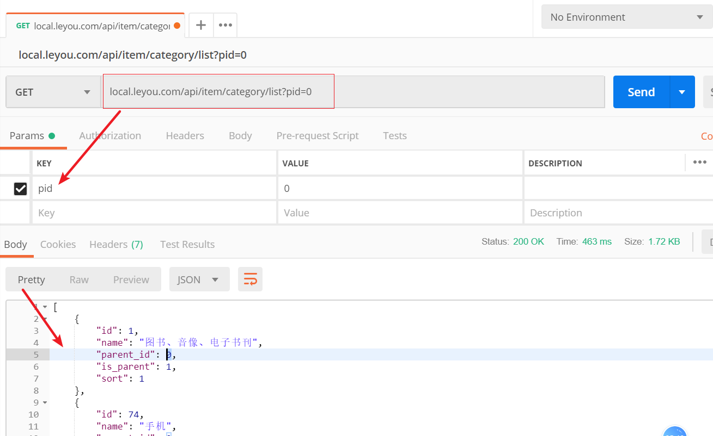

### 接口定义

- 请求方式：Get

- 请求路径：/api/item/category/list

- 请求参数：pid=0，根据tree组件的说明，应该是父节点的id，第一次查询为0，那就是查询一级类目

- 返回结果：

  根据前面tree组件的用法我们知道，返回的应该是json数组：

  ```json
  [
      {
          "id": 74,
          "name": "手机",
          "parentId": 0,
          "isParent": true,
          "sort": 2
    },
       {
          "id": 75,
          "name": "家用电器",
          "parentId": 0,
          "isParent": true,
          "sort": 3
  }
  ]
  ```

进一步修改

使用field来给字段起别名

参考文档: `https://www.kancloud.cn/manual/thinkphp5_1/354009`

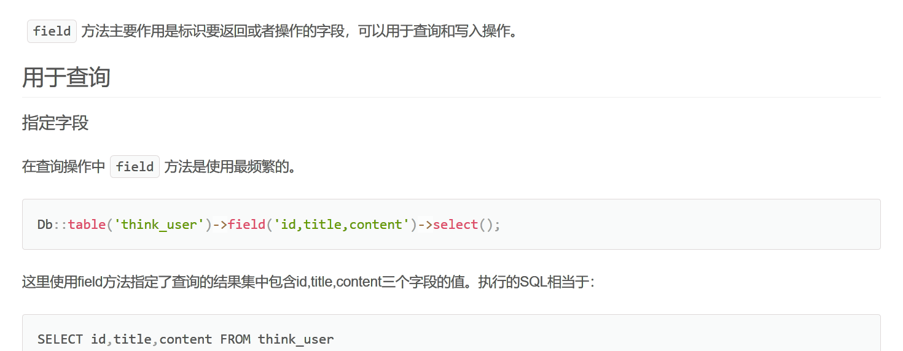


示例代码

```php
// 调用模型获取数据, 根据传递过来的pid返回数据
$cates = Cates::field('id, name, parent_id as parentId, is_parent as isParent, sort')
    ->where('parent_id', $request->pid)
    ->select();
```

使用postman工具测试


然后刷新页面查看：


发现报错了！

postman访问木有问题，但是用浏览器却报错，什么原因？

## 2.4.跨域问题

### 2.4.1.什么是跨域

跨域是指跨域名的访问，以下情况都属于跨域：

| 跨域原因说明       | 示例                                   |
| ------------------ | -------------------------------------- |
| 域名不同           | `www.jd.com` 与 `www.taobao.com`       |
| 域名相同，端口不同 | `www.jd.com:8080` 与 `www.jd.com:8081` |
| 二级域名不同       | `item.jd.com` 与 `miaosha.jd.com`      |

如果**域名和端口都相同，但是请求路径不同**，不属于跨域，如：

`www.jd.com/item`

`www.jd.com/goods`

而我们刚才是从`localhost:9001`去访问`local.leyou.com`，这就叫跨域。

### 2.4.2.为什么有跨域问题

跨域不一定会有跨域问题。

因为跨域问题是浏览器对于ajax请求的一种安全限制：**一个页面发起的ajax请求，只能是于当前页同域名的路径**，这能有效的阻止跨站攻击。

因此：**跨域问题 是浏览器 针对ajax的一种限制**。

但是这却给我们的开发带来了不变，而且在实际生成环境中，肯定会有很多台服务器之间交互，地址和端口都可能不同，怎么办？

### 2.4.3.解决跨域问题的方案

目前比较常用的跨域解决方案有3种：

- Jsonp

  最早的解决方案，利用script标签可以跨域的原理实现。

  限制：

  - 需要服务的支持
  - 只能发起GET请求

  具体可以看文档<跨域请求与jsonp>

- nginx反向代理

  思路是：利用nginx反向代理把跨域为不跨域，支持各种请求方式

  缺点：需要在nginx进行额外配置，语义不清晰

- CORS

  规范化的跨域请求解决方案，安全可靠。

  优势：

  - 在服务端进行控制是否允许跨域，可自定义规则
  - 支持各种请求方式

  缺点：

  - 会产生额外的请求

我们这里会采用cors的跨域方案。

## 2.5.cors解决跨域

### 2.5.1.什么是cors

CORS是一个W3C标准，全称是"跨域资源共享"（Cross-origin resource sharing）

它允许浏览器向跨源服务器，发出[`XMLHttpRequest`](http://www.ruanyifeng.com/blog/2012/09/xmlhttprequest_level_2.html)请求，从而克服了AJAX只能[同源](http://www.ruanyifeng.com/blog/2016/04/same-origin-policy.html)使用的限制。

CORS需要浏览器和服务器同时支持。目前，所有浏览器都支持该功能，IE浏览器不能低于IE10。

- 浏览器端：

  目前，所有浏览器都支持该功能（IE10以下不行）。整个CORS通信过程，都是浏览器自动完成，不需要用户参与。

- 服务端：

  CORS通信与AJAX没有任何差别，因此你不需要改变以前的业务逻辑。只不过，浏览器会在请求中携带一些头信息，我们需要以此判断是否运行其跨域，然后在响应头中加入一些信息即可。这一般通过过滤器完成即可。

### 2.5.2.原理有点复杂

浏览器会将ajax请求分为两类，其处理方案略有差异：简单请求、特殊请求。

文档: [阮一峰讲Cors](http://www.ruanyifeng.com/blog/2016/04/cors.html)

#### 简单请求

只要同时满足以下两大条件，就属于简单请求。：

（1) 请求方法是以下三种方法之一：

- HEAD
- GET
- POST

（2）HTTP的头信息不超出以下几种字段：

- Accept
- Accept-Language
- Content-Language
- Last-Event-ID
- Content-Type：只限于三个值`application/x-www-form-urlencoded`、`multipart/form-data`、`text/plain`

当浏览器发现ajax请求是简单请求时, 会在请求头中携带一个字段: Origin

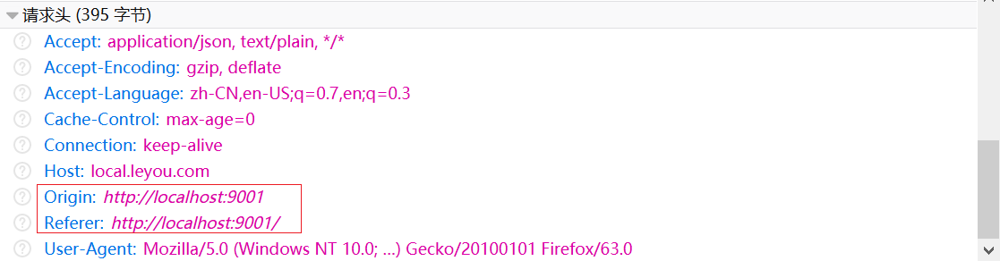

Origin中会指出当前请求属于哪个域（协议+域名+端口）。服务会根据这个值决定是否允许其跨域。

如果服务器允许跨域，需要在返回的响应头中携带下面信息：

```http
Access-Control-Allow-Origin: http://localhost:9001
Access-Control-Allow-Credentials: false
Content-Type: text/html; charset=utf-8
```

- Access-Control-Allow-Origin：可接受的域，是一个具体域名或者*，代表任意
- Access-Control-Allow-Credentials：是否允许携带cookie，默认情况下，cors不会携带cookie，除非这个值是true

#### 特殊请求

不符合简单请求的条件，会被浏览器判定为特殊请求,，例如请求方式为PUT。

> 预检请求

特殊请求会在正式通信之前，增加一次HTTP查询请求，称为"预检"请求（preflight）。

浏览器先询问服务器，当前网页所在的域名是否在服务器的许可名单之中，以及可以使用哪些HTTP动词和头信息字段。只有得到肯定答复，浏览器才会发出正式的`XMLHttpRequest`请求，否则就报错。

一个“预检”请求的样板：

```http
OPTIONS /cors HTTP/1.1
Origin: http://localhost:9001
Access-Control-Request-Method: PUT
Access-Control-Request-Headers: content-type
Host: local.leyou.com
Accept-Language: en-US
Connection: keep-alive
User-Agent: Mozilla/5.0...
```

与简单请求相比，除了Origin以外，多了两个头：

- Access-Control-Request-Method：接下来会用到的请求方式，比如PUT
- Access-Control-Request-Headers：会额外用到的头信息

> 预检请求的响应

服务的收到预检请求，如果许可跨域，会发出响应：

```http
HTTP/1.1 200 OK
Date: Mon, 01 Dec 2008 01:15:39 GMT
Server: Apache/2.0.61 (Unix)
Access-Control-Allow-Origin: *
Access-Control-Allow-Credentials: false
Access-Control-Allow-Methods: *
Access-Control-Allow-Headers: content-type
Access-Control-Max-Age: 1728000
Content-Type: text/html; charset=utf-8
Content-Encoding: gzip
Content-Length: 0
Keep-Alive: timeout=2, max=100
Connection: Keep-Alive
Content-Type: text/plain
```

除了`Access-Control-Allow-Origin`和`Access-Control-Allow-Credentials`以外，这里又额外多出3个头：

- Access-Control-Allow-Methods：允许访问的方式
- Access-Control-Allow-Headers：允许携带的头
- Access-Control-Max-Age：本次许可的有效时长，单位是秒，**过期之前的ajax请求就无需再次进行预检了**

如果浏览器得到上述响应，则认定为可以跨域，后续就跟简单请求的处理是一样的了。

小结:

浏览器每次发请求时, 询问服务端是否允许跨域, 服务端判断请求, 如果允许跨域就返回4个响应头

### 2.5.3.实现很简单

虽然原理比较复杂，但是前面说过：

- 浏览器端都有浏览器自动完成，我们无需操心
- 服务端添加一些头信息就可以

在tp中如何返回响应头信息

参考文档: `https://www.kancloud.cn/manual/thinkphp5_1/353995`

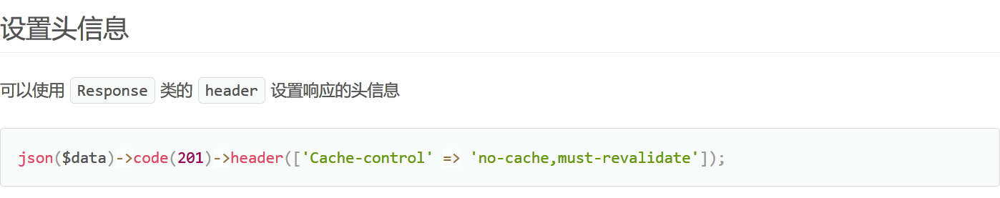

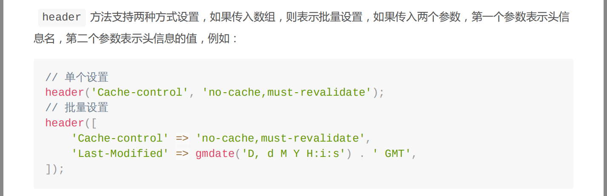

我们在代码中设置响应头

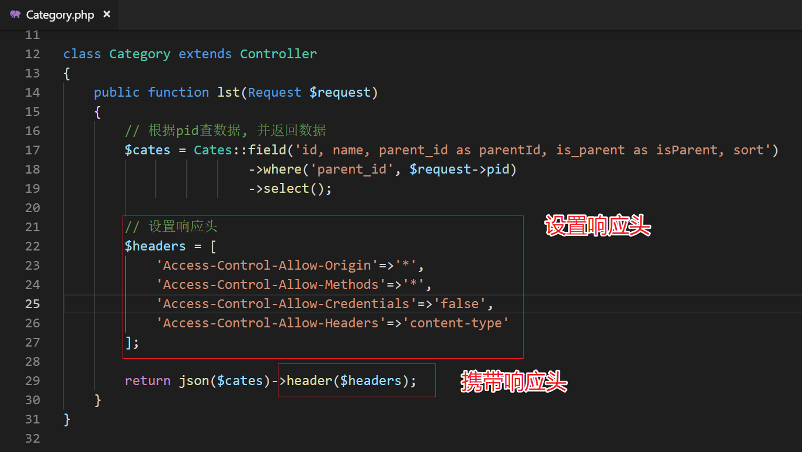

示例代码:

```php
// 设置响应头
$headers = [
    'Access-Control-Allow-Origin'=>'*',
    'Access-Control-Allow-Methods'=>'*',
    'Access-Control-Allow-Credentials'=>'false',
    'Access-Control-Allow-Headers'=>'content-type'
];

return json($cates)->header($headers);
```

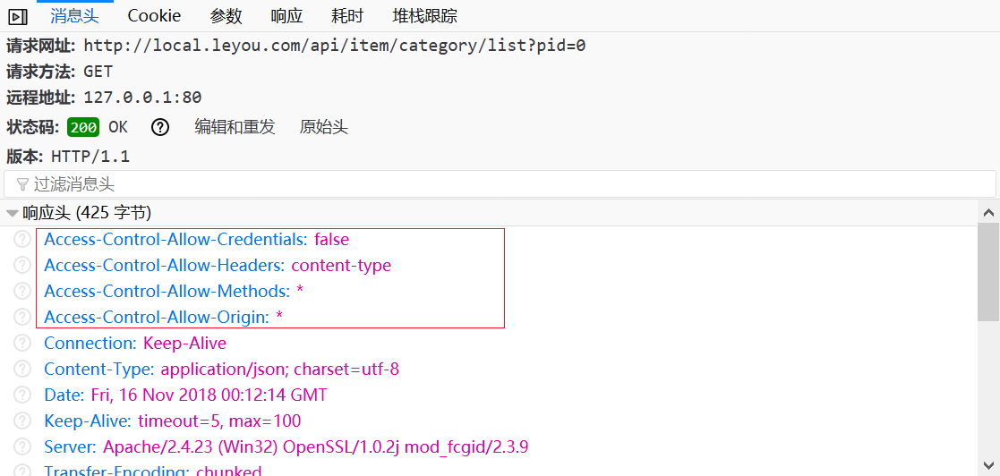

事实上，TP5.1已经帮我们写好了CORS的跨域, 只需要在路由的后面加上allowCrossDomain()就可以了

参考文档: `https://www.kancloud.cn/manual/thinkphp5_1/489844`


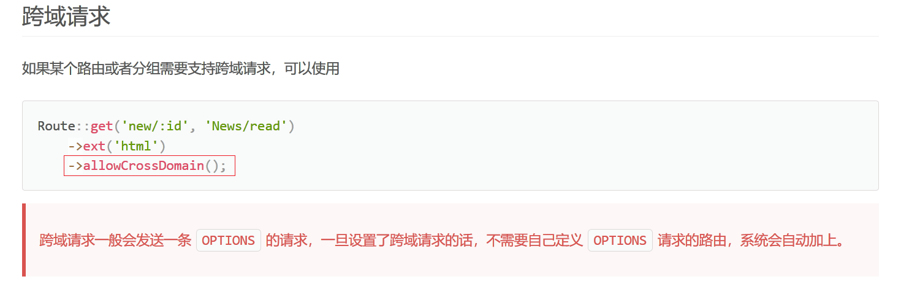

重新测试：

访问正常,

页面也OK了：

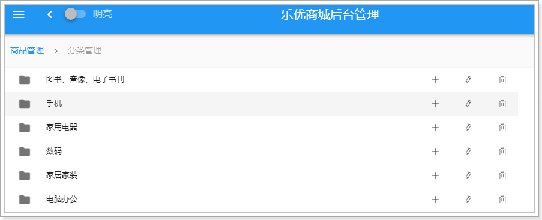

分类的增删改功能暂时就不做了，还有些bug -_!

页面已经预留好了事件接口，有兴趣的同学可以完成一下。

## 3.品牌的查询

商品分类完成以后，自然轮到了品牌功能了。

先看看我们要实现的效果：


接下来，我们从0开始，实现下从前端到后端的完整开发。

## 3.1.从0开始

查看页面：


## 3.2.品牌查询页面

### 3.2.1.data-tables组件

大家看到这个原型页面肯定能看出，其主体就是一个table。我们去Vuetify查看有关table的文档：

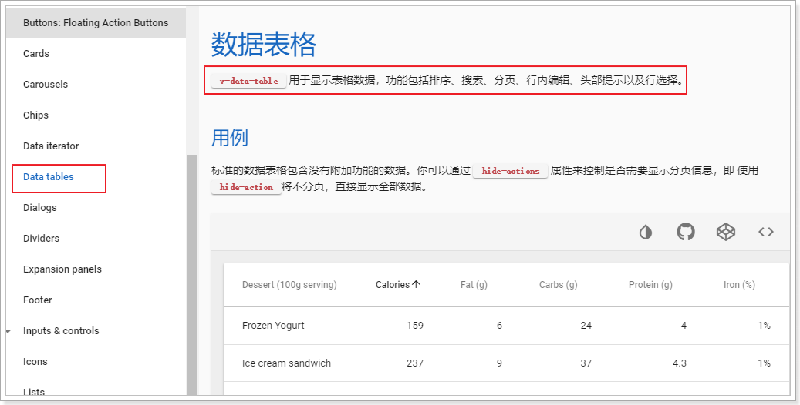

仔细阅读，发现`v-data-table`中有以下核心属性：

- dark：是否使用黑暗色彩主题，默认是false

- expand：表格的行是否可以展开，默认是false

- headers：定义表头的数组，数组的每个元素就是一个表头信息对象，结构：

  ```js
  {
    text: string, // 表头的显示文本
    value: string, // 表头对应的每行数据的key
    align: 'left' | 'center' | 'right', // 位置
    sortable: boolean, // 是否可排序
    class: string[] | string,// 样式
    width: string,// 宽度
  }
  ```

- items：表格的数据的数组，数组的每个元素是一行数据的对象，对象的key要与表头的value一致

- loading：是否显示加载数据的进度条，默认是false

- no-data-text：当没有查询到数据时显示的提示信息，string类型，无默认值

- pagination.sync：包含分页和排序信息的对象，将其与vue实例中的属性关联，表格的分页或排序按钮被触发时，会自动将最新的分页和排序信息更新。对象结构：

  ```js
  {
      page: 1, // 当前页
      rowsPerPage: 5, // 每页大小
      sortBy: '', // 排序字段
      descending:false, // 是否降序
  }
  ```

- total-items：分页的总条数信息，number类型，无默认值

- select-all ：是否显示每一行的复选框，Boolean类型，无默认值

- value：当表格可选的时候，返回选中的行

我们向下翻，找找有没有看起来牛逼的案例。

找到这样一条：

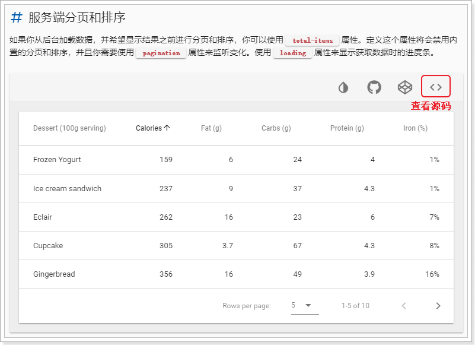

其它的案例都是由Vuetify帮我们对查询到的当前页数据进行排序和分页，这显然不是我们想要的。我们希望能在服务端完成对整体品牌数据的排序和分页，而这个案例恰好合适。

点击按钮，我们直接查看源码，然后直接复制到Brand.vue中

模板：

```vue
<template>
  <div>
    <v-data-table
      :headers="headers"
      :items="desserts"
      :search="search"
      :pagination.sync="pagination"
      :total-items="totalDesserts"
      :loading="loading"
      class="elevation-1"
    >
      <template slot="items" slot-scope="props">
        <td>{{ props.item.name }}</td>
        <td class="text-xs-right">{{ props.item.calories }}</td>
        <td class="text-xs-right">{{ props.item.fat }}</td>
        <td class="text-xs-right">{{ props.item.carbs }}</td>
        <td class="text-xs-right">{{ props.item.protein }}</td>
        <td class="text-xs-right">{{ props.item.iron }}</td>
      </template>
    </v-data-table>
  </div>
</template>
```

### 3.2.2.分析

接下来，就分析一下案例中每一部分是什么意思，搞清楚了，我们也可以自己玩了。

先看模板中table上的一些属性：

```vue
<v-data-table
              :headers="headers"
              :items="desserts"
              :search="search"
              :pagination.sync="pagination"
              :total-items="totalDesserts"
              :loading="loading"
              class="elevation-1"
              >
</v-data-table>
```

- headers：表头信息，是一个数组

- items：要在表格中展示的数据，数组结构，每一个元素是一行

- search：搜索过滤字段，用不到，暂时不管

- pagination.sync：分页信息，包含了当前页，每页大小，排序字段，排序方式等。加上.sync代表服务端排序，当用户点击分页条时，该对象的值会跟着变化。监控这个值，并在这个值变化时去服务端查询，即可实现页面数据动态加载了。

- total-items：总条数

- loading：boolean类型，true：代表数据正在加载，会有进度条。false：数据加载完毕。

  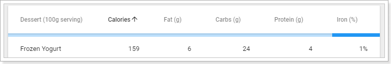

另外，在`v-data-table`中，我们还看到另一段代码：

```vue
<template slot="items" slot-scope="props">
        <td>{{ props.item.name }}</td>
        <td class="text-xs-right">{{ props.item.calories }}</td>
        <td class="text-xs-right">{{ props.item.fat }}</td>
        <td class="text-xs-right">{{ props.item.carbs }}</td>
        <td class="text-xs-right">{{ props.item.protein }}</td>
        <td class="text-xs-right">{{ props.item.iron }}</td>
</template>
```

这段就是在渲染每一行的数据。Vue会自动遍历上面传递的`items`属性，并把得到的对象传递给这段`template`中的`props.item`属性。我们从中得到数据，渲染在页面即可。

我们需要做的事情，主要有两件：

- 给items和totalItems赋值
- 当pagination变化时，重新获取数据，再次给items和totalItems赋值

### 3.2.3.初步实现

我们先弄点假品牌数据：

```json
[
  {
    "id": 2032,
    "name": "OPPO",
    "image": "http://img10.360buyimg.com/popshop/jfs/t2119/133/2264148064/4303/b8ab3755/56b2f385N8e4eb051.jpg",
    "letter": "O"
  },
  {
    "id": 2033,
    "name": "飞利浦（PHILIPS）",
    "image": "http://img12.360buyimg.com/popshop/jfs/t18361/122/1318410299/1870/36fe70c9/5ac43a4dNa44a0ce0.jpg",
    "letter": "F"
  },
  {
    "id": 2034,
    "name": "华为（HUAWEI）",
    "image": "http://img10.360buyimg.com/popshop/jfs/t5662/36/8888655583/7806/1c629c01/598033b4Nd6055897.jpg",
    "letter": "H"
  },
  {
    "id": 2036,
    "name": "酷派（Coolpad）",
    "image": "http://img10.360buyimg.com/popshop/jfs/t2521/347/883897149/3732/91c917ec/5670cf96Ncffa2ae6.jpg",
    "letter": "K"
  },
  {
    "id": 2037,
    "name": "魅族（MEIZU）",
    "image": "http://img13.360buyimg.com/popshop/jfs/t3511/131/31887105/4943/48f83fa9/57fdf4b8N6e95624d.jpg",
    "letter": "M"
  }
]
```

品牌中有id,name,image,letter字段。

#### 修改模板

```vue
<template>
  <div>
    <v-data-table
      :headers="headers"
      :items="brands"
      :search="search"
      :pagination.sync="pagination"
      :total-items="totalBrands"
      :loading="loading"
      class="elevation-1"
    >
      <template slot="items" slot-scope="props">
        <td class="text-xs-center">{{ props.item.id }}</td>
        <td class="text-xs-center">{{ props.item.name }}</td>
        <td class="text-xs-center">
          
          <span v-else>没有图片</span>
        </td>
        <td class="text-xs-center">{{ props.item.letter }}</td>
      </template>
    </v-data-table>
  </div>
</template>
```

我们修改了以下部分：

- items：指向一个brands变量，等下在js代码中定义
- total-items：指向了totalBrands变量，等下在js代码中定义
- template模板中，渲染了四个字段：
  - id：
  - name
  - image，注意，我们不是以文本渲染，而是赋值到一个`img`标签的src属性中，并且做了非空判断
  - letter

#### 编写数据

接下来编写要用到的数据：

``` vue
<script>
  export default {
    data() {
      return {
        headers: [
          {text: 'id', align: 'center', value: 'id'},
          {text: '名称', align: 'center', sortable: false, value: 'name'},
          {text: 'LOGO', align: 'center', sortable: false, value: 'image'},
          {text: '首字母', align: 'center', sortable: true, value: 'letter'},
        ], // 头信息
        brands: [], // 当前页品牌数据
        search: '', // 搜索过滤字段
        pagination: {}, // 分页信息
        totalBrands: 0, // 总条数
        loading: true, // 是否在加载中
      }
    }
  }
</script>
```

#### 编写函数，初始化数据

接下来就是对brands和totalBrands完成赋值动作了。

我们编写一个函数来完成赋值，提高复用性：

```js
methods:{
      getDataFromServer(){ // 从服务的加载数据的方法。
        // 伪造假数据
        const brands = [
          {
            "id": 2032,
            "name": "OPPO",
            "image": "http://img10.360buyimg.com/popshop/jfs/t2119/133/2264148064/4303/b8ab3755/56b2f385N8e4eb051.jpg",
            "letter": "O",
            "categories": null
          },
          {
            "id": 2033,
            "name": "飞利浦（PHILIPS）",
            "image": "http://img12.360buyimg.com/popshop/jfs/t18361/122/1318410299/1870/36fe70c9/5ac43a4dNa44a0ce0.jpg",
            "letter": "F",
            "categories": null
          },
          {
            "id": 2034,
            "name": "华为（HUAWEI）",
            "image": "http://img10.360buyimg.com/popshop/jfs/t5662/36/8888655583/7806/1c629c01/598033b4Nd6055897.jpg",
            "letter": "H",
            "categories": null
          },
          {
            "id": 2036,
            "name": "酷派（Coolpad）",
            "image": "http://img10.360buyimg.com/popshop/jfs/t2521/347/883897149/3732/91c917ec/5670cf96Ncffa2ae6.jpg",
            "letter": "K",
            "categories": null
          },
          {
            "id": 2037,
            "name": "魅族（MEIZU）",
            "image": "http://img13.360buyimg.com/popshop/jfs/t3511/131/31887105/4943/48f83fa9/57fdf4b8N6e95624d.jpg",
            "letter": "M",
            "categories": null
          }
        ];
        // 模拟延迟一段时间，随后进行赋值
        setTimeout(() => {
          // 然后赋值给brands
          this.brands = brands;
          this.totalBrands = brands.length;
          // 完成赋值后，把加载状态赋值为false
          this.loading = false;
        },400)
      }
}
```

然后使用钩子函数，在Vue实例初始化完毕后调用这个方法，这里使用mounted函数：

```js
mounted(){ // 渲染后执行
    // 查询数据
    this.getDataFromServer();
}
```

这里为什么使用mounted, 不用created?

我在调试后面的代码时, 使用created会报错, 因为数据会根据pagination的值变化而变化,变化时重新渲染页面数据

#### 完整代码

```vue
<template>
  <div>
    <v-data-table
      :headers="headers"
      :items="brands"
      :search="search"
      :pagination.sync="pagination"
      :total-items="totalBrands"
      :loading="loading"
      class="elevation-1"
    >
      <template slot="items" slot-scope="props">
        <td class="text-xs-center">{{ props.item.id }}</td>
        <td class="text-xs-center">{{ props.item.name }}</td>
        <td class="text-xs-center">
          
          <span v-else>没有图片</span>
        </td>
        <td class="text-xs-center">{{ props.item.letter }}</td>

      </template>
    </v-data-table>
  </div>
</template>

<script>
export default {
  data() {
    return {
      headers: [
        { text: "id", align: "center", value: "id" },
        { text: "名称", align: "center", sortable: false, value: "name" },
        { text: "LOGO", align: "center", sortable: false, value: "image" },
        { text: "首字母", align: "center", sortable: true, value: "letter" }
      ], // 头信息
      brands: [], // 当前页品牌数据
      search: "", // 搜索过滤字段
      pagination: {}, // 分页信息
      totalBrands: 0, // 总条数
      loading: true // 是否在加载中
    };
  },
  methods: {
    // 从服务器加载数据
    getDataFromServer() {
      // 模拟一些数据
      const brands = [
        {
          id: 2032,
          name: "OPPO",
          image:"http://img10.360buyimg.com/popshop/jfs/t2119/133/2264148064/4303/b8ab3755/56b2f385N8e4eb051.jpg",
          letter: "O"
        },
        {
          id: 2033,
          name: "飞利浦（PHILIPS）",
          image:
            "http://img12.360buyimg.com/popshop/jfs/t18361/122/1318410299/1870/36fe70c9/5ac43a4dNa44a0ce0.jpg",
          letter: "F"
        },
        {
          id: 2034,
          name: "华为（HUAWEI）",
          image:
            "http://img10.360buyimg.com/popshop/jfs/t5662/36/8888655583/7806/1c629c01/598033b4Nd6055897.jpg",
          letter: "H"
        },
        {
          id: 2036,
          name: "酷派（Coolpad）",
          image:
            "http://img10.360buyimg.com/popshop/jfs/t2521/347/883897149/3732/91c917ec/5670cf96Ncffa2ae6.jpg",
          letter: "K"
        },
        {
          id: 2037,
          name: "魅族（MEIZU）",
          image:
            "http://img13.360buyimg.com/popshop/jfs/t3511/131/31887105/4943/48f83fa9/57fdf4b8N6e95624d.jpg",
          letter: "M"
        }
      ]
      // 模拟延迟一段时间，随后进行赋值
      setTimeout( ()=>{
        this.brands = brands
        this.totalBrands = brands.length
        this.loading = false
      }, 400 )
    }
  },
  mounted () {
    this.getDataFromServer()
  }
};
</script>

<style scoped>
</style>
```

刷新页面查看：

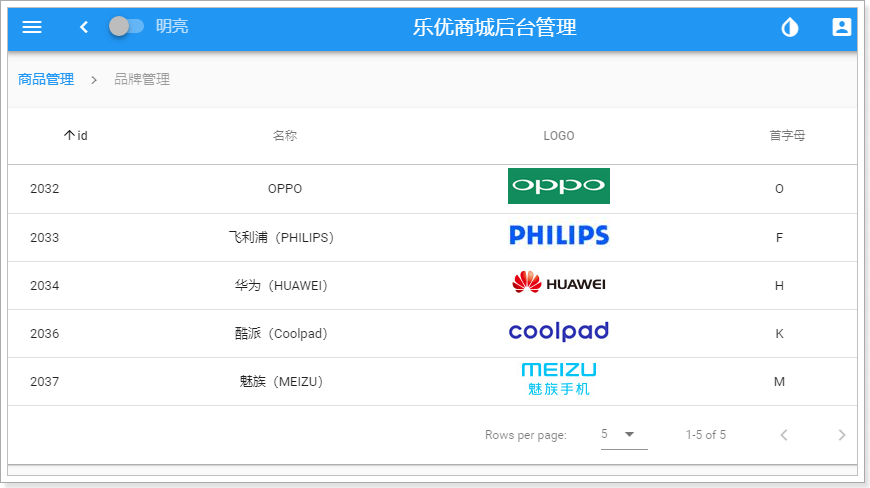

### 3.2.4.优化页面

#### 编辑和删除按钮

我们将来要对品牌进行增删改，需要给每一行数据添加 修改删除的按钮，一般放到改行的最后一列：

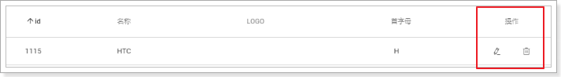

其实就是多了一列，只是这一列没有数据，而是两个按钮而已。

我们先在头（headers）中添加一列：

```js
headers: [
        { text: "id", align: "center", value: "id" },
        { text: "名称", align: "center", sortable: false, value: "name" },
        { text: "LOGO", align: "center", sortable: false, value: "image" },
        { text: "首字母", align: "center", sortable: true, value: "letter" },
        { text: "操作", align: "center", sortable: false },
      ], // 头信息
```

然后在模板中添加按钮：

```vue
<template slot="items" slot-scope="props">
    <td class="text-xs-center">{{ props.item.id }}</td>
    <td class="text-xs-center">{{ props.item.name }}</td>
    <td class="text-xs-center">
        
        <span v-else>没有图片</span>
    </td>
    <td class="text-xs-center">{{ props.item.letter }}</td>
    <td class="justify-center layout">
        编辑/删除
    </td>
</template>
```

因为不知道按钮怎么写，先放个普通文本看看：

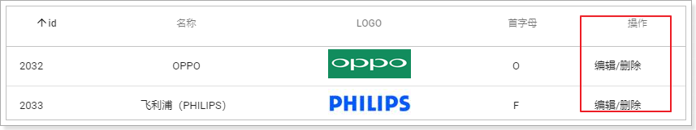

然后在官方文档中找到按钮的用法：

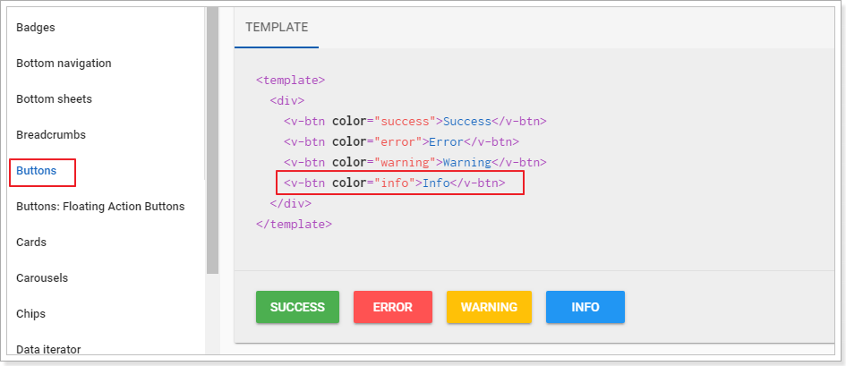

修改我们的模板：

```vue
<template slot="items" slot-scope="props">
    <td>{{ props.item.id }}</td>
    <td class="text-xs-center">{{ props.item.name }}</td>
    <td class="text-xs-center"></td>
    <td class="text-xs-center">{{ props.item.letter }}</td>
    <td class="justify-center layout">
        <v-btn color="info">编辑</v-btn>
        <v-btn color="warning">删除</v-btn>
    </td>
</template>
```

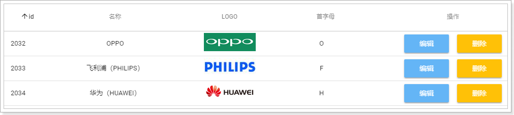

#### 新增按钮

因为新增根某个品牌无关，是独立的，因此我们可以放到表格的外面：

 

效果：

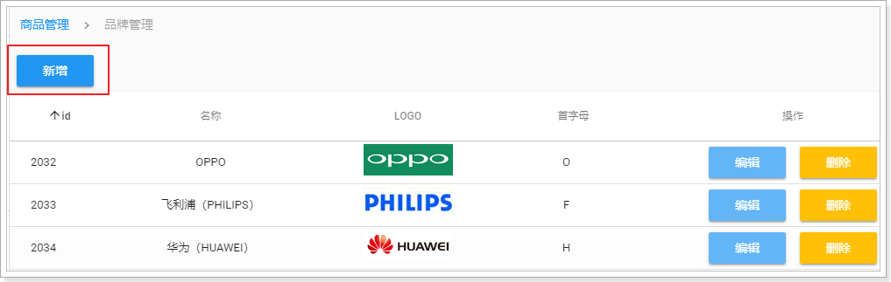

#### 卡片（card）

为了不让按钮显得过于孤立，我们可以将按`新增按钮`和`表格`放到一张卡片（card）中。

我们去官网查看卡片的用法：


卡片`v-card`包含四个基本组件：

- v-card-media：一般放图片或视频
- v-card-title：卡片的标题，一般位于卡片顶部
- v-card-text：卡片的文本（主体内容），一般位于卡片正中
- v-card-action：卡片的按钮，一般位于卡片底部

我们可以把`新增的按钮`放到`v-card-title`位置，把`table`放到下面，这样就成一个上下关系。

```vue
  <v-card>
    <!-- 卡片的头部 -->
    <v-card-title>
      <v-btn color="primary">新增</v-btn>
    </v-card-title>
    <!-- 分割线 -->
    <v-divider/>
    <!--卡片的中部-->
    <v-data-table
      :headers="headers"
      :items="brands"
      :search="search"
      :pagination.sync="pagination"
      :total-items="totalBrands"
      :loading="loading"
      class="elevation-1"
    >
      <template slot="items" slot-scope="props">
        <td>{{ props.item.id }}</td>
        <td class="text-xs-center">{{ props.item.name }}</td>
        <td class="text-xs-center"></td>
        <td class="text-xs-center">{{ props.item.letter }}</td>
        <td class="justify-center layout">
          <v-btn color="info">编辑</v-btn>
          <v-btn color="warning">删除</v-btn>
        </td>
      </template>
    </v-data-table>
  </v-card>
```

效果：

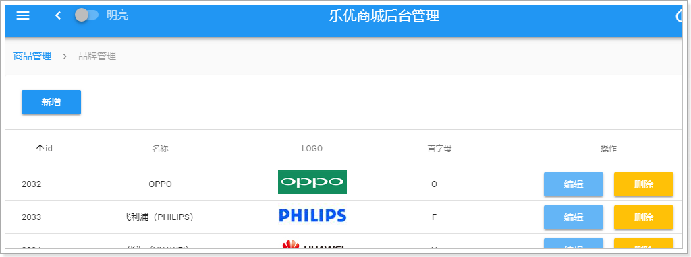

#### 添加搜索框

我们还可以在卡片头部添加一个搜索框，其实就是一个文本输入框。

查看官网中，文本框的用法：


- name：字段名，表单中会用到
- label：提示文字
- value：值。可以用v-model代替，实现双向绑定

修改模板，添加输入框：

```vue
<!-- 卡片的头部 -->
<v-card-title>
    <v-btn color="primary">新增</v-btn>
    <!--搜索框，与search属性关联-->
    <v-text-field label="请输入关键字搜索" v-model="search"></v-text-field>
</v-card-title>
```

效果：

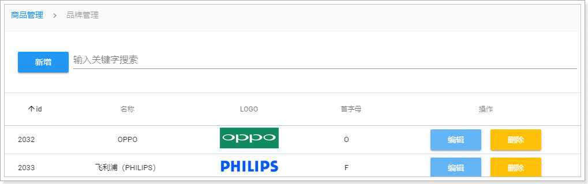

发现输入框变的超级长！！！

这个时候，我们可以使用Vuetify提供的一个空间隔离工具：

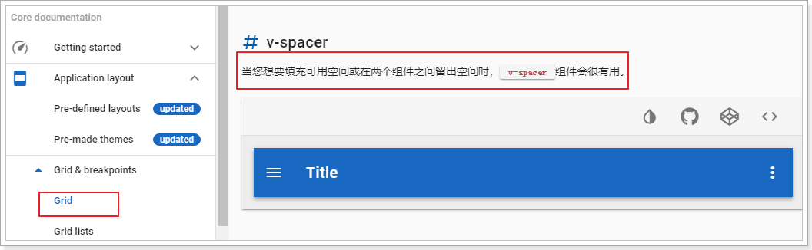

修改代码：

```html
    <v-card-title>
      <v-btn color="primary">新增品牌</v-btn>
      <!--空间隔离组件-->
      <v-spacer />
      <!--搜索框，与search属性关联-->
      <v-text-field label="输入关键字搜索" v-model="search"/>
    </v-card-title>
```

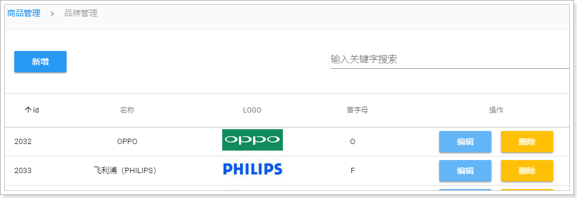

#### 给搜索框添加搜索图标

查看textfiled的文档，发现：

 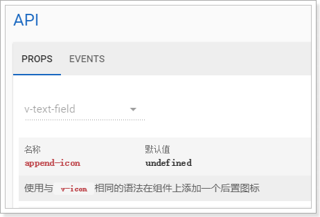

通过append-icon属性可以为 输入框添加后置图标，所有可用图标名称可以到 [material-icons官网](https://material.io/tools/icons/)去查看。

修改我们的代码：

```html
<v-text-field label="输入关键字搜索" v-model="search" append-icon="search"/>
```

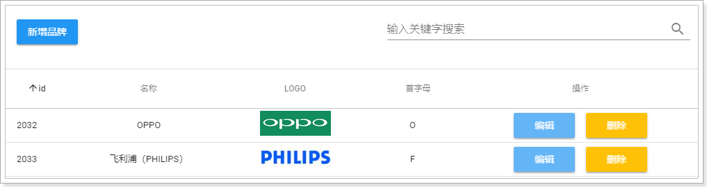

#### 把文本框变紧凑

搜索框看起来高度比较高，页面不够紧凑。这其实是因为默认在文本框下面预留有错误提示空间。通过下面的属性可以取消提示：


修改代码：

```html
<v-text-field label="输入关键字搜索" v-model="search" append-icon="search" hide-details/>
```

效果：

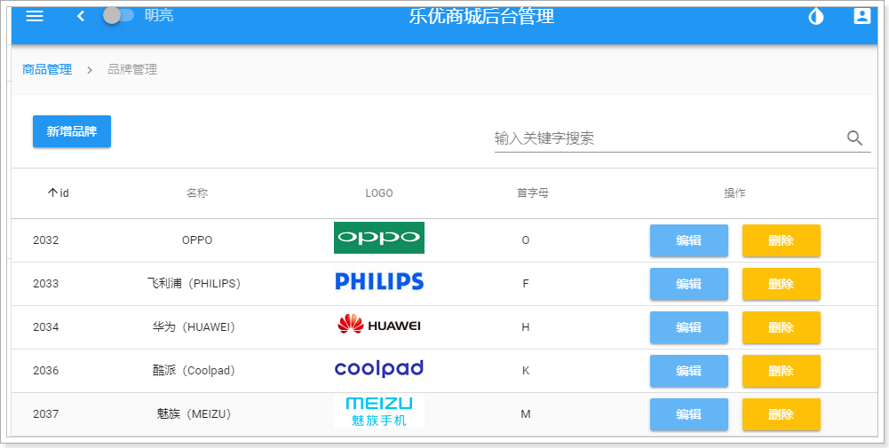

几乎已经达到了原来一样的效果了吧！

## 3.3.后台提供查询接口

前台页面已经准备好，接下来就是后台提供数据接口了。

### 3.3.1.数据库表

```mysql
CREATE TABLE `tb_brand` (
  `id` bigint(20) NOT NULL AUTO_INCREMENT COMMENT '品牌id',
  `name` varchar(50) NOT NULL COMMENT '品牌名称',
  `image` varchar(200) DEFAULT '' COMMENT '品牌图片地址',
  `letter` char(1) DEFAULT '' COMMENT '品牌的首字母',
  PRIMARY KEY (`id`)
) ENGINE=InnoDB AUTO_INCREMENT=325400 DEFAULT CHARSET=utf8 COMMENT='品牌表，一个品牌下有多个商品（spu），一对多关系';

```

简单的四个字段，不多解释。

这里需要注意的是，品牌和商品分类之间是多对多关系。因此我们有一张中间表，来维护两者间关系：

```mysql
CREATE TABLE `tb_category_brand` (
  `category_id` bigint(20) NOT NULL COMMENT '商品类目id',
  `brand_id` bigint(20) NOT NULL COMMENT '品牌id',
  PRIMARY KEY (`category_id`,`brand_id`)
) ENGINE=InnoDB DEFAULT CHARSET=utf8 COMMENT='商品分类和品牌的中间表，两者是多对多关系';

```

### 3.3.2.规划路由

在tp目录/route/route.php中编写一个路由

```php
Route::get('api/item/brand/page', 'api/Brand/page')->allowCrossDomain();
```

### 3.3.3.创建控制器

使用ctrl+`打开命令行, 在命令行中创建Brand控制器

```php
php think make:controller api/Brand --plain
```


编写page方法

```php
namespace app\api\controller;

use think\Controller;
use think\Request;

class Brand extends Controller
{
    public function page(Request $request)
    {
        // 调用模型获取数据
    }
}
```

### 3.3.4.分析接口

- 请求方式：查询，肯定是Get

- 请求路径：分页查询，/api/item/brand/page

- 请求参数：根据我们刚才编写的页面，有分页功能，有排序功能，有搜索过滤功能，因此至少要有5个参数：

  - page：当前页，int
  - rows：每页大小，int
  - sortBy：排序字段，String
  - desc：是否为降序，boolean
  - key：搜索关键词，String

  ``` php
  http://local.leyou.com/api/item/brand/page?page=1&rows=5&sortBy=id&desc=true
  ```

- 响应结果：分页结果一般至少需要两个数据

  - total：总条数
  - items：当前页数据
  - totalPage：有些还需要总页数

### 3.3.5. 创建模型

ctrl+`打开命令行工具, 执行命令

```php
php think make:model api/Brands
```


接下来，我们编写Brands模型

```php
<?php

namespace app\api\model;

use think\Model;

class Brands extends Model
{
    // 定义主键
    protected $pk = 'id';
    // 定义表名
    protected $table = 'tb_brand';

}
```

### 3.3.6. 完善控制器

- 引入模型类

```php
// 引入模型类
use app\api\model\Brands;
```

- 解析GET传递的参数, 并给默认值

  在控制器的page方法中, 使用`$request->param()`获取到所有请求数据

  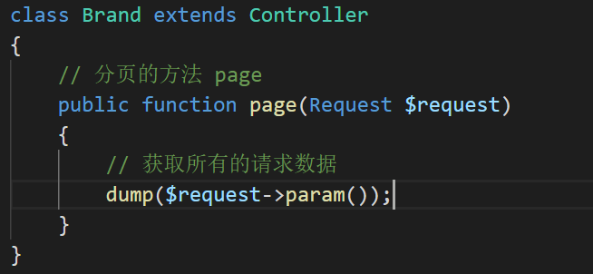

  效果如下:

  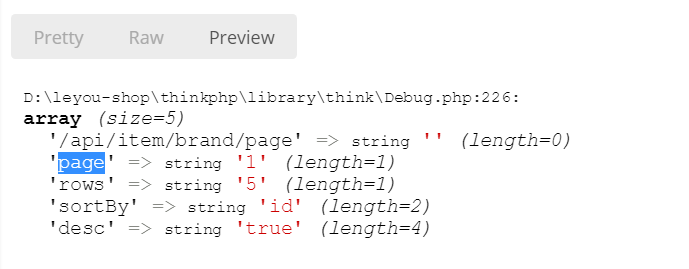

```php
// 解析GET参数, 并给默认值
$page = $request->param('page', 1);
$rows = $request->param('rows', 5);
$sort = $request->param('sortBy', 'id');
$desc = $request->param('desc', 'asc');
$desc = ($desc == 'true') ? 'desc' : 'asc';
$key  = $request->param('key', '');
```

- 构造数据

```php
// 构造数据
$total = Brands::count();
$totalPage = ceil($total/$rows);

$items = Brands::whereLike('name', "%{$key}%")
    ->order($sort, $desc)
    ->page($page, $rows)
    ->select();

$data = [
    'total'=>$total,
    'totalPage'=>$totalPage,
    'items'=>$items
];
```

- 返回

```php
// 返回
return json($data);
```

完整代码

``` php
<?php

namespace app\api\controller;

use think\Controller;
use think\Request;
// 引入模型类
use app\api\model\Brands;

class Brand extends Controller
{
    public function page(Request $request)
    {
        // 解析GET参数, 并给默认值
        $page = $request->param('page', 1);
        $rows = $request->param('rows', 5);
        $sort = $request->param('sortBy', 'id');
        $desc = $request->param('desc', 'asc');
        $desc = ($desc == 'true') ? 'desc' : 'asc';
        $key  = $request->param('key', '');

        // 构造数据
        $total = Brands::count();
        $totalPage = ceil($total/$rows);

        $items = Brands::whereLike('name', "%{$key}%")
                            ->order($sort, $desc)
                            ->page($page, $rows)
                            ->select();

        $data = [
            'total'=>$total,
            'totalPage'=>$totalPage,
            'items'=>$items
        ];

        // 返回
        return json($data);
    }
}


```

### 3.3.7.测试


接下来，去页面请求数据并渲染

## 4.4.异步查询工具axios

异步查询数据，自然是通过ajax查询，大家首先想起的肯定是jQuery。但jQuery与MVVM的思想不吻合，而且ajax只是jQuery的一小部分。因此不可能为了发起ajax请求而去引用这么大的一个库。

### 4.3.1.axios入门

Vue官方推荐的ajax请求框架叫做：axios，看下demo：


axios的Get请求语法：

```js
axios.get("/item/category/list?pid=0") // 请求路径和请求参数拼接
    .then(function(resp){
    // 成功回调函数
})
    .catch(function(){
    // 失败回调函数
})
// 参数较多时，可以通过params来传递参数
axios.get("/item/category/list", {
        params:{
            pid:0
        }
})
    .then(function(resp){})// 成功时的回调
    .catch(function(error){})// 失败时的回调
```

axios的POST请求语法：

比如新增一个用户

```js
axios.post("/user",{
    name:"Jack",
    age:21
})
    .then(function(resp){})
    .catch(function(error){})
```

- 注意，POST请求传参，不需要像GET请求那样定义一个对象，在对象的params参数中传参。post()方法的第二个参数对象，就是将来要传递的参数

PUT和DELETE请求与POST请求类似

### 4.3.2.axios的全局配置

而在我们的项目中，已经引入了axios，并且进行了简单的封装，在src下的http.js中：

http.js中对axios进行了一些默认配置：

```js
import Vue from 'vue'
import axios from 'axios'
import config from './config'
// config中定义的基础路径是：http://local.leyou.com/api
axios.defaults.baseURL = config.api; // 设置axios的基础请求路径
axios.defaults.timeout = 2000; // 设置axios的请求时间

Vue.prototype.$http = axios;// 将axios赋值给Vue原型的$http属性，这样所有vue实例都可使用该对象

```

- http.js中导入了config的配置，还记得吗？

- http.js对axios进行了全局配置：`baseURL=config.api`，即`http://local.leyou.com/api`。因此以后所有用axios发起的请求，都会以这个地址作为前缀。

- 通过`Vue.property.$http = axios`，将`axios`赋值给了 Vue原型中的`$http`。这样以后所有的Vue实例都可以访问到$http，也就是访问到了axios了。

### 4.3.3.测试一下

我们在组件`MyBrand.vue`的getDataFromServer方法，通过$http发起get请求，测试查询品牌的接口，看是否能获取到数据：


 控制台结果：

可以看到，在请求成功的返回结果response中，有一个data属性，里面就是真正的响应数据。

响应结果中与我们设计的一致，包含3个内容：

- total：总条数，目前是164
- items：当前页数据
- totalPage：总页数，目前是33

## 4.5.异步加载品牌数据

虽然已经通过ajax请求获取了品牌数据，但是刚才的请求没有携带任何参数，这样显然不对。我们后端接口需要5个参数：

- page：当前页，int
- rows：每页大小，int
- sortBy：排序字段，String
- desc：是否为降序，boolean
- key：搜索关键词，String

而页面中分页信息应该是在pagination对象中，我们通过浏览器工具，查看pagination中有哪些属性：

 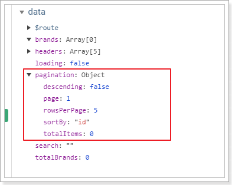

分别是：

- descending：是否是降序，对应请求参数的desc
- page：当前页，对应参数的page
- rowsPerpage：每页大小，对应参数中的rows
- sortBy：排序字段，对应参数的sortBy

缺少一个搜索关键词，这个应该是通过v-model与输入框绑定的属性：search。这样，所有参数就都有了。

另外，不要忘了把查询的结果赋值给brands和totalBrands属性，Vuetify会帮我们渲染页面。

接下来，我们在`getDataFromServer`方法中完善请求参数：

```js
// 发起请求
this.$http.get("/item/brand/page",{
        params:{
            key: this.search, // 搜索条件
            page: this.pagination.page,// 当前页
            rows: this.pagination.rowsPerPage,// 每页大小
            sortBy: this.pagination.sortBy,// 排序字段
            desc: this.pagination.descending// 是否降序
        }
    }).then(resp => { // 这里使用箭头函数
        // 将得到的数据赋值给本地属性
        this.brands = resp.data.items;
        this.totalBrands = resp.data.total;
        // 完成赋值后，把加载状态赋值为false
        this.loading = false;
    })
```

查看网络请求：


效果：


## 4.6.完成分页和过滤

### 4.6.1.分页

现在我们实现了页面加载时的第一次查询，你会发现你点击分页或搜索不会发起新的请求，怎么办？

虽然点击分页，不会发起请求，但是通过浏览器工具查看，会发现pagination对象的属性一直在变化：

我们可以利用Vue的监视功能：watch，当pagination发生改变时，会调用我们的回调函数，我们在回调函数中进行数据的查询即可！

具体实现：

``` js
watch: {
    // 要监听的变量名
    pagination: { // 监视pagination属性的变化
      deep: true, // deep为true，会监视pagination的属性及属性中的对象属性变化
      handler() {
        // 变化后的回调函数，这里我们再次调用getDataFromServer即可
        this.getDataFromServer();
      }
    }
  }
```

成功实现分页功能：

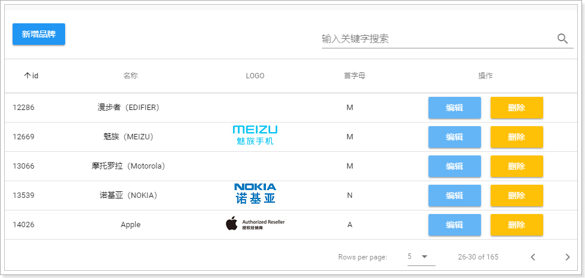

### 4.6.2.过滤

分页实现了，过滤也很好实现了。过滤字段对应的是search属性，我们只要监视这个属性即可:

 ```js
watch: {
    pagination: { // 监视pagination属性的变化
      deep: true, // deep为true，会监视pagination的属性及属性中的对象属性变化
      handler() {
        // 变化后的回调函数，这里我们再次调用getDataFromServer即可
        this.getDataFromServer();
      }
    },
    search: {
      handler() {
        this.getDataFromServer();
      }
    }
  }
 ```

页面结果：

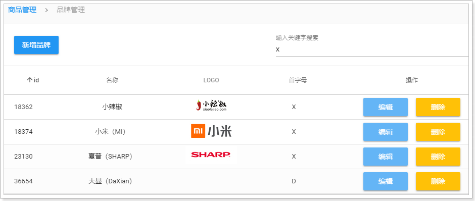

## 4.7.完整代码

```vue
<template>
  <v-card>
    <!-- 卡片的头部 -->
    <v-card-title>
      <v-btn color="primary">新增</v-btn>
      <!--空间隔离组件-->
      <v-spacer></v-spacer>
      <!--搜索框，与search属性关联-->
      <v-text-field label="请输入关键字搜索" v-model="search" append-icon="search" hide-details />
    </v-card-title>
    <!-- 分割线 -->
    <v-divider/>
    <v-data-table
      :headers="headers"
      :items="brands"
      :pagination.sync="pagination"
      :total-items="totalBrands"
      :loading="loading"
      class="elevation-1"
    >
      <template slot="items" slot-scope="props">
        <td class="text-xs-center">{{ props.item.id }}</td>
        <td class="text-xs-center">{{ props.item.name }}</td>
        <td class="text-xs-center">
          
          <span v-else>没有图片</span>
        </td>
        <td class="text-xs-center">{{ props.item.letter }}</td>
        <td class="justify-center layout">
          <v-btn color="info">编辑</v-btn>
          <v-btn color="warning">删除</v-btn>
        </td>
      </template>
    </v-data-table>
  </v-card>
</template>

<script>
export default {
  data() {
    return {
      headers: [
        { text: "id", align: "center", value: "id" },
        { text: "名称", align: "center", sortable: false, value: "name" },
        { text: "LOGO", align: "center", sortable: false, value: "image" },
        { text: "首字母", align: "center", sortable: true, value: "letter" },
        { text: "操作", align: "center", sortable: false }
      ], // 头信息
      brands: [], // 当前页品牌数据
      search: "", // 搜索过滤字段
      pagination: {}, // 分页信息
      totalBrands: 0, // 总条数
      loading: true // 是否在加载中
    };
  },
  methods: {
    // 从服务器加载数据
    getDataFromServer() {
      this.$http
        .get("/item/brand/page", {
          params: {
            key: this.search, // 搜索条件
            page: this.pagination.page, // 当前页
            rows: this.pagination.rowsPerPage, // 每页大小
            sortBy: this.pagination.sortBy, // 排序字段
            desc: this.pagination.descending // 是否降序
          }
        })
        .then(resp => {
          console.log(resp);
          // 将得到的数据赋值给本地属性
          this.brands = resp.data.items;
          this.totalBrands = resp.data.total;
          // 完成赋值后，把加载状态赋值为false
          this.loading = false;
        });
    }
  },
  mounted() {
    this.getDataFromServer();
  },
  watch: {
    pagination: { // 监视pagination属性的变化
      deep: true, // deep为true，会监视pagination的属性及属性中的对象属性变化
      handler() {
        // 变化后的回调函数，这里我们再次调用getDataFromServer即可
        this.getDataFromServer();
      }
    },
    search: {
      handler() {
        this.getDataFromServer();
      }
    }
  }
};
</script>

<style scoped>
</style>

```
