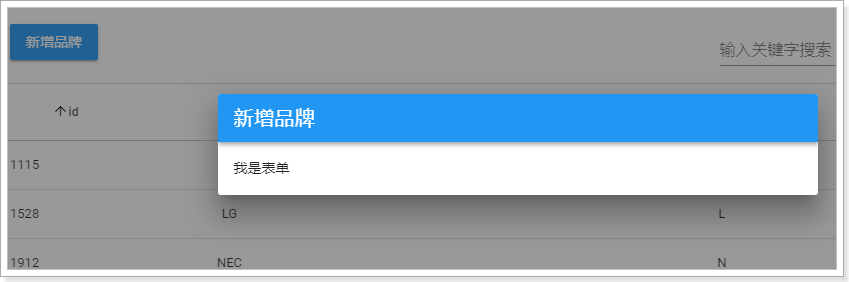
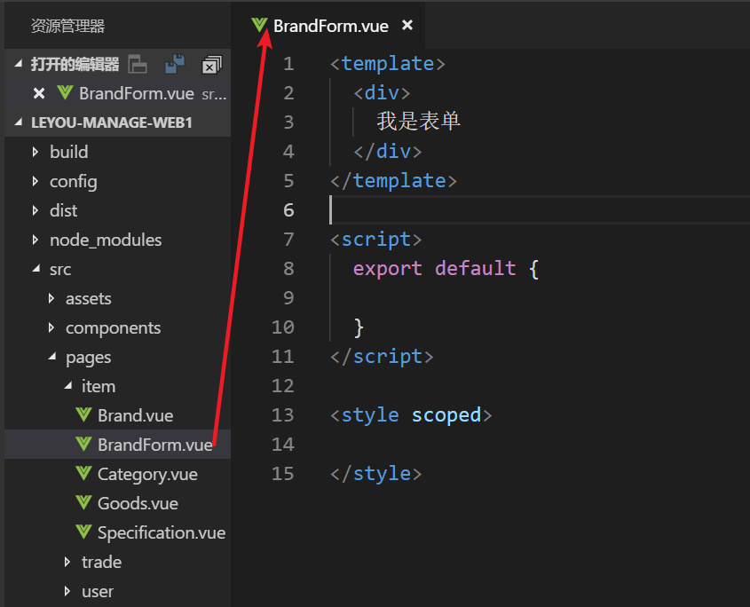
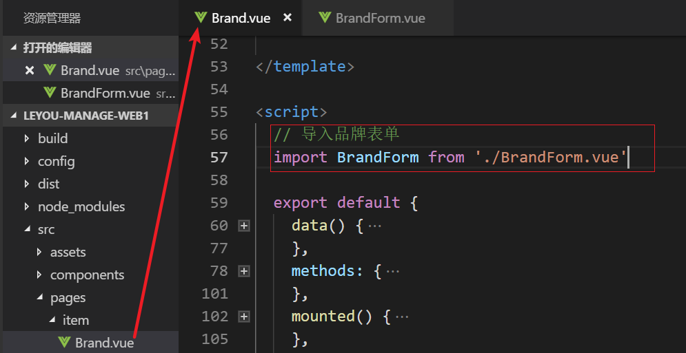
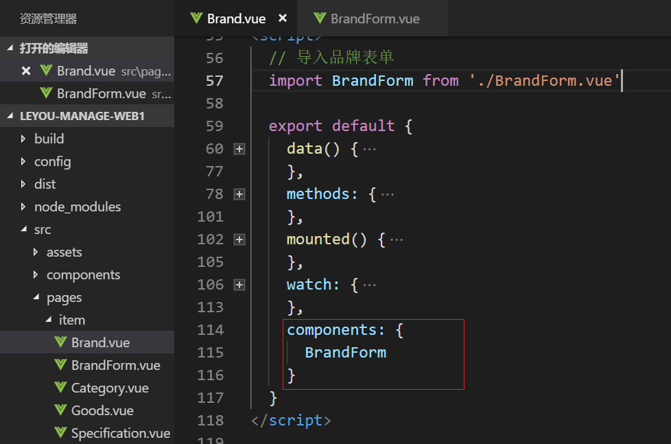
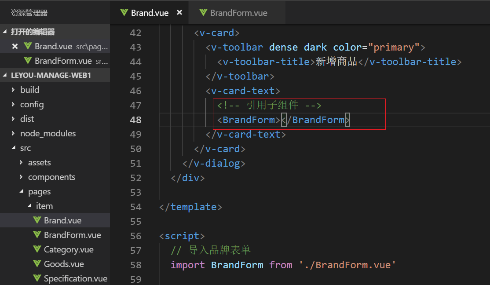
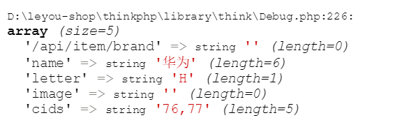
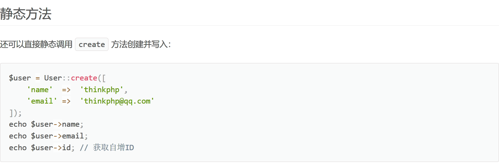
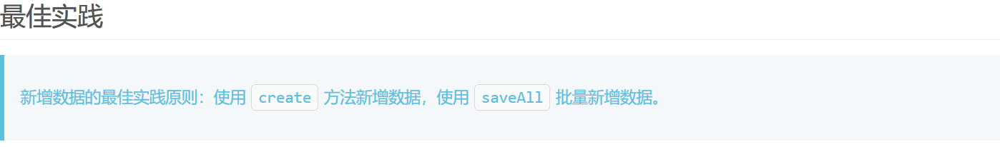
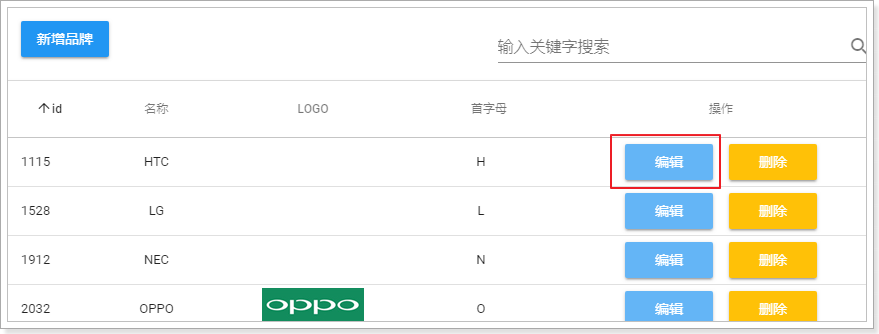

# 0.学习目标

- 独立实现品牌新增
- 实现图片上传
- 实现品牌修改
- 实现品牌删除

# 1.品牌的新增

之前我们完成了品牌的查询，接下来就是新增功能。

## 1.1.页面实现

### 1.1.1.初步编写弹窗

当我们点击新增按钮，应该出现一个弹窗，然后在弹窗中出现一个表格，我们就可以填写品牌信息了。

我们查看Vuetify官网，弹窗是如何实现：


另外，我们可以通过文档看到对话框的一些属性：

- value：控制窗口的可见性，true可见，false，不可见
- max-width：控制对话框最大宽度
- scrollable ：是否可滚动，要配合v-card来使用，默认是false
- persistent ：点击弹窗以外的地方不会关闭弹窗，默认是false

现在，我们来使用一下。

首先，我们在data中定义一个show属性，来控制对话框的显示状态：


然后，在页面添加一个`v-dialog`

```html
<!--弹出的对话框-->
<v-dialog max-width="500" v-model="show" persistent>
    <v-card>
        <!--对话框的标题-->
        <v-toolbar dense dark color="primary">
            <v-toolbar-title>新增品牌</v-toolbar-title>
        </v-toolbar>
        <!--对话框的内容，表单-->
        <v-card-text class="px-5">
            我是表单
        </v-card-text>	
    </v-card>
</v-dialog>
```

说明：

- 我们给dialog指定了3个属性，分别是

  - max-width：限制宽度
  - v-model：value值双向绑定到show变量，用来控制窗口显示
  - persisitent：控制窗口不会被意外关闭

- 因为可滚动需要配合`v-card`使用，因此我们在对话框中加入了一个`v-card`

  - 在`v-card`的头部添加了一个 `v-toolbar`，作为窗口的头部，并且写了标题为：新增品牌
    - dense：紧凑显示
    - dark：黑暗主题
    - color：颜色，primary就是整个网站的主色调，蓝色
  - 在`v-card`的内容部分，暂时空置，等会写表单

- `class=“px-5"`：vuetify的内置样式，含义是padding的x轴设置为5，这样表单内容会缩进一些，而不是顶着边框

  基本语法：`{property}{direction}-{size}`

  - property：属性，有两种`padding`和`margin`
    - `p`：对应`padding`
    - `m`：对应`margin`
  - direction：只padding和margin的作用方向，
    - `t` - 对应`margin-top`或者`padding-top`属性
    - `b` - 对应`margin-bottom` or `padding-bottom`
    - `l` - 对应`margin-left` or `padding-left`
    - `r` - 对应`margin-right` or `padding-right`
    - `x` - 同时对应`*-left`和`*-right`属性
    - `y` - 同时对应`*-top`和`*-bottom`属性
  - size：控制空间大小，基于`$spacer`进行倍增，`$spacer`默认是16px
    - `0`：将`margin`或padding的大小设置为0
    - `1` - 将`margin`或者`padding`属性设置为`$spacer * .25`
    - `2` - 将`margin`或者`padding`属性设置为`$spacer * .5`
    - `3` - 将`margin`或者`padding`属性设置为`$spacer`
    - `4` - 将`margin`或者`padding`属性设置为`$spacer * 1.5`
    - `5` - 将`margin`或者`padding`属性设置为`$spacer * 3`

### 1.1.2.实现弹窗的可见和关闭

> 窗口可见

接下来，我们要在点击新增品牌按钮时，将窗口显示，因此要给新增按钮绑定事件。

``` vue
<v-btn color="primary" @click="show=true">新增品牌</v-btn>
```

效果：



> 窗口关闭

现在，悲剧发生了，因为我们设置了persistent属性，窗口无法被关闭了。除非把show属性设置为false

因此我们需要给窗口添加一个关闭按钮：

```html
<!--对话框的标题-->
<v-toolbar dense dark color="primary">
    <v-toolbar-title>新增品牌</v-toolbar-title>
    <v-spacer/>
    <!--关闭窗口的按钮-->
    <v-btn icon @click="show=false"><v-icon>close</v-icon></v-btn>
</v-toolbar>
```

效果：

 


### 1.1.3.新增品牌的表单页

接下来就是写表单了。我们有两种选择：

- 直接在dialog对话框中编写表单代码
- 另外编写一个组件，组件内写表单代码。然后在对话框引用组件

选第几种？

我们选第二种方案，优点：

- 表单代码独立组件，可拔插，方便后期的维护。
- 代码分离，可读性更好。


我们新建一个`BrandForm.vue`组件：



将BrandForm引入到Brand中，这里使用局部组件的语法：

在Brand.vue中, 先导入自定义组件：



```js
  // 导入自定义的表单组件
  import BrandForm from './BrandForm'
```

然后通过components属性来指定局部组件：



```js
components:{
    BrandForm
}
```

然后在页面中引用：



也可以使用brand-form标签引用子组件

页面效果：

 

### 1.1.4.编写表单

#### 1.1.4.1.表单

查看文档，找到关于表单的部分：


`v-form`，表单组件，内部可以有许多输入项。`v-form`有下面的属性：

- value：true，代表表单验证通过；false，代表表单验证失败

`v-form`提供了两个方法：

- reset：重置表单数据
- validate：校验整个表单数据，前提是你写好了校验规则。返回Boolean表示校验成功或失败

我们在data中定义一个valid属性，跟表单的value进行双向绑定，观察表单是否通过校验，同时把等会要跟表单关联的品牌brand对象声明出来：

```js
  export default {
    data() {
      return {
        valid:false, // 表单校验结果标记
        brand:{
          name:'', // 品牌名称
          letter:'', // 品牌首字母
          image:'',// 品牌logo
          categories:[], // 品牌所属的商品分类数组
        }
      }
    }
  }
```

然后，在页面先写一个表单：

```html
<v-form v-model="valid">
	
</v-form>
```


#### 1.1.4.2.文本框

我们的品牌总共需要这些字段：

- 名称
- 首字母
- 商品分类，有很多个
- LOGO

表单项主要包括文本框、密码框、多选框、单选框、文本域、下拉选框、文件上传等。思考下我们的品牌需要哪些？

- 文本框：品牌名称、品牌首字母都属于文本框
- 文件上传：品牌需要图片，这个是文件上传框
- 下拉选框：商品分类提前已经定义好，这里需要通过下拉选框展示，提供给用户选择。

先看文本框，昨天已经用过的，叫做`v-text-field`：

 

查看文档，`v-text-field`有以下关键属性：

- **append-icon**：文本框后追加图标，需要填写图标名称。无默认值
- clearable：是否添加一个清空图标，点击会清空文本框。默认是false
- color：颜色
- counter：是否添加一个文本计数器，在角落显示文本长度，指定true或允许的组大长度。无默认值
- dark：是否应用黑暗色调，默认是false
- disable：是否禁用，默认是false
- flat：是否移除默认的动画效果，默认是false
- full-width：指定宽度为全屏，默认是false
- hide-details：是否因此错误提示，默认是false
- hint：输入框的提示文本
- **label**：输入框的标签
- **multi-line**：是否转为文本域，默认是false。文本框和文本域可以自由切换
- placeholder：输入框占位符文本，focus后消失
- **required**：是否为必填项，如果是，会在label后加*，不具备校验功能。默认是false(更新之后不一样)
- **rows**：文本域的行数，`multi-line`为true时才有效
- **rules**：指定校验规则及错误提示信息，数组结构。默认[]
- **single-line**：是否单行文本显示，默认是false
- **suffix**：显示后缀

接下来，我们先添加两个字段：品牌名称、品牌的首字母，校验规则暂时不写：

```html
  <v-form v-model="valid">
    <v-text-field v-model="brand.name" label="请输入品牌名称" required />
    <v-text-field v-model="brand.letter" label="请输入品牌首字母" required />
  </v-form>
```

- 千万不要忘了通过`v-model`把表单项与`brand`的属性关联起来。

效果：


#### 1.1.4.3.级联下拉选框

接下来就是商品分类了，按照刚才的分析，商品分类应该是下拉选框。

但是大家仔细思考，商品分类包含三级。在展示的时候，应该是先由用户选中1级，才显示2级；选择了2级，才显示3级。形成一个多级分类的三级联动效果。

这个时候，就不是普通的下拉选框，而是三级联动的下拉选框！

这样的选框，在Vuetify中并没有提供（它提供的是基本的下拉框）。因此我已经给大家编写了一个无限级联动的下拉选框，能够满足我们的需求。

 

具体请参考课前资料的《自定义组件用法指南.md》

我们在代码中使用：

```js
    <v-cascader
      url="/item/category/list"
      multiple 
      required
      v-model="brand.categories"
      label="请选择商品分类"/>
```

- url：加载商品分类选项的接口路径
- multiple：是否多选，这里设置为true，因为一个品牌可能有多个分类
- requried：是否是必须的，这里为true，会在提示上加*，提醒用户
- v-model：关联我们brand对象的categories属性
- label：文字说明


效果：

 

data中获取的结果：

 


#### 1.1.4.4.文件上传项

在Vuetify中，也没有文件上传的组件。

还好，我已经给大家写好了一个文件上传的组件：


详细用法，参考《自定义组件使用指南.md》

我们添加上传的组件：

```html
<v-layout row>
        <v-flex xs3>
          <span class="subheading">品牌LOGO:</span>
        </v-flex>
        <v-flex>
          <v-upload v-model="brand.image" url="/upload" :multiple="false" :pic-width="250" :pic-height="90" />
        </v-flex>
</v-layout>
```

注意：

- 文件上传组件本身没有提供文字提示。因此我们需要自己添加一段文字说明
- 我们要实现文字和图片组件左右放置，因此这里使用了`v-layout`布局组件：
  - layout添加了row属性，代表这是一行，如果是column，代表是列
  - layout下面有`v-flex`组件，是这一行的单元，我们有2个单元
    - `<v-flex xs3>` ：显示文字说明，xs3是响应式布局，代表占12格中的3格
    - 剩下的部分就是图片上传组件了
- `v-upload`：图片上传组件，包含以下属性：
  - v-model：将上传的结果绑定到brand的image属性
  - url：上传的路径，我们先随便写一个。
  - multiple：是否运行多图片上传，这里是false。因为品牌LOGO只有一个
  - pic-width和pic-height：可以控制l图片上传后展示的宽高

最终结果：

 


#### 1.1.4.5.按钮

上面已经把所有的表单项写完。最后就差提交和清空的按钮了。

在表单的最下面添加两个按钮：

```html
    <v-layout class="my-4" row>
      <v-spacer/>
      <v-btn @click="submit" color="primary">提交</v-btn>
      <v-btn @click="clear" >重置</v-btn>
    </v-layout>
```

- 通过layout来进行布局，`my-4`增大上下边距
- `v-spacer`占用一定空间，将按钮都排挤到页面右侧
- 两个按钮分别绑定了submit和clear事件

我们先将方法定义出来：

```js
methods:{
    submit(){
        // 提交表单
    },
    clear(){
        // 重置表单
    }
}
```

重置表单相对简单，因为v-form组件已经提供了reset方法，用来清空表单数据。只要我们拿到表单组件对象，就可以调用方法了。

我们可以通过`$refs`内置对象来获取表单组件。

首先，在表单上定义`ref`属性：

 

然后，在页面查看`this.$refs`属性：


看到`this.$refs`中只有一个属性，就是`myBrandForm`

我们在clear中来获取表单对象并调用reset方法：

```js
    methods:{
      submit(){
        // 提交表单
        console.log(this)
      },
      clear(){
        // 重置表单
        this.$refs.myBrandForm.reset()
        // 需要手动清空商品分类
        this.brand.categories = []
      }
    }
```

要注意的是，这里我们还手动把this.categories清空了，因为我写的级联选择组件并没有跟表单结合起来。需要手动清空。

### 1.1.5.表单校验

#### 1.1.5.1.校验规则

Vuetify的表单校验，是通过rules属性来指定的：


校验规则的写法：


说明：

- 规则是一个数组
- 数组中的元素是一个函数，该函数接收表单项的值作为参数，函数返回值两种情况：
  - 返回true，代表成功，
  - 返回错误提示信息，代表失败

#### 1.1.5.2.项目中代码

我们有四个字段：

- name：做非空校验和长度校验，长度必须大于1
- letter：首字母，校验长度为1，非空。
- image：图片，不做校验，图片可以为空
- categories：非空校验，自定义组件已经帮我们完成，不用写了

首先，我们定义规则：

```js
nameRules:[
    v => !!v || "品牌名称不能为空",
    v => v.length > 1 || "品牌名称至少2位"
],
letterRules:[
    v => !!v || "首字母不能为空",
    v => /^[A-Z]$/.test(v) || "品牌字母只能是一个A~Z的大写字母"
]
```

然后，在页面标签中指定：

```html
<v-text-field v-model="brand.name" label="请输入品牌名称" required :rules="nameRules" />
<v-text-field v-model="brand.letter" label="请输入品牌首字母" required :rules="letterRules" />
```

效果：

 


### 1.1.6.表单提交

在submit方法中添加表单提交的逻辑：

```js
submit() {
    // 1.表单验证
    if (this.$refs.myBrandForm.validate()) {
        // 2.解构brand数组, 提取出categories, 剩下的放到params对象中
        const {categories, ... params} = this.brand
        // 3.只保留id, 并使用,连接
        params.cids = categories.map(c => c.id).join(',')

        // 发送数据给后台
        this.$http.post('/item/brand', params).then(resp => {
            const {status, data} = resp

            if (status == 201) {
                this.$message.success('添加成功')
            }else {
                this.$message.error('添加失败')
            }

        })
    }
}
```

- 1、通过`this.$refs.myBrandForm`选中表单，然后调用表单的`validate`方法，进行表单校验。返回boolean值，true代表校验通过

- 2、通过解构表达式来获取brand中的值，categories需要处理，单独获取。其它的存入params对象中

- 3、品牌和商品分类的中间表只保存两者的id，而brand.categories中保存的数对象数组，里面有id和name属性，因此这里通过数组的map功能转为id数组，然后通过join方法拼接为字符串

- 4、发起请求

- 5、弹窗提示成功还是失败，这里用到的是我们的自定义组件功能message组件：


  这个插件把`$message`对象绑定到了Vue的原型上，因此我们可以通过`this.$message`来直接调用。

  包含以下常用方法：

  - info、error、success、warning等，弹出一个带有提示信息的窗口，色调与为普通（灰）、错误（红色）、成功（绿色）和警告（黄色）。使用方法：this.$message.info("msg")
  - confirm：确认框。用法：`this.$message.confirm("确认框的提示信息")`，返回一个Promise

## 1.2.后端实现新增

### 思路分析

添加brand表记录, 需要维护两张表

- 向tb_brand表中添加一条记录
- 向分类品牌关联表tb_category_brand表中添加多条记录

请求参数如何设计?

我们在vue中保存的brand数据如下

```json
brand: {
    categories: [
        {id: 76, name: '手机'},
        {id: 77, name: '对讲机'}
    ],
    name: '华为',
    image: '',
    letter: 'H'
}
```

可以将categories转换为cids, 后台其实只需要跟brand关联的category的id就可以了, 因此, 这样设计

```json
brand: {
    cids: '76,77',
    name: '华为',
    image: '',
    letter: 'H'
}
```


### 接口分析

还是一样，先分析四个内容：

- 请求方式：POST

- 请求路径：/item/brand

- 请求参数：brand对象，外加商品分类的id放在cids(字符串) 样子如76,77

  ```json
  brand: {
      cids: '76,77',
      name: '华为',
      image: '',
      letter: 'H'
  }
  ```

- 返回值：成功返回201状态码, 失败返回404状态码

### 1.2.1.规划路由

在route.php中, 添加一条路由规则

```php
// 添加品牌
Route::post('api/item/brand', 'api/Brand/add')->allowCrossDomain();
```

### 1.2.2.编写add方法

```php
public function add(Request $request)
{
    // 1. 获取提交的参数
    //dump($request->param());

    // 2. 根据提交的数据, 添加到brands表中
    $brand = Brands::create($request->param());

    $cids = $request->param('cids');
    // 3. 向关联的表category_brand中添加数据
    // cids 76, 77
    foreach (explode(',',$cids) as $cid ) {
        $data = ['category_id'=>$cid, 'brand_id'=>$brand->id];
        Db::table('tb_category_brand')->insert($data);
    }
    // 4. 返回结果, 当然可以加入其它的判断, 这里就不演示了
    return json($brand, '201');
}
```

1. 通过$request->param()获取提交的参数, 返回的就是一个数组

   

2. 调用模型的create方法添加数据(参考文档: [模型-添加](https://www.kancloud.cn/manual/thinkphp5_1/354042))





使用create方法, 传递一个数组, 这个数组可以是$request->param()的返回值, 并过滤掉不需要的字段!!!

create方法返回新添加的数据对象

3. 向关联的表category_brand中添加数据中添加数据
4. 返回结果

### 1.2.3. 测试

使用sql语句, 查询brand中最后添加的记录

```sql
select * from tb_brand order by id desc limit 1;
```

再根据查询得到的id, 查询中间表

```sql
// 325402是新添加的brand的id
select * from tb_category_brand where brand_id=325402;
```


## 1.3.新增完成后关闭窗口

我们发现有一个问题：新增不管成功还是失败，窗口都一致在这里，不会关闭。

这样很不友好，我们希望如果新增失败，窗口保持；但是新增成功，窗口关闭才对。


因此，我们需要**在新增的ajax请求完成以后，关闭窗口**

但问题在于，控制窗口是否显示的标记在父组件：Brand.vue中。子组件如何才能操作父组件的属性？或者告诉父组件该关闭窗口了？


之前我们讲过一个父子组件的通信，有印象吗？

- 第一步，在父组件中定义一个函数，用来关闭窗口，并且关闭的同时重新加载数据：

```js
closeWindow(){
    // 关闭窗口
    this.show = false;
    // 重新加载数据
    this.getDataFromServer();
}
```

- 第二步，父组件在使用子组件时，绑定事件，关联到这个函数：

```html
<!--对话框的内容，表单-->
<v-card-text class="px-5">
    <BrandForm @close="closeWindow"></BrandForm>
</v-card-text>
```

- 第三步，子组件通过`this.$emit`调用父组件的函数：


测试OK

# 2.实现图片上传

## 2.1 前端行为分析

在点击上传文件后, 前端会发起一个post请求

请求的地址是: http://local.leyou.com/api/upload


并且name="file"


## 2.2 后台实现文件上传

### 接口分析

- 请求方式：POST
- 请求路径：/upload
- 返回值：完整的图片路径

### 2.2.1. 规划路由

在route.php中添加一条路由规则

```php
// 上传文件
Route::post('api/upload', 'api/Brand/upload')->allowCrossDomain();
```

### 2.2.2.实现控制器方法

参考TP手册关于上传文件部分的例子, 参考文档----[上传](https://www.kancloud.cn/manual/thinkphp5_1/354121)


```php
public function upload(Request $request)
{
    // 1. 获取上传的文件, file是name属性的值
    $file = request()->file('file');
    // 2. 移动到框架应用根目录/public/uploads 目录下
    $info = $file->move('./uploads');

    $str = "http://local.leyou.com/uploads/".$info->getSaveName();

    if ($info) {
        return str_replace("\\", "/", $str);
    }
}
```


### 2.2.3.创建uploads目录


## 2.3 联调测试

在前端上传文件, 后台返回完整的URL路径, 前端会根据返回路径请求图片, 并显示出来


在vue中, 会同步更新到brand的image中


在后台中, 可以看到上传的文件


# 3.修改品牌

修改的难点在于回显。实现对话框的复用

当我们点击编辑按钮，希望弹出窗口的同时，看到原来的数据：




## 3.1.点击编辑出现弹窗

这个比较简单，修改show属性为true即可实现，我们绑定一个点击事件：

```html
<v-btn color="info" @click="editBrand">编辑</v-btn>
```

然后编写事件，改变show 的状态：

 ``` js
editBrand() {
    // 控制弹窗可见
    this.show = true;
}
 ```

如果仅仅是这样，编辑按钮与新增按钮将没有任何区别，关键在于，如何回显呢？

## 3.2.回显数据

回显数据，就是把当前点击的品牌数据传递到子组件（BrandForm）。而父组件给子组件传递数据，通过props属性。

- 第一步：在编辑时获取当前选中的品牌信息，并且记录到data中

  先在data中定义属性，用来接收用来编辑的brand数据：

   

  我们在页面触发编辑事件时，把当前的brand传递给editBrand方法：

  ```html
  <v-btn color="info" @click="editBrand(props.item)">编辑</v-btn>
  ```

  然后在editBrand中接收数据，赋值给oldBrand：

  ```js
  editBrand(oldBrand){
    // 控制弹窗可见：
    this.show = true
    // 获取要编辑的brand
    this.oldBrand = oldBrand
  },
  ```

- 第二步：把获取的brand数据 传递给子组件

  ```html
  <!--对话框的内容，表单-->
  <v-card-text class="px-5">
      <brand-form @close="closeWindow" :oldBrand="oldBrand"/>
  </v-card-text>
  ```

- 第三步：在子组件中通过props接收要编辑的brand数据，Vue会自动完成回显

  接收数据：

   ```js
  props: {
      oldBrand: {
          type: Object,
      }
  },
   ```


  通过watch函数监控oldBrand的变化，把值copy到本地的brand：

  ```js
  watch: {
      oldBrand: {// 监控oldBrand的变化
          handler(val) {
              if(val){
                  // 注意不要直接复制，否则这边的修改会影响到父组件的数据，copy属性即可
                  this.brand =  Object.deepCopy(val)
              }else{
                  // 为空，初始化brand
                  this.brand = {
                      name: '',
                      letter: '',
                      image: '',
                      categories: [],
                  }
              }
          },
          deep: true
      }
  }
  ```

  - Object.deepCopy 自定义的对对象进行深度复制的方法。
  - 需要判断监听到的是否为空，如果为空，应该进行初始化


测试：发现数据回显了，除了商品分类以外：

 


## 3.3.商品分类回显

为什么商品分类没有回显？

因为品牌中并没有商品分类数据。我们需要在进入编辑页面之前，查询商品分类信息：

### 接口分析

- 请求方式：get

- 请求路径：/item/brand/cates/:bid

- 请求参数：bid: 品牌的id

- 返回值：返回当前品牌下所有的分类数据

  ```json
  [
      {
          "id": 76,
          "name": "手机"
      },
      {
          "id": 77,
          "name": "对讲机"
      }
  ]
  ```


### 3.3.1.规划路由

> 小技巧: 使用路由分组, 优化路由规则

当很多路由规则有相同点时, 可以使用路由分组来优化路由规则, 这样可以提高路由匹配的效率，不必每次都去遍历完整的路由规则. 参考文档----[路由分组](https://www.kancloud.cn/manual/thinkphp5/118036)

将代码改造如下:

```php
Route::group('api', function () {
    // 获取品牌列表
    Route::get('/item/brand/page', 'api/Brand/page');
    // 添加品牌
    Route::post('/item/brand', 'api/Brand/add');
    // 上传品牌图片
    Route::post('/upload', 'api/Brand/upload');
})->allowCrossDomain();
```

当请求的路由以api开头时, 做为一个路由的分组, 都允许跨域请求

在api分组下, 添加一条路由规则:

```php
Route::get('/item/brand/cates/:bid', 'api/Brand/cates');
```


### 3.3.2.实现控制器方法

```php
public function cates(Request $request, $bid)
{
    // 1. 根据brand_id查询中间表, 得到category_id
    $data = Db::table('tb_category_brand')
        ->field('category_id')
        ->where('brand_id', $bid)
        ->select();

    $cates = [];
    // 2. 根据category_id, 查询分类表
    foreach ($data as $v) {
        $cates[] = Db::table('tb_category')
            ->field('id, name')
            ->find($v['category_id']);
    }

    return json($cates);
}
```

### 3.3.3.前台查询分类并渲染数据

我们在编辑页面打开之前，先把数据查询完毕：

```js
editBrand(oldBrand) {
    this.$http.get('/item/brand/cates/'+oldBrand.id).then(resp => {
        // 控制弹窗可见
        this.show = true
        // 获取要编辑的brand
        this.oldBrand = oldBrand
        // 获取品牌对应的分类信息
        this.oldBrand.categories = resp.data
    })
}
```

### 3.3.4.新增窗口数据干扰

但是，此时却产生了新问题：新增窗口竟然也有数据？

原因：

​	如果之前打开过编辑，那么在父组件中记录的oldBrand会保留。下次再打开窗口，如果是编辑窗口到没问题，但是新增的话，就会再次显示上次打开的品牌信息了。


解决：

​	新增窗口打开前，把数据置空。

首先, 给新增按钮绑定一个方法:


```js
addBrand() {
    // 控制弹窗可见
    this.show = true
    // 把oldBrand变为null
    this.oldBrand = null
}
```


### 4.3.4.提交表单时判断是新增还是修改

新增和修改是同一个页面，我们该如何判断？

父组件中点击按钮弹出新增或修改的窗口，因此父组件非常清楚接下来是新增还是修改。

因此，最简单的方案就是，在父组件中定义变量，记录新增或修改状态，当弹出页面时，把这个状态也传递给子组件。

第一步：在父组件中记录状态：

 


第二步：在新增和修改前，更改状态：

 

第三步：传递给子组件

 ``` vue
<v-card-text class="px-5">
    <BrandForm @close="closeWindow" :oldBrand="oldBrand" :isEdit="isEdit"></BrandForm>
</v-card-text>
 ```


第四步，子组件接收标记：

``` js
props: {
    oldBrand: {
    	type: Object
    },
    isEdit: {
        type: Boolean,
        default: false
    }
},
```

标题的动态化：

 在父组件中, 修改对话框标题

表单提交动态：

axios除了除了get和post外，还有一个通用的请求方式：

```js
// 将数据提交到后台
this.$http({
    method: this.isEdit ? 'put' : 'post', // put表示修改, post表示添加
    url: '/item/brand',
    data: params
}).then(() => {
    // 关闭窗口
    this.$emit("close");
    this.$message.success("保存成功！");
}).catch(() => {
    this.$message.error("保存失败！");
});
```

## 3.4.后台实现

接口分析

- 请求方式：put
- 请求路径：/item/brand
- 请求参数：brand对象，外加商品分类的id数组cids
- 返回值：

### 3.4.1.规划路由


### 3.4.2.实现upd方法

```php
public function upd(Request $request)
{
    // 1. 更新品牌表
    Brands::update($request->param());
    // 2. 更新中间表
    // 这里存在一点逻辑小bug, 当更新的分类是新添加时会怎样
    $cids = $request->param('cids');
    foreach (explode(',', $cids) as $cid) {
        Db::table('tb_category_brand')
            ->where('brand_id', $request->id)
            ->update(['category_id'=>$cid]);
    }
}
```

更新中间表时, 存在一点逻辑上的小问题, 留给大家自己思考并实现吧^_^

# 4.删除品牌

## 4.1.前端实现

### 4.1.1.绑定删除事件


### 4.1.2.实现删除方法

```js
delBrand(oldBrand) {
    // 1. 弹出确认框 
    this.$message.confirm('确认删除该品牌吗?').then(() => {
        // 2. 发送delete请求, 删除品牌数据
        this.$http.delete('/item/brand/'+oldBrand.id)
        .then(resp => {
            this.getDataFromServer()
            this.$message.success('删除成功')
        }).catch(resp => {
            this.$message.error('删除失败')
        })
    })
}
```

1. 使用`this.$message.confirm`弹出确认框
2. 使用`this.$http`发送delete请求, 删除品牌数据

## 4.2.后端实现

### 接口分析

- 请求方式：delete
- 请求路径：/item/brand/:bid
- 请求参数：bid: 品牌的id
- 返回值：

### 4.2.1.规划路由

```php
// 删除品牌
Route::delete('/item/brand/:id', 'api/Brand/del');
```

### 4.4.2.实现方法

```php
public function del(Request $request, $id)
{
    // 1. 根据主键删除品牌表数据
    Brands::destroy($id);

    // 2. 维护中间表, 这里大家试着实现一下吧
}
```


