# 0.学习目标

- 了解商品新增的页面实现
- 独立编写商品新增后台功能

# 1.商品新增

## 1.1.效果预览

新增商品窗口：

 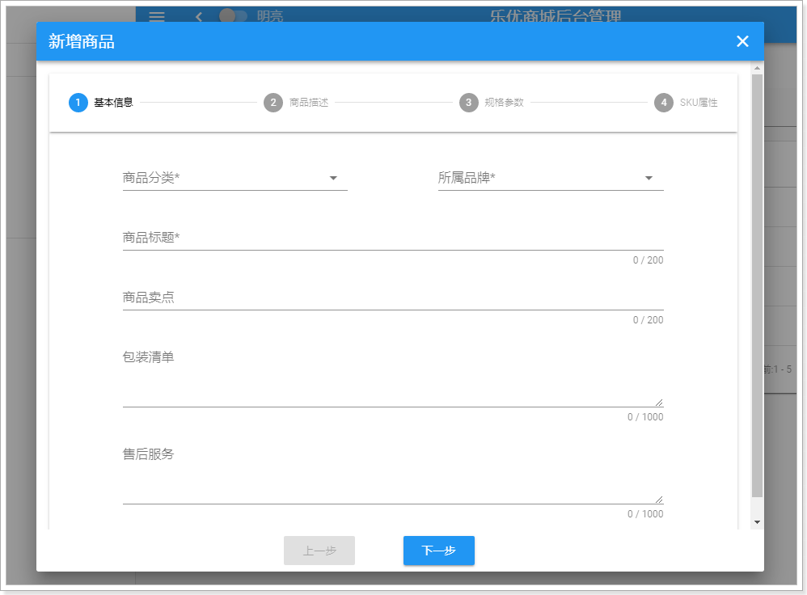

这个表单比较复杂，因为商品的信息比较多，分成了4个部分来填写：

- 基本信息
- 商品描述信息
- 规格参数信息
- SKU信息


## 1.2.从0开始

我们刚刚在查询时，已经实现创建了GoodsForm.vue，并且已经在Goods.vue中引入。

不过目前没有写代码：

```vue
<template>
  <div>
    我是商品表单页面
  </div>
</template>

<script>
  export default {
    
  }
</script>

<style scoped>

</style>

```

然后在Goods.vue中，已经引入了GoodsForm组件，并且页面中也形成了对话框：

```js
  // 导入自定义的表单组件
  import GoodsForm from './GoodsForm'
```

```html
<v-dialog max-width="500" v-model="show" persistent>
    <v-card>
        <!--对话框的标题-->
        <v-toolbar dense dark color="primary">
            <v-toolbar-title>{{isEdit ? '修改' : '新增'}}商品</v-toolbar-title>
            <v-spacer/>
            <!--关闭窗口的按钮-->
            <v-btn icon @click="closeWindow">
                <v-icon>close</v-icon>
            </v-btn>
        </v-toolbar>
        <!--对话框的内容，表单-->
        <v-card-text class="px-5">
            <goods-form :oldGoods="oldGoods"/>
        </v-card-text>
    </v-card>
</v-dialog>
```


并且也已经给新增按钮绑定了点击事件：

```html
<v-btn color="primary" @click="addGoods">新增商品</v-btn>
```

addGoods方法中，设置对话框的show属性为true：

```js
addGoods() {
    // 修改标记
    this.isEdit = false;
    // 控制弹窗可见：
    this.show = true;
    // 把oldBrand变为null
    this.oldBrand = null;
}
```


不过弹窗中没有任何数据：

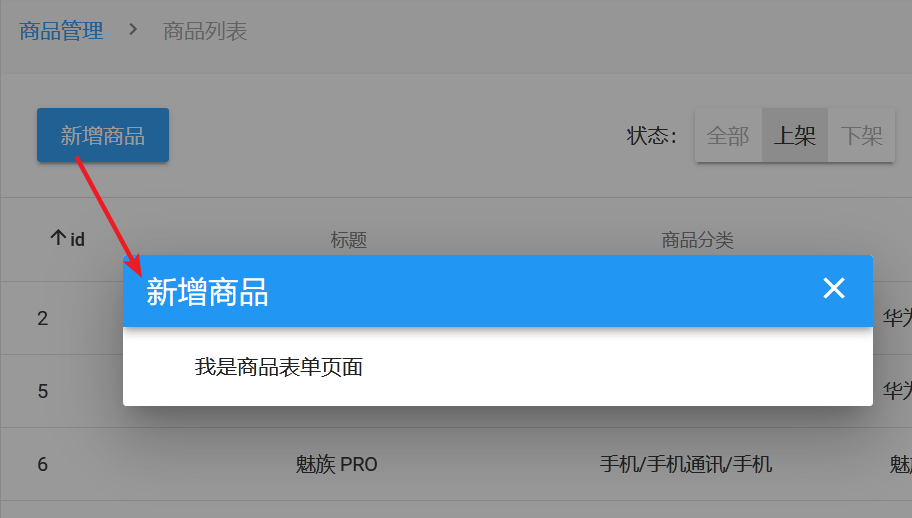


## 1.3.新增商品页的基本框架

### 1.3.1.Steppers，步骤线

预览效果图中，分四个步骤显示商品表单的组件，叫做stepper，看下文档：


其基本结构如图：


一个步骤线（v-stepper）总的分为两部分：

- v-stepper-header：代表步骤的头部进度条，只能有一个
  - v-stepper-step：代表进度条的每一个步骤，可以有多个
- v-stepper-items：代表当前步骤下的内容组，只能有一个，内部有stepper-content
  - v-stepper-content：代表每一步骤的页面内容，可以有多个


> v-stepper

- value：其值是当前所在的步骤索引，可以用来控制步骤切换
- dark：是否使用黑暗色调，默认false
- non-linear：是否启用非线性步骤，用户不用按顺序切换，而是可以调到任意步骤，默认false
- vertical：是否垂直显示步骤线，默认是false，即水平显示

> v-stepper-header的属性：

- 无

> v-stepper-step的属性

- color：颜色
- complete：当前步骤是否已经完成，布尔值
- editable：是否可编辑任意步骤（非线性步骤）
- step：步骤索引

> v-stepper-items

- 无

> v-stepper-content

- step：步骤索引，需要与v-stepper-step中的对应

### 1.3.2.编写页面

首先我们在data中定义一个变量，记录当前的步骤数：

```js
data() {
    return {
        step: 1, // 当前的步骤数，默认为1
    }
},
```

然后在模板页面中引入步骤线：

```html
<v-stepper v-model="step">
    <v-stepper-header>
      <v-stepper-step :complete="step > 1" step="1">基本信息</v-stepper-step>
      <v-divider/>
      <v-stepper-step :complete="step > 2" step="2">商品描述</v-stepper-step>
      <v-divider/>
      <v-stepper-step :complete="step > 3" step="3">规格参数</v-stepper-step>
      <v-divider/>
      <v-stepper-step step="4">SKU属性</v-stepper-step>
    </v-stepper-header>
    <v-stepper-items>
      <v-stepper-content step="1">
        基本信息
      </v-stepper-content>
      <v-stepper-content step="2">
        商品描述
      </v-stepper-content>
      <v-stepper-content step="3">
        规格参数
      </v-stepper-content>
      <v-stepper-content step="4">
        SKU属性
      </v-stepper-content>
    </v-stepper-items>
  </v-stepper>
```

效果：


步骤线出现了！


那么问题来了：该如何让这几个步骤切换呢？


### 1.3.3.步骤切换按钮

#### 分析

如果改变step的值与指定的步骤索引一致，就可以实现步骤切换了：

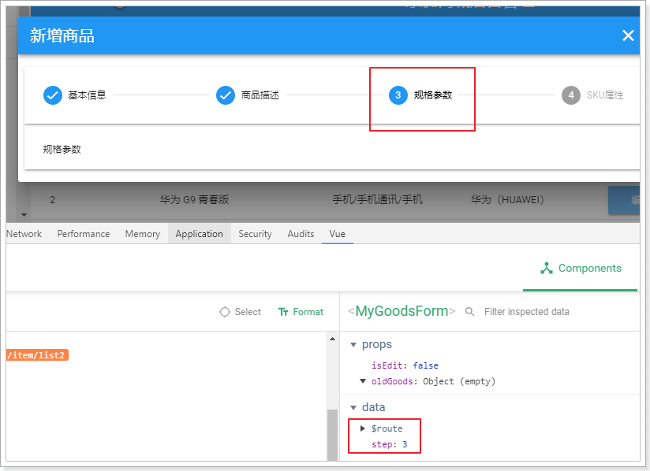


因此，我们需要定义两个按钮，点击后修改step的值，让步骤前进或后退。

那么这两个按钮放哪里？

如果放在GoodsForm内，当表单内容过多时，按钮会被挤压到屏幕最下方，不够友好。最好是能够悬停状态。


所以，按钮必须放到Goods组件中，也就是父组件。

父组件的对话框是一个card，card组件提供了一个滚动效果，scrollable，如果为true，card的内容滚动时，其头部和底部是可以静止的。

```vue
<v-dialog v-model="show" persistent scrollable>
```

现在card的头部是弹框的标题，card的中间就是表单内容。如果我们把按钮放到底部，就可以实现悬停效果。

#### 页面添加按钮

改造Goods的对话框组件：

  ```vue
<v-card-text class="px-5" style="height: 600px">
    <goods-form :oldGoods="oldGoods" />
</v-card-text>
<v-card-actions class="elevation-10">
    <v-spacer></v-spacer>
    <v-btn color="primary">上一步</v-btn>
    <v-btn color="primary">下一步</v-btn>
    <v-spacer></v-spacer>
</v-card-actions>
  ```

- 将内容部分的高度设置为600px
- 在添加两个按钮
- 前后各使用一个占位格实现居中对齐

查看页面：


#### 添加点击事件

现在这两个按钮点击后没有任何反应。我们需要给他们绑定点击事件，来修改GoodsForm中的step的值。

也就是说，父组件要修改子组件的属性状态。想到什么了？

props属性。

我们先在父组件定义一个step属性：

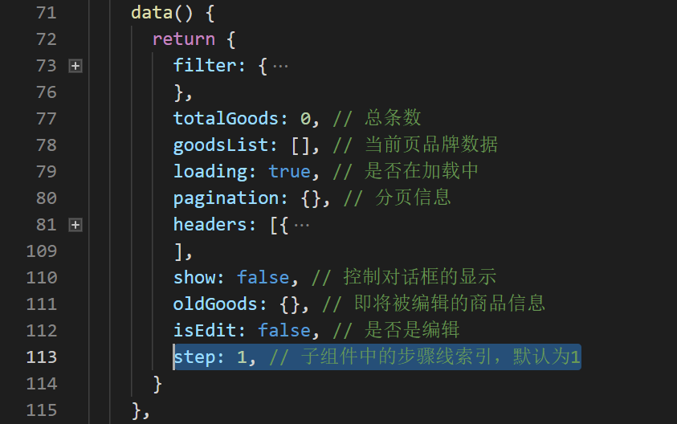

然后在点击事件中修改它：

```js
prev(){
    if(this.step > 1){
        this.step--
    }
},
next(){
    if(this.step < 4){
        this.step++
    }
}
```

页面绑定事件：

```html
<!--底部按钮，用来操作步骤线-->
<v-card-actions class="elevation-10">
    <v-spacer></v-spacer>
    <v-btn @click="prev" color="primary" :disabled="step === 1">上一步</v-btn>
    <v-btn @click="next" color="primary" :disabled="step === 4">下一步</v-btn>
    <v-spacer></v-spacer>
</v-card-actions>
```

然后把step属性传递给子组件：

```html
<!--对话框的内容，表单-->
<v-card-text class="px-3" style="height: 600px">
    <goods-form :oldGoods="oldGoods" :step="step"/>
</v-card-text>
```

子组件中接收属性：

 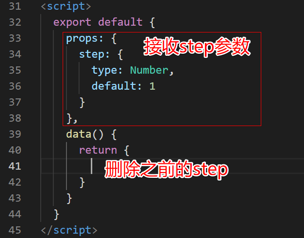

测试效果：

 

## 1.4.商品基本信息

商品基本信息，主要是一些纯文本比较简单的SPU属性，例如：

商品分类、商品品牌、商品标题、商品卖点（子标题），包装清单，售后服务

接下来，我们一一添加这些表单项。

注：这里为了简化，我们就不进行form表单校验了。之前已经讲过。

### 1.4.1.在data中定义Goods属性

首先，我们需要定义一个goods对象，包括商品的上述属性。

```js
data() {
      return {
        goods: {
          categories: {}, // 商品3级分类数组信息
          brand_id: 0, // 品牌id信息
          title: '', // 标题
          sub_title: '', // 子标题
        },
        spu_detail: {
          packing_list: '', // 包装列表
          after_service: '', // 售后服务
          description: '', // 描述
        },
      }
    }
```

注意，这里我们定义了goods, 定义了spu_detail属性，这样更符合数据库的结构。

### 1.4.2.商品分类选框

商品分类选框之前我们已经做过了。是级联选框。直接拿来用：

在第一步的内容里, 使用级联框

```vue 
<v-stepper-content step="1">
    <v-cascader url="/item/category/list" 
                required
                showAllLevels 
                v-model="goods.categories" 
                label="请选择商品分类" 
                />
</v-stepper-content>
```

跟以前使用有一些区别：

- 一个商品只能有一个分类，所以这里去掉了multiple属性
- 商品SPU中要保存3级商品分类，因此我们这里需要选择showAllLevels属性，显示所有3级分类

效果：

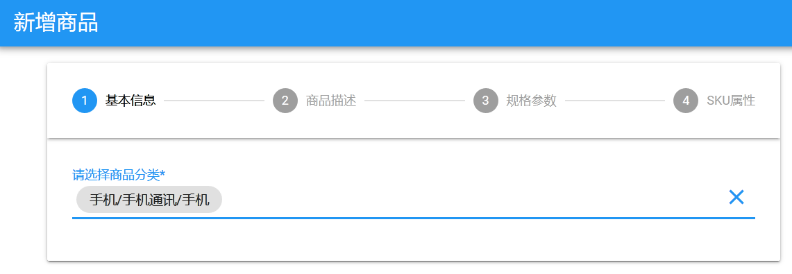

查看goods的属性，三级类目都在：

 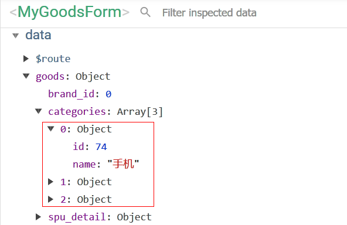

### 1.4.3.品牌选择

#### select组件

品牌不分级别，使用普通下拉选框即可。我们查看官方文档的下拉选框说明：

 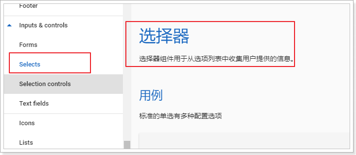

组件名：v-select

比较重要的一些属性：

- item-text：选项中用来展示的字段名，默认是text
- item-value：选项中用来作为value值的字段名，默认是value
- items：待选项的对象数组
- label：提示文本
- multiple：是否支持多选，默认是false

其它次要属性：

- autocomplete：是否根据用户输入的文本进行搜索过滤（自动），默认false
- chips：是否以小纸片方式显示用户选中的项，默认false
- clearable：是否添加清空选项图标，默认是false
- color：颜色
- dense：是否压缩选择框高度，默认false
- editable：是否可编辑，默认false
- hide-details：是否隐藏错误提示，默认false
- hide-selected：是否在菜单中隐藏已选择的项
- hint：提示文本
- 其它基本与`v-text-filed`组件类似，不再一一列举


#### 页面实现

备选项items需要我们去后台查询，而且必须是在用户选择商品分类后去查询。

我们定义一个属性，保存品牌的待选项信息：

 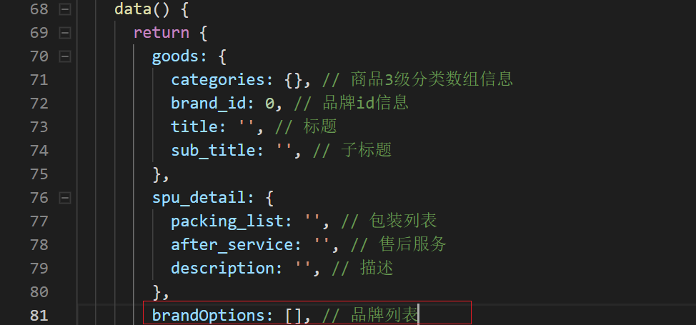

然后编写一个watch，监控goods.categories的变化：

```js
watch: {
    'goods.categories': {
        deep: true,
        handler(val) {
            // 判断商品分类是否存在，存在才查询
            if (val && val.length > 0) {
                // 根据分类查询品牌
                this.$http.get("/item/cate_brand/" + this.goods.categories[2].id)
                    .then(({data}) => {
                    this.brandOptions = data;
                })
            }
        }
    }
}
```

我们的品牌对象包含以下字段：id、name、letter、image。显然item-text应该对应name，item-value应该对应id

因此我们添加一个选框，指定item-text和item-value

```html
<!--品牌-->
<v-select
      :items="brandOptions"
      item-text="name"
      item-value="id"
      label="所属品牌"
      v-model="goods.brand_id"
      required
      autocomplete
      clearable
      dense chips
/>
```


#### 后台提供接口

页面需要去后台查询品牌信息，我们自然需要提供：

规划路由

```php
// 获取分类下的品牌信息
Route::get('/item/cate_brand/:cid', 'api/Brand/cate_brand');
```

实现cate_brand方法

```php
public function cate_brand(Request $request, $cid)
{
    // 根据分类查询分类下所有的品牌id
    $brand_ids = Db::table('tb_category_brand')
        ->where('category_id', $cid)
        ->column('brand_id');
    // 根据品牌id查询所有品牌信息
    $brands = Db::table('tb_brand')
        ->whereIn('id', $brand_ids)
        ->select();

    return json($brands);
}
```


#### 测试效果

 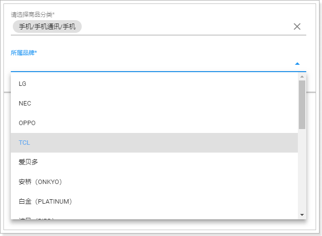

### 1.4.4.标题等其它字段

标题等字段都是普通文本，直接使用`v-text-field`即可：

```html
<v-text-field label="商品标题" v-model="goods.title" :counter="200" required />
<v-text-field label="商品卖点" v-model="goods.sub_title" :counter="200"/>
<v-text-field label="包装清单" v-model="spu_detail.packing_list" :counter="1000" multi-line :rows="3"/>
<v-text-field label="售后服务" v-model="spu_detail.after_service" :counter="1000" multi-line :rows="3"/>
```

一些新的属性：

- counter：计数器，记录当前用户输入的文本字数
- rows：文本域的行数
- multi-line：把单行文本变成文本域

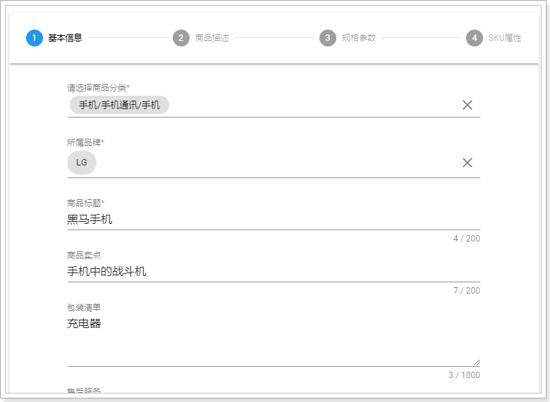


## 1.5.商品描述信息

商品描述信息比较复杂，而且图文并茂，甚至包括视频。

这样的内容，一般都会使用富文本编辑器。

### 1.5.1.什么是富文本编辑器

百度百科：

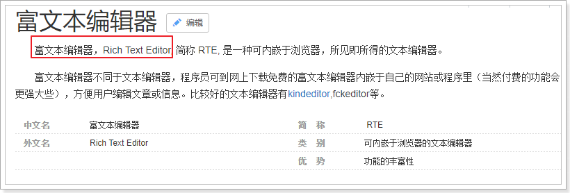

通俗来说：富文本，就是比较丰富的文本编辑器。普通的框只能输入文字，而富文本还能给文字加颜色样式等。

富文本编辑器有很多，例如：KindEditor、Ueditor。但并不原生支持vue

但是我们今天要说的，是一款支持Vue的富文本编辑器：`vue-quill-editor`


### 1.5.2.Vue-Quill-Editor

GitHub的主页：https://github.com/surmon-china/vue-quill-editor

Vue-Quill-Editor是一个基于Quill的富文本编辑器：[Quill的官网](https://quilljs.com/)


### 1.5.3.使用指南

使用非常简单：

第一步：安装，使用npm命令：

```
npm install vue-quill-editor --save
```

第二步：加载，在js中引入：

全局使用：

```js
import Vue from 'vue'
import VueQuillEditor from 'vue-quill-editor'

const options = {}; /* { default global options } */

Vue.use(VueQuillEditor, options); // options可选
```

局部使用：

```js
import 'quill/dist/quill.core.css'
import 'quill/dist/quill.snow.css'
import 'quill/dist/quill.bubble.css'

import {quillEditor} from 'vue-quill-editor'

var vm = new Vue({
    components:{
        quillEditor
    }
})
```


第三步：页面引用：

```html
<quill-editor v-model="spu_detail.description" :options="editorOption"/>
```


### 1.5.4.自定义的富文本编辑器

不过这个组件有个小问题，就是图片上传的无法直接上传到后台，因此我们对其进行了封装，支持了图片的上传。

使用也非常简单：

```html
<v-stepper-content step="2">
    <v-editor v-model="spu_detail.description" upload-url="/upload/image"/>
</v-stepper-content>
```

- upload-url：是图片上传的路径
- v-model：双向绑定，将富文本编辑器的内容绑定到spu_detail.description


### 1.5.6.效果：


## 1.6.规格参数

商品规格参数与商品分类绑定，因此我们需要在用户选择商品分类后，去后台查询对应的规格参数模板。

### 1.6.1.查询商品规格

首先，我们在data中定义变量，记录查询到的规格参数模板：


然后，我们通过watch监控goods.categories的变化，然后去查询规格：

 ```js
// 根据分类查询规格参数
this.$http.get("/item/spec/" + this.goods.categories[2].id).then(resp => {
    // 解构
    const {status, data} = resp
    // 将返回值转换化json对象
    this.specifications = JSON.parse(data)
})
 ```


查看是否查询到：

 

### 1.6.2.页面展示规格属性

获取到了规格参数，还需要把它展示到页面中。

现在查询到的规格参数只有key，并没有值。值需要用户来根据SPU信息填写，因此规格参数最终需要处理为表单。

> 整体结构

整体来看，规格参数是数组，每个元素是一组规格的集合。我们需要分组来展示。比如每组放到一个card中。

> 注意事项：

规格参数中的属性有一些需要我们特殊处理：

 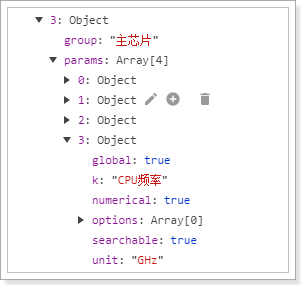

- numerical：是否是数值类型，如果是，把单位补充在页面表单，不允许用户填写，并且要验证用户输入的数据格式
- options：是否有可选项，如果有，则使用下拉选框来渲染。


页面代码：

```html
<!--3、规格参数-->
<v-stepper-content step="3">
    <v-flex class="xs10 mx-auto px-3">
        <!--遍历整个规格参数，获取每一组-->
        <v-card v-for="spec in specifications" :key="spec.group" class="my-2">
            <!--组名称-->
            <v-card-title class="subheading">{{spec.group}}</v-card-title>
            <!--遍历组中的每个属性-->
            <v-card-text v-for="param in spec.params" :key="param.k" class="px-5">
                <!--判断是否有可选项，如果没有，则显示文本框。还要判断是否是数值类型，如果是把unit显示到后缀-->
                <v-text-field v-if="param.options.length <= 0" 
                              :label="param.k" v-model="param.v" :suffix="param.unit || ''"/>
                <!--否则，显示下拉选项-->
                <v-select v-else :label="param.k" v-model="param.v" :items="param.options"/>
            </v-card-text>
        </v-card>
    </v-flex>
</v-stepper-content>
```


效果：

 


## 1.7.SKU特有属性

图片和价格会根据颜色内存大小的不同而变化, 因此我们准备一个页面供用户提供相关的信息

咱们要制作一个这样的页面

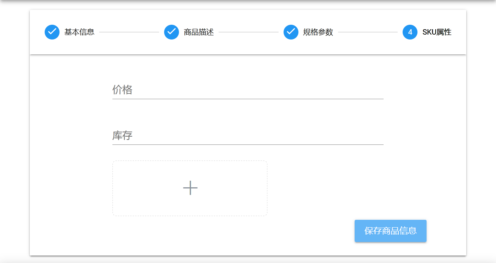

### 1.7.1. 定义sku数据

根据数据表的设计, 这样来定义sku

```js
sku: {
    image: '',
    price: '',
    stock: '',
    own_spec: {}
}
```

- image: 表示商品的图片

- price: 价格

- stock:库存

- own_spce: 是商品的特有属性

  例如

  ```json
  {
      "机身颜色":"金",
      "内存":"4GB",
      "机身存储":"32GB"
  }
  ```

### 1.7.2.编写模板

```vue
<v-stepper-content step="4">
    <v-layout justify-center>
        <v-flex xs8>
            <v-text-field label="价格" v-model="sku.price"></v-text-field>
            <v-text-field label="库存" v-model="sku.stock"></v-text-field>
            <v-upload v-model="sku.image" url="/upload" :multiple="false" :pic-width="250" :pic-height="90" />
        </v-flex>
    </v-layout>
    <v-flex xs3 offset-xs9>
        <v-btn color="info">保存商品信息</v-btn>
    </v-flex>
</v-stepper-content>
```

### 1.7.3.构建own_spec数据

之前咱们分析过, 商品的特有属性其实是属性模板的一部分, 所以, 可以通过watch(监听)specifications的变化来计算own_spec的值

思路分析:

1. 遍历specifications, 依次取出params属性
2. 遍历params属性, 找到其中global为false的元素
3. 添加到own_spec对象中

```js
'specifications': {
    deep: true,
        handler() {
        const temp = {}
        this.specifications.forEach(item => {
            const {params} = item
            params.forEach(param => {
                if (!param.global) {
                    temp[param.k] = param.v
                }
            })
        })
        this.sku.own_spec = temp
    }
}
```

## 1.8.表单提交

### 1.8.1.添加提交按钮

我们在step=4，也就是SKU属性列表页面,末尾， 添加一个提交按钮。

```html
<!--提交按钮-->
<v-flex xs3 offset-xs9>
    <v-btn color="info">保存商品信息</v-btn>
</v-flex>
```


### 1.8.2.点击事件

当用户点击保存，我们就需要对页面的数据进行整理，然后提交到后台服务。

现在我们页面包含了哪些信息呢？我们与数据库对比，看看少什么

- goods：里面包含了SPU的几乎所有信息
  - title：标题
  - subtitle：子标题，卖点
  - categories：分类对象数组，需要进行整理 **
  - brand_id：品牌id
- spu_detail：商品详情
  - packingList：包装清单
  - afterService：售后服务
  - description：商品描述
  - 缺少全局规格属性specifications **
  - 缺少特有规格属性模板spec_template **
- skus：包含了sku列表的几乎所有信息
  - price：价格，需要处理为以分为单位
  - stock：库存
  - enable：是否启用
  - images：图片
  - ows_spec: 特有规格
- specifications：全局规格参数的键值对信息


在页面绑定点击事件：

```html
<!--提交按钮-->
<v-flex xs3 offset-xs9>
    <v-btn color="info" @click="submit">保存商品信息</v-btn>
</v-flex>
```

编写submit方法

```js
submit() {
    // 1. 组织spu数据
    const {categories:[{id:cid1},{id:cid2},{id:cid3}]} = this.goods
    this.goods['cid1'] = cid1
    this.goods['cid2'] = cid2
    this.goods['cid3'] = cid3
    // 2. 组织spu_detail数据


    this.$http.post('/item/goods/spu', this.goods).then(resp => {
        const {status, data} = resp

        if (status == 200) {
            // 3. 继续发请求添加sku和spu_detail
            // 这里是有些小瑕疵的, 这样写spu与sku之间就是一对一
            this.$http.post('/item/goods/detail/'+data.id, this.spu_detail)
            this.$http.post('/item/goods/sku/'+data.id, this.sku)
        }
    })
}
```

### 1.8.3.后台实现接口(作业)


### 补充: 商品表单复杂版

在下面的GoodsForm.vue实现了spu与sku的一对多, 但是算法过于复杂, 对刚入门的新手不太友好, 如果对自己的编程和逻辑能力有信心, 可以尝试挑战一下. 

```vue
<template>
  <v-stepper v-model="step">
    <v-stepper-header>
      <v-stepper-step :complete="step > 1" step="1">基本信息</v-stepper-step>
      <v-divider/>
      <v-stepper-step :complete="step > 2" step="2">商品描述</v-stepper-step>
      <v-divider/>
      <v-stepper-step :complete="step > 3" step="3">规格参数</v-stepper-step>
      <v-divider/>
      <v-stepper-step step="4">SKU属性</v-stepper-step>
    </v-stepper-header>
    <v-stepper-items>
      <!--1、基本信息-->
      <v-stepper-content step="1">   
        <v-flex class="xs10 mx-auto">
          <v-form v-model="valid" ref="basic">
            <v-layout row>
              <v-flex xs5>
                <!--商品分类-->
                <v-cascader
                  url="/item/category/list"
                  required
                  showAllLevels
                  v-model="goods.categories"
                  label="请选择商品分类"/>
              </v-flex>
              <v-spacer/>
              <v-flex xs5>
                <!--品牌-->
                <v-select
                  :items="brandOptions"
                  item-text="name"
                  item-value="id"
                  label="所属品牌"
                  v-model="goods.brandId"
                  required
                  autocomplete
                  clearable
                  dense chips
                  :rules="[v => !!v || '品牌不能为空']"
                />
              </v-flex>
            </v-layout>
            <v-text-field label="商品标题" v-model="goods.title" :counter="200" required :rules="[v => !!v || '商品标题不能为空']"/>
            <v-text-field label="商品卖点" v-model="goods.subTitle" :counter="200"/>
            <v-text-field label="包装清单" v-model="goods.spuDetail.packingList" :counter="1000" multi-line :rows="3"/>
            <v-text-field label="售后服务" v-model="goods.spuDetail.afterService" :counter="1000" multi-line :rows="3"/>
          </v-form>       
        </v-flex>
      </v-stepper-content>
      <!--2、商品描述-->
      <v-stepper-content step="2">
        <v-editor v-model="goods.spuDetail.description" upload-url="/upload/image"/>
      </v-stepper-content>
      <!--3、规格参数-->
      <v-stepper-content step="3">
        <v-flex class="xs10 mx-auto px-3">
          <!--遍历整个规格参数，获取每一组-->
          <v-card v-for="spec in specifications" :key="spec.group" class="my-2">
            <!--组名称-->
            <v-card-title class="subheading">{{spec.group}}</v-card-title>
            <!--遍历组中的每个属性，并判断是否是全局属性，不是则不显示-->
            <v-card-text v-for="param in spec.params" :key="param.k" v-if="param.global" class="px-5">
              <!--判断是否有可选项，如果没有，则显示文本框。还要判断是否是数值类型，如果是把unit显示到后缀-->
              <v-text-field v-if="param.options.length <= 0" :label="param.k" v-model="param.v"
                            :suffix="param.unit || ''"/>
              <!--否则，显示下拉选项-->
              <v-select v-else :label="param.k" v-model="param.v" :items="param.options"/>
            </v-card-text>
          </v-card>
        </v-flex>
      </v-stepper-content>
      <!--4、SKU属性-->
      <v-stepper-content step="4">
        <v-flex class="mx-auto">
          <!--遍历特有规格参数-->
          <v-card flat v-for="spec in specialSpecs" :key="spec.k">
            <!--特有参数的标题-->
            <v-card-title class="subheading">{{spec.k}}:</v-card-title>
            <!--特有参数的待选项，需要判断是否有options，如果没有，展示文本框，让用户自己输入-->
            <v-card-text v-if="spec.options.length <= 0" class="px-5">
              <div v-for="i in spec.selected.length+1" :key="i" class="layout row">
                <v-text-field :label="'新的' + spec.k + ':'" class="flex xs10" auto-grow
                              v-model="spec.selected[i-1]" v-bind:value="i"/>
                <v-spacer/>
                <v-btn @click="spec.selected.splice(i-1,1)" v-if="i <= spec.selected.length" icon>
                  <i class="el-icon-delete"/>
                </v-btn>
              </div>
            </v-card-text>
            <!--如果有options，需要展示成多个checkbox-->
            <v-card-text v-else class="container fluid grid-list-xs">
              <v-layout row wrap class="px-5">
                <v-checkbox color="primary" v-for="o in spec.options" :key="o" class="flex xs3"
                            :label="o" v-model="spec.selected" :value="o"/>
              </v-layout>
            </v-card-text>
          </v-card>
          <v-card>
            <!--标题-->
            <v-card-title class="subheading">SKU列表</v-card-title>
            <!--SKU表格，hide-actions因此分页等工具条-->
            <v-data-table :items="skus" :headers="headers" hide-actions item-key="indexes">
              <template slot="items" slot-scope="props">
                <tr @click="props.expanded = !props.expanded">
                  <!--价格和库存展示为文本框-->
                  <td v-for="(v,k) in props.item" :key="k" v-if="['price', 'stock'].includes(k)"
                      class="text-xs-center">
                    <v-text-field single-line v-model="props.item[k]" @click.stop=""/>
                  </td>
                  <!--enable展示为checkbox-->
                  <td class="text-xs-center" v-else-if="k === 'enable'">
                    <v-checkbox v-model="props.item[k]"/>
                  </td>
                  <!--indexes和images不展示，其它展示为普通文本-->
                  <td class="text-xs-center" v-else-if="!['indexes','images'].includes(k)">{{v}}</td>
                </tr>
              </template>
              <!--点击表格后展开-->
              <template slot="expand" slot-scope="props">
                <v-card class="elevation-2 flex xs11 mx-auto my-2">
                  <!--图片上传组件-->
                  <v-upload v-model="props.item.images" url="/upload/image"/>
                </v-card>
              </template>
            </v-data-table>
          </v-card>
        </v-flex>
        <!--提交按钮-->
        <v-flex xs3 offset-xs9>
          <v-btn color="info" @click="submit">保存商品信息</v-btn>
        </v-flex>
      </v-stepper-content>
    </v-stepper-items>
  </v-stepper>
</template>

<script>
export default {
  name: "goods-form",
  props: {
    oldGoods: {
      type: Object
    },
    isEdit: {
      type: Boolean,
      default: false
    },
    step: {
      type: Number,
      default: 1
    }
  },
  data() {
    return {
      valid:false,
      goods: {
        categories: [], // 商品分类信息
        brandId: 0, // 品牌id信息
        title: "", // 标题
        subTitle: "", // 子标题
        spuDetail: {
          packingList: "", // 包装列表
          afterService: "", // 售后服务
          description: "" // 商品描述
        }
      },
      brandOptions: [], // 品牌列表
      specifications: [], // 规格参数的模板
      specialSpecs: [] // 特有规格参数模板
    };
  },
  methods: {
    submit() {
      // 表单校验。
      if(!this.$refs.basic.validate){
        this.$message.error("请先完成表单内容！");
      }
      // 先处理goods，用结构表达式接收,除了categories外，都接收到goodsParams中
      const {
        categories: [{ id: cid1 }, { id: cid2 }, { id: cid3 }],
        ...goodsParams
      } = this.goods;
      // 处理规格参数
      const specs = this.specifications.map(({ group, params }) => {
        const newParams = params.map(({ options, ...rest }) => {
          return rest;
        });
        return { group, params: newParams };
      });
      // 处理特有规格参数模板
      const specTemplate = {};
      this.specialSpecs.forEach(({ k, selected }) => {
        specTemplate[k] = selected;
      });
      // 处理sku
      const skus = this.skus
        .filter(s => s.enable)
        .map(({ price, stock, enable, images, indexes, ...rest }) => {
          // 标题，在spu的title基础上，拼接特有规格属性值
          const title = goodsParams.title + " " + Object.values(rest).join(" ");
          return {
            price: this.$format(price), // 价格需要格式化
            stock,
            enable,
            indexes,
            title, // 基本属性
            images: !images ? "" : images.join(","), // 图片
            ownSpec: JSON.stringify(rest) // 特有规格参数
          };
        });
      Object.assign(goodsParams, {
        cid1,
        cid2,
        cid3, // 商品分类
        skus // sku列表
      });
      goodsParams.spuDetail.specifications = JSON.stringify(specs);
      goodsParams.spuDetail.specTemplate = JSON.stringify(specTemplate);

      this.$http({
        method: this.isEdit ? "put" : "post",
        url: "/item/goods",
        data: goodsParams
      })
        .then(() => {
          // 成功，关闭窗口
          this.$emit("close");
          // 提示成功
          this.$message.success("保存成功了");
        })
        .catch(() => {
          this.$message.error("保存失败！");
        });
    }
  },
  watch: {
    oldGoods: {
      deep: true,
      handler(val) {
        if (!this.isEdit) {
          Object.assign(this.goods, {
            categories: null, // 商品分类信息
            brandId: 0, // 品牌id信息
            title: "", // 标题
            subTitle: "", // 子标题
            spuDetail: {
              packingList: "", // 包装列表
              afterService: "", // 售后服务
              description: "" // 商品描述
            }
          });
          this.specifications = [];
        } else {
          this.goods = Object.deepCopy(val);

          // 先得到分类名称
          const names = val.cname.split("/");
          // 组织商品分类数据
          this.goods.categories = [
            { id: val.cid1, name: names[0] },
            { id: val.cid2, name: names[1] },
            { id: val.cid3, name: names[2] }
          ];

          // 将skus处理成map
          const skuMap = new Map();
          val.skus.forEach(sku => {
            skuMap.set(sku.indexes, sku);
          });
          this.goods.skus = skuMap;
        }
      }
    },
    "goods.categories": {
      deep: true,
      handler(val) {
        // 判断商品分类是否存在，存在才查询
        if (val && val.length > 0) {
          // 根据分类查询品牌
          this.$http
            .get("/item/brand/cid/" + this.goods.categories[2].id)
            .then(({ data }) => {
              this.brandOptions = data;
            });
          // 根据分类查询规格参数
          this.$http
            .get("/item/spec/" + this.goods.categories[2].id)
            .then(({ data }) => {
              // 保存全部规格
              this.specifications = data;

              // 判断当前是否是编辑状态，如果是，开始对规格参数进行回显
              if (this.isEdit) {
                // 得到回显数据中的规格模板, 需要进行json反序列化
                const specs = JSON.parse(this.goods.spuDetail.specifications);
                // 遍历规格参数，并且回显
                this.specifications.forEach((spec, i) => {
                  spec.params.forEach((param, j) => {
                    param.v = specs[i].params[j].v;
                  });
                });
              }

              // 对特有规格进行筛选
              const temp = [];
              data.forEach(({ params }) => {
                params.forEach(({ k, options, global }) => {
                  if (!global) {
                    temp.push({
                      k,
                      options,
                      selected: []
                    });
                  }
                });
              });
              this.specialSpecs = temp;

              // 判断是否是编辑，如果是，对特有规格属性进行回显
              if (this.isEdit) {
                // 得到回显数据中的特有规格属性值:
                const template = JSON.parse(this.goods.spuDetail.specTemplate);
                // 遍历特有规格参数，回显数据
                this.specialSpecs.forEach(s => {
                  s.selected = template[s.k];
                });
              }
            });
        }
      }
    }
  },
  computed: {
    skus() {
      // 过滤掉用户没有填写数据的规格参数
      const arr = this.specialSpecs.filter(s => s.selected.length > 0);
      // 通过reduce进行累加笛卡尔积
      return arr.reduce(
        (last, spec, index) => {
          const result = [];
          last.forEach(o => {
            spec.selected.forEach((option, i) => {
              const obj = {};
              Object.assign(obj, o);
              obj[spec.k] = option;
              // 拼接当前这个特有属性的索引
              obj.indexes = (o.indexes || "") + "_" + i;
              if (index === arr.length - 1) {
                // 如果发现是最后一组，则添加价格、库存等字段
                Object.assign(obj, {
                  price: 0,
                  stock: 0,
                  enable: false,
                  images: []
                });
                // 去掉索引字符串开头的下划线
                obj.indexes = obj.indexes.substring(1);
                if (this.isEdit) {
                  // 如果是编辑，则回填sku信息
                  const sku = this.goods.skus.get(obj.indexes);
                  if (sku != null) {
                    const { price, stock, enable, images } = sku;
                    Object.assign(obj, {
                      price: this.$format(price),
                      stock,
                      enable,
                      images: images ? images.split(",") : []
                    });
                  }
                }
              }
              result.push(obj);
            });
          });
          return result;
        },
        [{}]
      );
    },
    headers() {
      if (this.skus.length <= 0) {
        return [];
      }
      const headers = [];
      Object.keys(this.skus[0]).forEach(k => {
        let value = k;
        if (k === "price") {
          // enable，表头要翻译成“价格”
          k = "价格";
        } else if (k === "stock") {
          // enable，表头要翻译成“库存”
          k = "库存";
        } else if (k === "enable") {
          // enable，表头要翻译成“是否启用”
          k = "是否启用";
        } else if (k === "indexes" || k === "images") {
          // 图片和索引不在表格中展示
          return;
        }
        headers.push({
          text: k,
          align: "center",
          sortable: false,
          value
        });
      });
      return headers;
    }
  }
};
</script>

<style scoped>
</style>

```

核心思想

1. 在添加一个spu时, 可以动态的添加多个sku
2. 根据特有属性, 计算笛卡尔积
3. 动态生成表格, 计算indexes下标
4. 一次将所有数据提交到后台处理

