# 0.学习目标

- 了解商品编辑页面回显
- 能够独立实现商品编辑后台
- 独立搭建前台系统页面

# 1.搭建前台首页

## 1.1.创建Home模块

使用ctrl+`打开命令行, 执行如下命令

```php
php think build --module home
```

执行完成后, 会在application目录下自动生成一个home目录

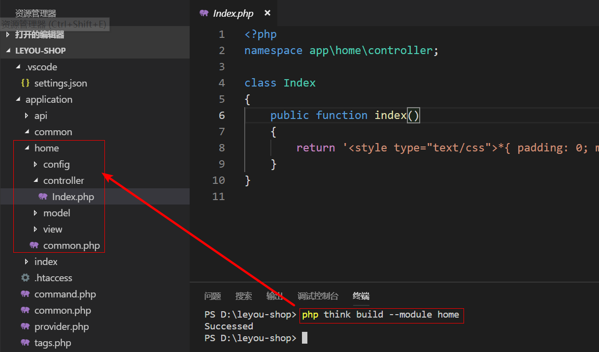

## 1.2.集成前台首页

### 1.2.1.复制静态页面

在home/view下创建一个跟控制器同名的目录Index, 再创建一个跟方法同名的文件index.html

找到前台首页的静态页面, 复制到index.html中

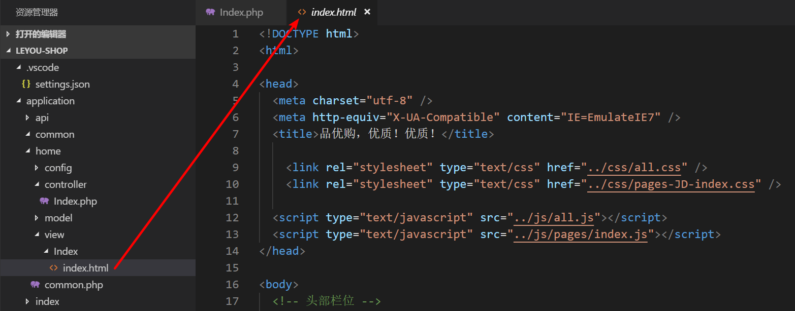

### 1.2.2.渲染视图

在控制器中, 有两种方法渲染视图, 参考文档: https://www.kancloud.cn/manual/thinkphp5_1/354065

- 使用基类控制器的fetch方法
- 使用view()助手函数

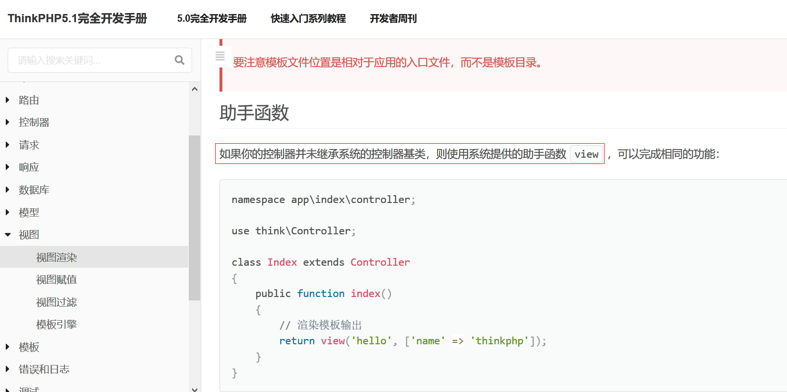

目前, 咱们还没有继承Controller的基类, 所以直接使用view()助手函数

示例代码:

```php
<?php
namespace app\home\controller;

class Index
{
    public function index()
    {
        return view();
    }
}
```

默认情况下, 不带任何参数, 系统会去`application/模块名/view/控制器名/`下找跟方法同名的文件

因此, 就是view/Index/index.html

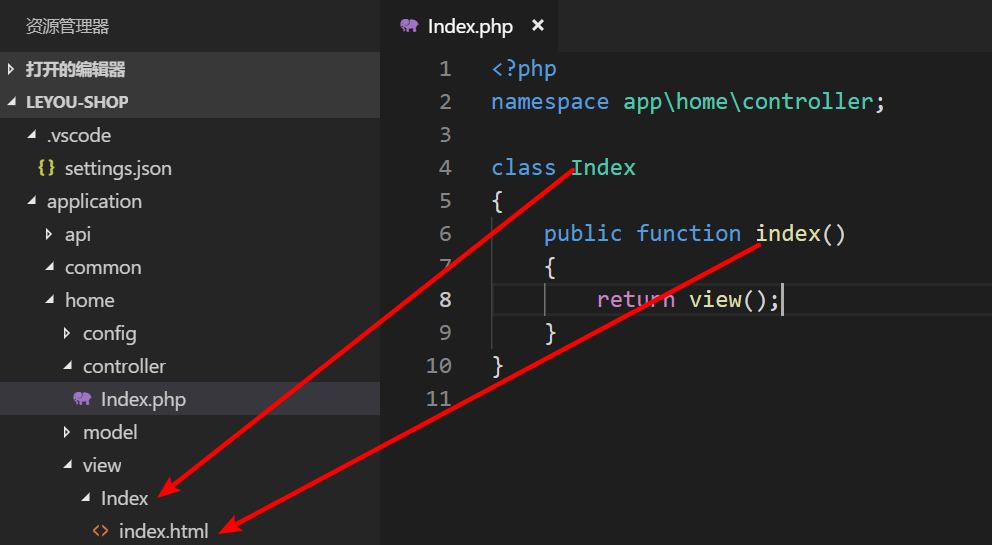

在浏览器中访问这个路由: http://local.leyou.com/home/index/index

- home: 模块名
- index: 控制器名, 默认值为index
- index: 方法名, 默认值为index

测试效果如下:

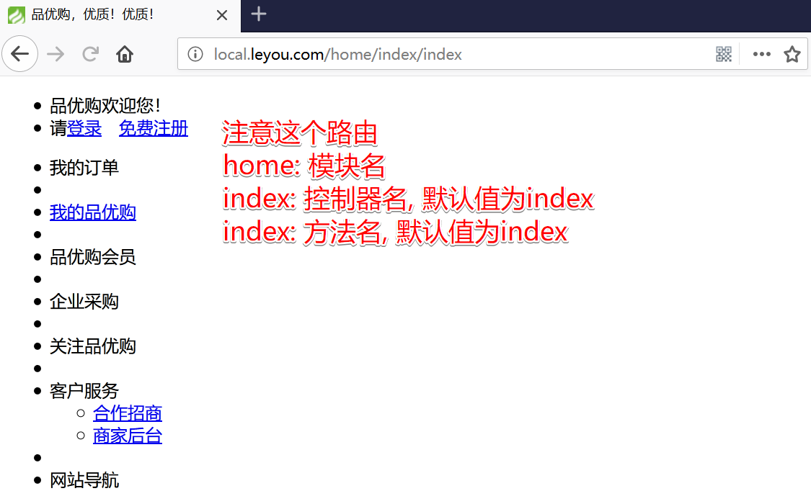

另一种写法:

```php
<?php
namespace app\home\controller;
// 1.引入基类Controller
use think\Controller;
// 2.继承基类
class Index extends Controller
{
    public function index()
    {
        // 3. 调用基类的fetch方法
        return $this->fetch();
    }
}
```

### 1.2.3.解决样式问题

我们发现, 上面的页面没有正常显示

在浏览器下按F12, 打开网络工具, 查看发现原因是, css/js文件没找到

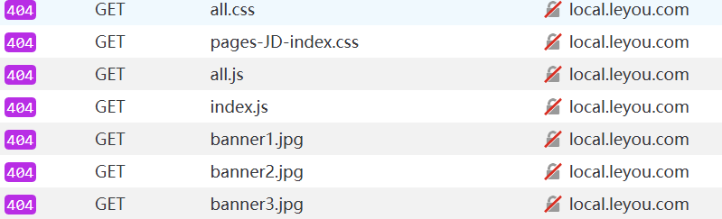

在public/static目录下创建一个跟模块同名的目录home

复制静态资源文件到public/static/home目录下

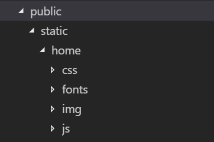

找到view/Index/index.html

- 将所有../css改成/static/home/css
- 将所有../js改成/static/home/js
- 将所有../img改成/static/home/js

由于public就是网站的根目录, 因些这里可以直接使用/static

测试效果如下:

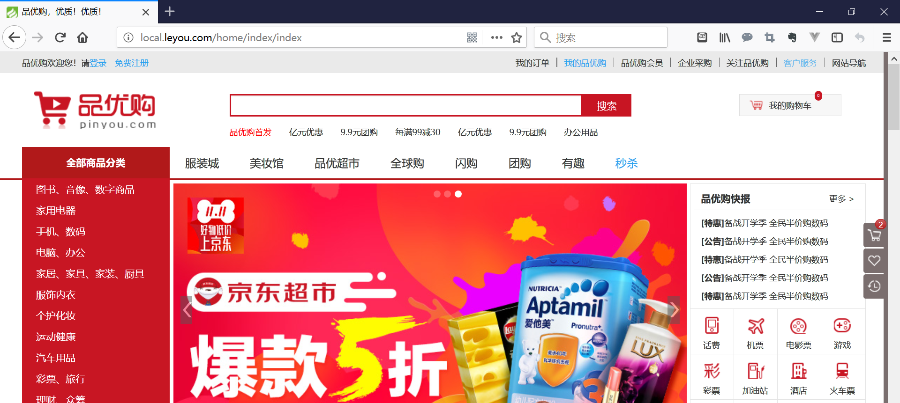

# 2.用户注册

## 2.1.需求分析

当用户点击注册时, 显示注册页面

输入手机号, 发送手机验证码, 完成注册

1. 集成手机验证码
2. 加盐加密

## 2.2.思路分析

1. 入口链接, 与规划路由(/home/login/register)
2. 当以get方法请求Login控制器的register方法时渲染页面
3. 当以post方法请求Login控制器的register方法时处理表单提交
4. 调用第三方接口(阿里大于)完成手机验证码发送
5. 完成新用户入库

## 2.3.规划路由

在index.html中修改"注册"的入口链接

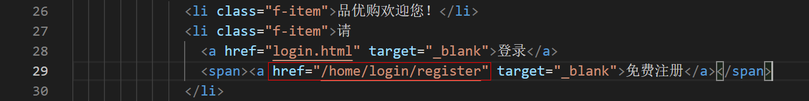

### 2.3.1.根据路由创建控制器

使用ctrl+`打开命令行, 执行如下命令

```php
php think make:controller home/Login --plain
```

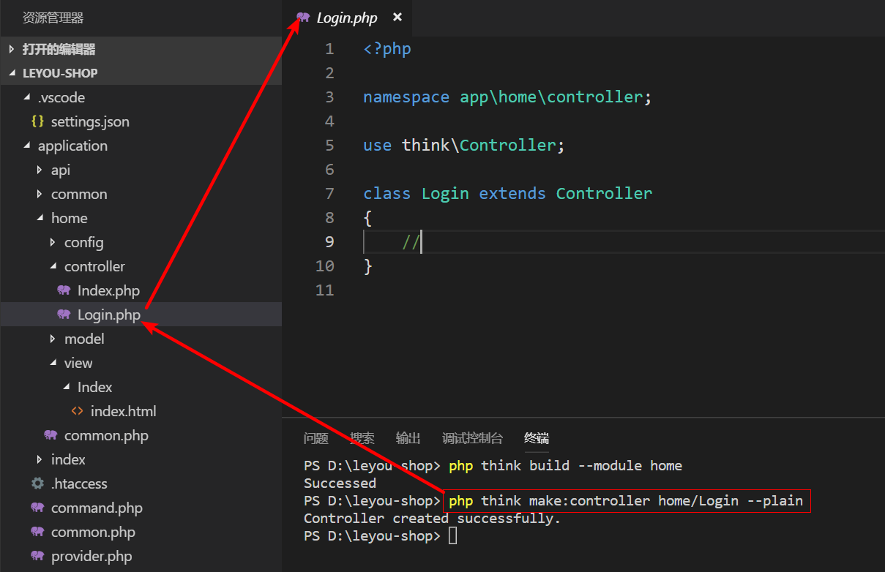

### 2.3.2.编写register方法

```php
<?php

namespace app\home\controller;

use think\Controller;
// 1.引入类元素
use think\Request;

class Login extends Controller
{
    // 2. 定义register方法
    public function register(Request $request)
    {
        return "home-Login-register";
    }
}
```

1. 引入类元素, 可以在register中使用依赖注入

2. 定义register方法

   在register方法, 返回一点测试数据

### 2.3.3.测试

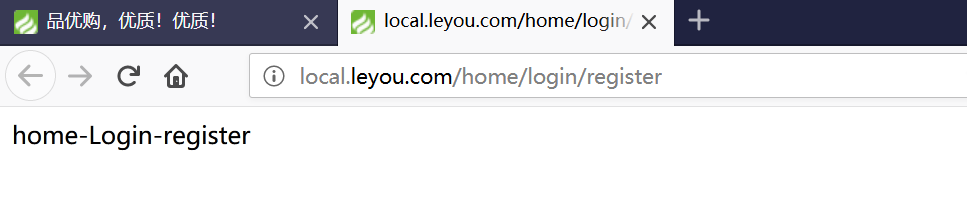

## 2.4.渲染视图

首先判断请求方式

- 如果是GET请求, 就渲染视图
- 如果是POST请求, 就处理数据. 新增入库

```php
// 2. 定义register方法
public function register(Request $request)
{
    if ($request->method() == 'GET') {
        // 渲染页面
        return view();
    }else if ($request->method() == 'POST') {
        // 处理数据, 新增入库
    }
}
```

在这里, 可以使用请求类型判断, 参考文档: https://www.kancloud.cn/manual/thinkphp5_1/353988

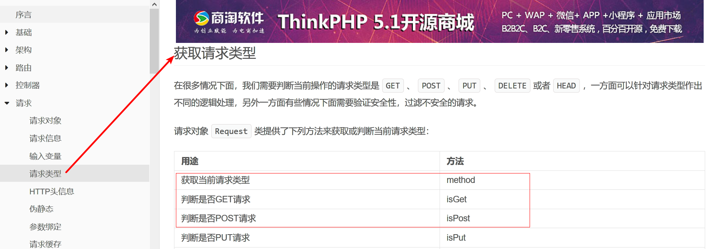

在view下创建Login/register.html, 复制模板内容, 并替换css/js路径

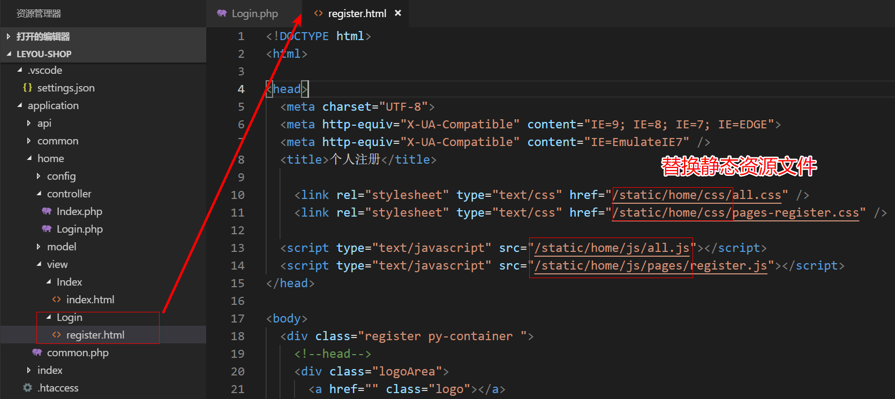

测试如下:

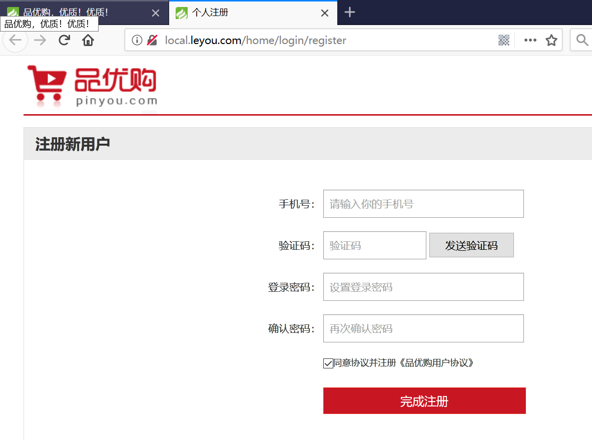

## 2.5.发送手机验证码

这里, 我们使用第三方的短信接口完成发送验证码, 提供这种服务的公司很多, 我们选择**阿里云通信**, 之前叫阿里大于

官网: https://dayu.aliyun.com/

具体使用, 见文档<阿里短信>

## 2.6.集成阿里大于到项目中

在这里, 已经有热心的网友帮我们做成了composer包, 我们使用composer安装一下就可以了

https://blog.csdn.net/qq_21119513/article/details/80500263

### 2.6.1.安装

使用ctrl+`打开命令行, 执行如下命令

```shell
composer require hao/alidayu
```

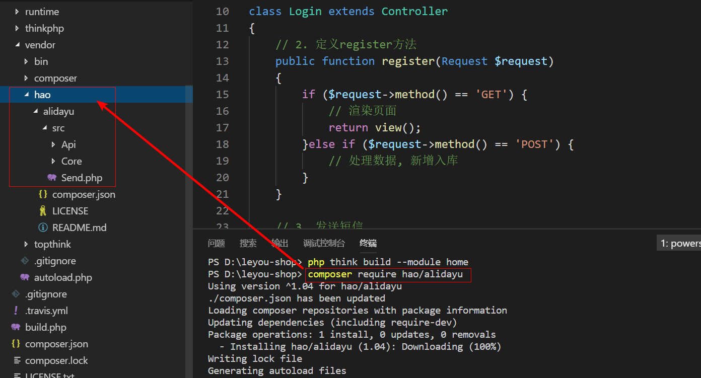

执行命令后, 会在composer下生成hao/alidayu目录

### 2.6.2.配置

找到配置文件在application/home/config下创建app.php配置文件

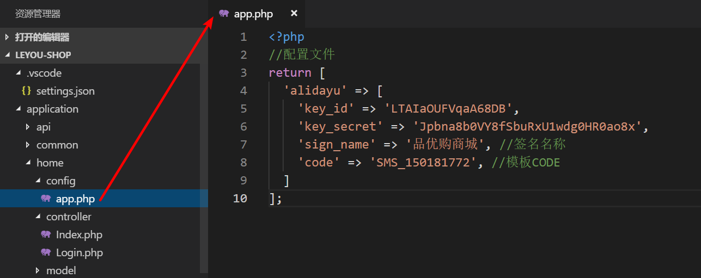

示例代码:

```php
<?php
//配置文件
return [
  'alidayu' => [
    'key_id' => 'LTAIaOUFVqaA68DB',
    'key_secret' => 'Jpbna8b0VY8fSbuRxU1wdg0HR0ao8x',
    'sign_name' => '品优购商城', //签名名称
    'code' => 'SMS_150181772', //模板CODE
  ]
];
```

### 2.6.3.发送短信

请求方式: post

请求路由: /home/login/sendCode

请求参数: phone(手机号)

编写一个方法, 发送一条短信, 并测试

```php
// 3. 发送短信
public function sendCode(Request $request)
{
    // 读取配置文件
    $config = config('alidayu');
    // 实例化对象
    $send = new \Aliyun\Send($config);
    // 生成4位随机数
    $code = mt_rand(1000, 9999);

    $data = [
        'code' => $code,
        'product' => 'xxx'
    ];
    $mobile = $request->phone;

    // 发送数据
    $res = $send->sendSms($mobile,$data);

    // 判断结果
    if ($res === true) {
        return json(['status'=>200, 'msg'=>'发送成功', 'data'=>$code]);
    }else {
        return json(['status'=>500]);
    }
}
```

### 2.6.4.使用ajax发送请求

在register.html中, 编写如下代码

``` js
<script>
	$(function () {
		// 使用jquery绑定按钮的点击事件
		$('#dyMobileButton').click(function () {
			// 获取手机号的值
			var phone = $('#phone').val()

			if (phone == '') {
				alert('请填写手机号')
				return
			}
			// 发送ajax请求
			$.ajax({
				url: '/home/login/sendCode',
				type: 'post',
				data: {phone: phone},
				dataType: 'json',
				success: function (resp) {
					alert(resp.msg)
				}
			})
		})
	})
</script>
```

### 2.6.5.制作倒计时效果

```js
//倒计时效果
var time = 60;
//设置定时器
var interval = setInterval(function(){
    //将标签的内容 改为“重新发送：59s”
    time--;
    if(time > 0){
        $('#dyMobileButton').html('重新发送：' + time + 's');
        $('#dyMobileButton').attr('disabled', true);
    }
    if(time == 0){
        //停止倒计时
        $('#dyMobileButton').html('发送验证码');
        $('#dyMobileButton').attr('disabled', false);
        //清除定时器
        clearInterval(interval);
    }
}, 1000);
```

## 2.7.表单提交

使用jq提交form表单

```js
// 绑定"完成注册"的点击事件
$('#reg_btn').click(function() {
    // 触发表单的提交
    $('#reg_form').submit()
})
```

当点击"完成注册"时, 浏览器会发送一个post请求

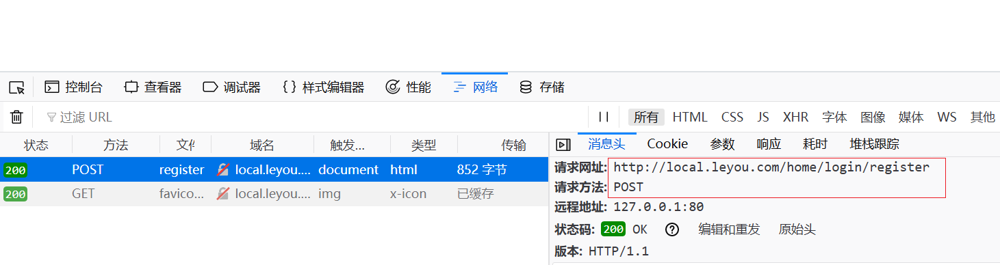

根据上述的路由, tp会找到home模块下Login控制器, register方法, 并且, 请求方式是POST

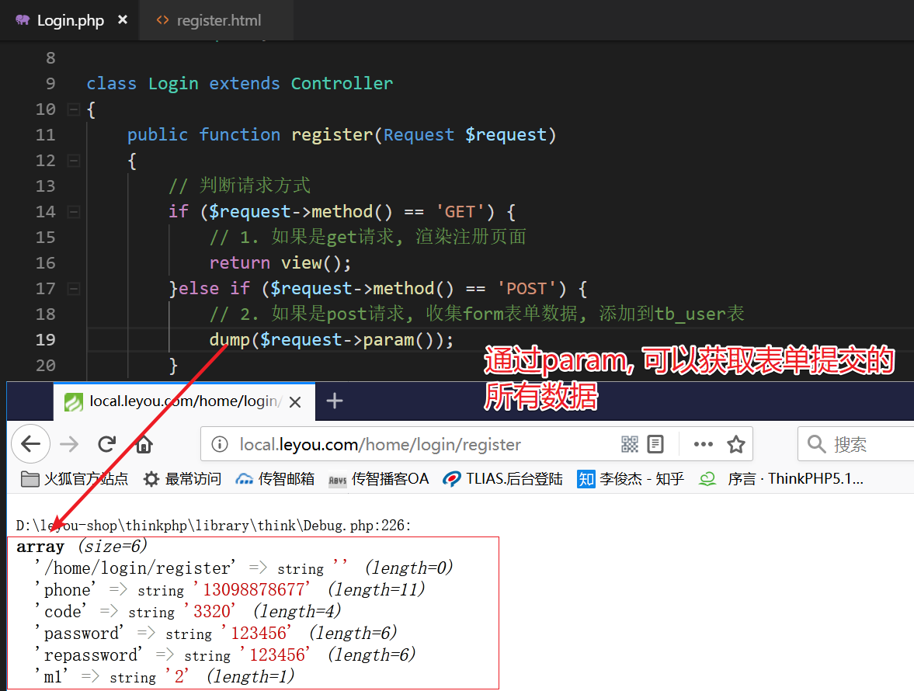

register.html完整代码:

```html
<!DOCTYPE html>
<html>

<head>
	<meta charset="UTF-8">
	<meta http-equiv="X-UA-Compatible" content="IE=9; IE=8; IE=7; IE=EDGE">
	<meta http-equiv="X-UA-Compatible" content="IE=EmulateIE7" />
	<title>个人注册</title>

    <link rel="stylesheet" type="text/css" href="/static/home/css/all.css" />
    <link rel="stylesheet" type="text/css" href="/static/home/css/pages-register.css" />
    
	<script type="text/javascript" src="/static/home/js/all.js"></script>
	<script type="text/javascript" src="/static/home/js/pages/register.js"></script>
</head>

<body>
	<div class="register py-container ">
		<!--head-->
		<div class="logoArea">
			<a href="" class="logo"></a>
		</div>
		<!--register-->
		<div class="registerArea">
			<h3>注册新用户<span class="go">我有账号，去<a href="login.html" target="_blank">登陆</a></span></h3>
			<div class="info">
				<form action="/home/login/register" method="post" id="reg_form" class="sui-form form-horizontal">
					<div class="control-group">
						<label class="control-label">手机号：</label>
						<div class="controls">
							<input type="text" id="phone" name="phone" placeholder="请输入你的手机号" class="input-xfat input-xlarge">
							<span class="error"></span>
						</div>
					</div>
					<div class="control-group">
						<label for="inputPassword" class="control-label">验证码：</label>
						<div class="controls">
							<input type="text" id="code" name="code" placeholder="验证码" class="input-xfat input-xlarge" style="width:120px">
							<button type="button" class="btn-xlarge" id="dyMobileButton">发送验证码</button>
							<span class="error"></span>
						</div>
					</div>
					<div class="control-group">
						<label for="inputPassword" class="control-label">登录密码：</label>
						<div class="controls">
							<input type="password" id="password" name="password" placeholder="设置登录密码" class="input-xfat input-xlarge">
							<span class="error"></span>
						</div>
					</div>
					<div class="control-group">
						<label for="inputPassword" class="control-label">确认密码：</label>
						<div class="controls">
							<input type="password" id="repassword" name="repassword" placeholder="再次确认密码" class="input-xfat input-xlarge">
							<span class="error"></span>
						</div>
					</div>
					<div class="control-group">
						<label for="inputPassword" class="control-label">&nbsp;&nbsp;&nbsp;&nbsp;&nbsp;&nbsp;</label>
						<div class="controls">
							<input name="m1" type="checkbox" value="2" checked=""><span>同意协议并注册《品优购用户协议》</span>
						</div>
					</div>
					<div class="control-group">
						<label class="control-label"></label>
						<div class="controls btn-reg">
							<a id="reg_btn" class="sui-btn btn-block btn-xlarge btn-danger reg-btn" href="javascript:;">完成注册</a>
						</div>
					</div>
				</form>
				<div class="clearfix"></div>
			</div>
		</div>
		<!--foot-->
		<div class="py-container copyright">
			<ul>
				<li>关于我们</li>
				<li>联系我们</li>
				<li>联系客服</li>
				<li>商家入驻</li>
				<li>营销中心</li>
				<li>手机品优购</li>
				<li>销售联盟</li>
				<li>品优购社区</li>
			</ul>
			<div class="address">地址：北京市昌平区建材城西路金燕龙办公楼一层 邮编：100096 电话：400-618-4000 传真：010-82935100</div>
			<div class="beian">京ICP备08001421号京公网安备110108007702
			</div>
		</div>
	</div>
</body>
<script>
	$(function () {
		// 使用jquery绑定按钮的点击事件
		$('#dyMobileButton').click(function () {
			// 获取手机号的值
			var phone = $('#phone').val()

			if (phone == '') {
				alert('请填写手机号')
				return
			}
			// 发送ajax请求
			$.ajax({
				url: '/home/login/sendCode',
				type: 'post',
				data: {phone: phone},
				dataType: 'json',
				success: function (resp) {
					alert(resp.msg)
				}
			})

			//倒计时效果
			var time = 60;
			//设置定时器
			var interval = setInterval(function(){
					//将标签的内容 改为“重新发送：59s”
					time--;
					if(time > 0){
							$('#dyMobileButton').html('重新发送：' + time + 's');
							$('#dyMobileButton').attr('disabled', true);
					}
					if(time == 0){
							//停止倒计时
							$('#dyMobileButton').html('发送验证码');
							$('#dyMobileButton').attr('disabled', false);
							//清除定时器
							clearInterval(interval);
					}
			}, 1000);
		})
		
		//提交表单
		$('#reg_btn').click(function(){
			$('form').submit();
		});
	})
</script>
</html>
```

## 2.8.后端处理

### 2.8.1.接收参数

```php
// 接收参数
$data = $request->param();
```

### 2.8.2.表单验证

由于前端的验证容易被绕过, 对于用户注册这种比较私密的信息, 我们一般使用后台验证

定义验证规则

```php
// 验证规则
$rules = [
    'phone' => 'require|regex:\d{11}|unique:user',
    'code' => 'require|regex:\d{4}',
    'password' => 'require|length:6,16|confirm:repassword'
];
```

phone/code/password是表单中的name属性, 后面对应的是规则

TP的默认规则见文档:

验证---内置规则: https://www.kancloud.cn/manual/thinkphp5_1/354107#_232

- requrie: 必填
- regex: 正则
- unique:对应的user表(不带表前缀)中phone字段不能重复
- length:长度
- confirm:跟指定的字段一致

定义提示信息:

```php
// 提示信息
$msg = [
    'phone.require' => '手机号不能为空',
    'phone.regex' => '手机号格式不正确',
    'phone.unique' => '手机号已被注册',
    'code.require' => '验证码不能为空',
    'code.regex' => '验证码格式不正确',
    'password.require' => '密码不能为空',
    'password.length' => '密码长度必须在6~16个字符',
    'password.confirm' => '两次密码输入不一致',
];
```

验证并判断

```php
// 实例化Validate对象
$valid = new \think\Validate($rules, $msg);

if (!$valid->check($data)) {
    //验证不通过
    $this->error($valid->getError());
}

```

如何判断验证码是否正确?

1) 当产生4位随机数并发送成功时, 保存到session中

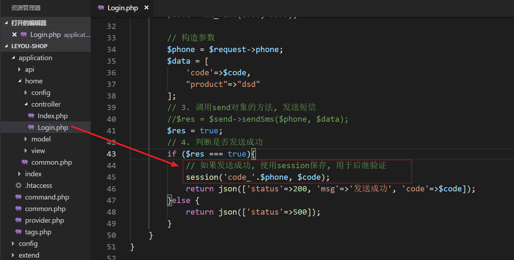

- 在这里之所以使用`code_`前缀, 为了区分不同的手机号

---

### 扩展-session()助手函数的用法

- session()助手函数的用法

  https://www.kancloud.cn/manual/thinkphp5_1/354117

1) 设置session

```php
//语法
session('变量名', '变量值');
session('name', 'xiaoming');
```

如果带两个参数, 表示设置

2) 读取session

```php
//语法
session('变量名');
session('name');
```

如果带一个参数, 表示读取

3) 判断是否赋值

```php
//语法
session('?变量名');
session('?name');
```

4) 删除session变量值

```php
//语法
session('变量名', null);
session('name', null);
```


-----

2) 对比提交的code和session中保存的值是否一致

```php
// 从session中读取code值
$code = session('code_'.$request->phone);
//dump($code);exit;
if ($request->code != $code) {
    // 用提交过来的code和session保存中的code比较
    $this->error('验证码错误');

}
```

如果都没有错, 则表示验证通过, 会跳转到登录页面

```php
// 验证通过
$this->success('注册成功', '/home/login/login');
```

### 2.8.3.编写login方法

```php
// 4. 登录
public function login()
{
    return 'login';
}
```

## 2.9.处理数据入库

### 2.9.1.自定义加密函数

出于项目安全的考虑, 我们使用加盐加密, 在common.php中定义加盐函数

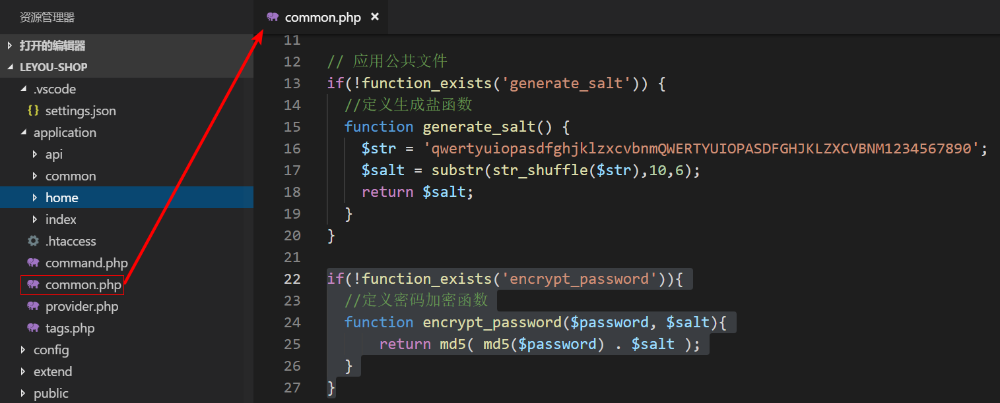

- str_shuffle: 随机的打乱str字符串的顺序
- substr: 从第10位开始, 截取6位

定义加盐函数

```php
if(!function_exists('generate_salt')) {
  //定义生成盐函数
  function generate_salt() {
    $str = 'qwertyuiopasdfghjklzxcvbnmQWERTYUIOPASDFGHJKLZXCVBNM1234567890';
    $salt = substr(str_shuffle($str),10,6);
    return $salt;
  }
}
```

定义加密函数

```php
if(!function_exists('encrypt_password')){
  //定义密码加密函数
  function encrypt_password($password, $salt){
      return md5( md5($password) . $salt );
  }
}
```

### 2.9.2.新增入库

分析下数据表中, 需要哪些字段

需要phone,  password, salt

因此, 咱们构建这3个字段

```php
// 新增入库
$user['phone'] = $request->phone;
$user['salt'] = generate_salt();
$user['password'] = encrypt_password($request->password, $user['salt']);           
```

这里使用Db类, 调用insert方法

```php
$res = \think\Db::table('tb_user')->insert($user);
```

判断跳转

```php
// 判断跳转
if ($res) {
    $this->success('注册成功', '/home/login/login');
}else {
    $this->error('添加到数据库失败');
}
```

使用模型的写法

1) 创建模型

```php
php think make:model home/Users
```

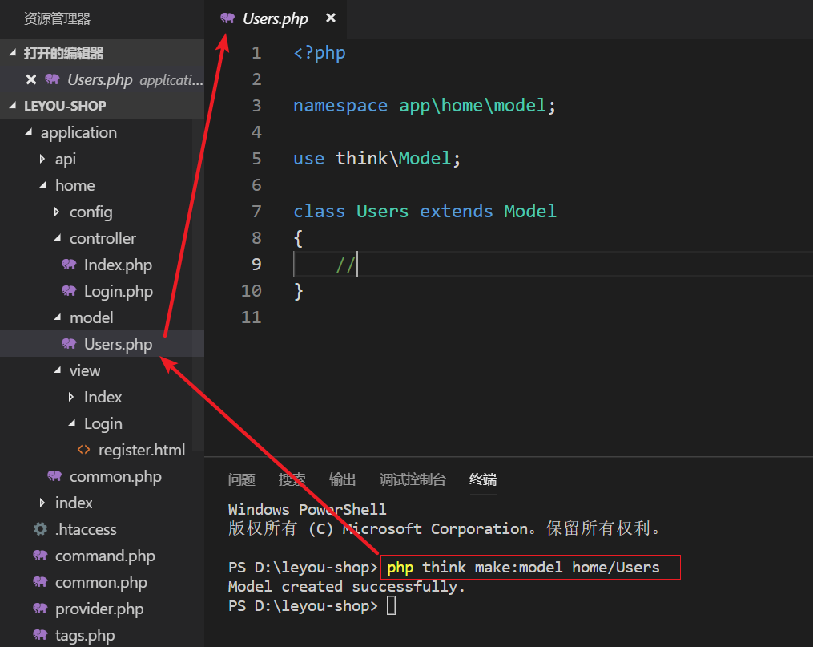

2) 编写模型

```php
class Users extends Model
{
    protected $pk='id';

    protected $table='tb_user';
}
```

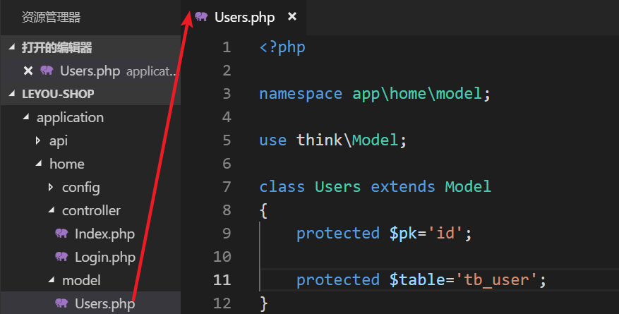

3) 在控制器中引用模型

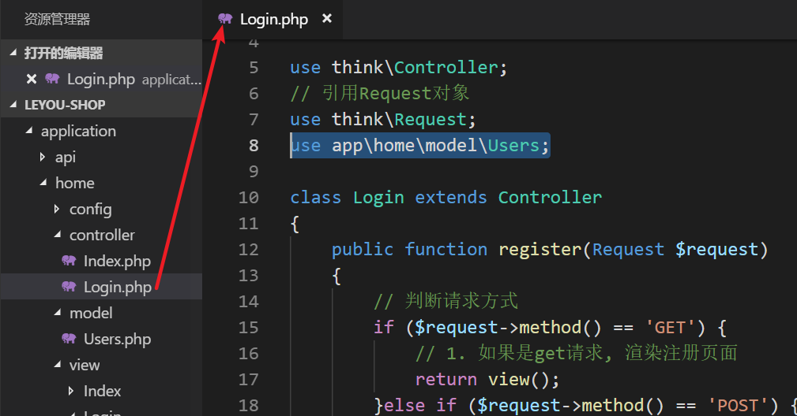

4) 使用模型调用方法

```php
$res = Users::create($user);
```

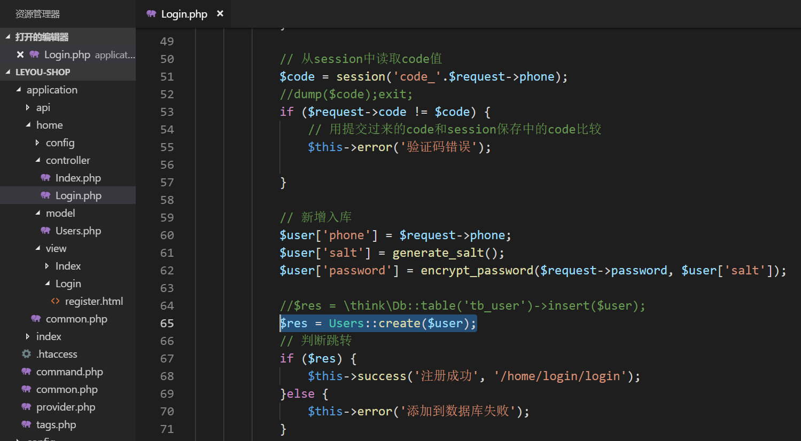


register的完整代码

```php
public function register(Request $request)
{
    // 判断请求方式
    if ($request->method() == 'GET') {
        // 1. 如果是get请求, 渲染注册页面
        return view();
    }else if ($request->method() == 'POST') {
        // 2. 如果是post请求, 收集form表单数据, 添加到tb_user表
        // 接收参数
        $data = $request->param();

        // 验证规则
        $rules = [
            'phone' => 'require|regex:\d{11}|unique:user',
            'code' => 'require|regex:\d{4}',
            'password' => 'require|length:6,16|confirm:repassword'
        ];

        // 提示信息
        $msg = [
            'phone.require' => '手机号不能为空',
            'phone.regex' => '手机号格式不正确',
            'phone.unique' => '手机号已被注册',
            'code.require' => '验证码不能为空',
            'code.regex' => '验证码格式不正确',
            'password.require' => '密码不能为空',
            'password.length' => '密码长度必须在6~16个字符',
            'password.confirm' => '两次密码输入不一致',
        ];

        // 实例化Validate对象
        $valid = new \think\Validate($rules, $msg);

        if (!$valid->check($data)) {
            //验证不通过
            $this->error($valid->getError());
        }

        // 从session中读取code值
        $code = session('code_'.$request->phone);
        //dump($code);exit;
        if ($request->code != $code) {
            // 用提交过来的code和session保存中的code比较
            $this->error('验证码错误');

        }

        // 新增入库
        $user['phone'] = $request->phone;
        $user['salt'] = generate_salt();
        $user['password'] = encrypt_password($request->password, $user['salt']);

        //$res = \think\Db::table('tb_user')->insert($user);
        $res = Users::create($user);
        // 判断跳转
        if ($res) {
            $this->success('注册成功', '/home/login/login');
        }else {
            $this->error('添加到数据库失败');
        }
    }
}
```

# 3.用户登录与退出

## 3.1.需求分析

当用户注册完后, 跳转到登录页面

也可以在首页, 直接登录

手机号的中间4位使用*代替

## 3.2.思路分析

1. 入口链接, 与规划路由(/home/login/login)
2. 当以get方法请求Login控制器的login方法时渲染页面
3. 当以post方法请求Login控制器的login方法时处理表单提交
4. 完成用户验证
5. 保存登录状态到session中

## 3.3.规划路由

### 3.3.1.修改入口链接

在index.html中修改登录的路由

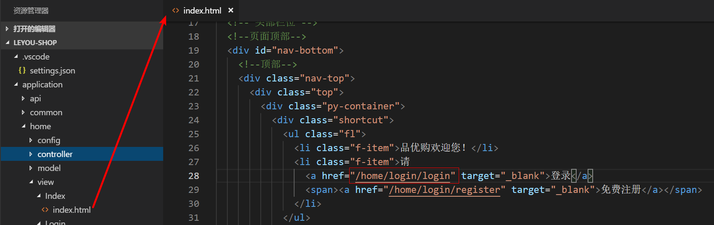

在register.html中修改登录的路由

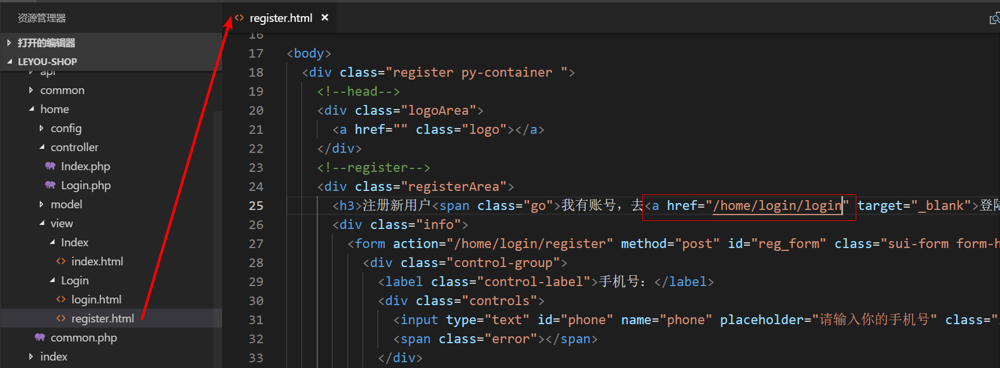

### 3.3.2.编写login方法

```php
// 4. 登录
public function login()
{
    if ($request->method() == 'GET') {
        // 渲染页面
        return view();
    }else if ($request->method() == 'POST') {
        // 处理数据, 新增入库
    }
}
```

## 3.4.渲染视图

在view下创建Login/login.html, 复制模板内容, 并替换css/js路径

测试效果:

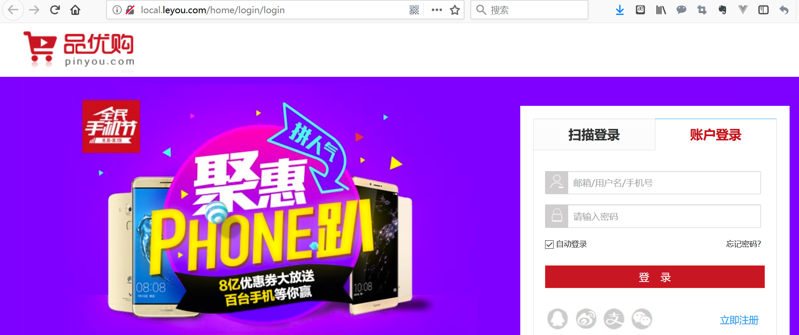

## 3.5.表单提交

修改表单的属性

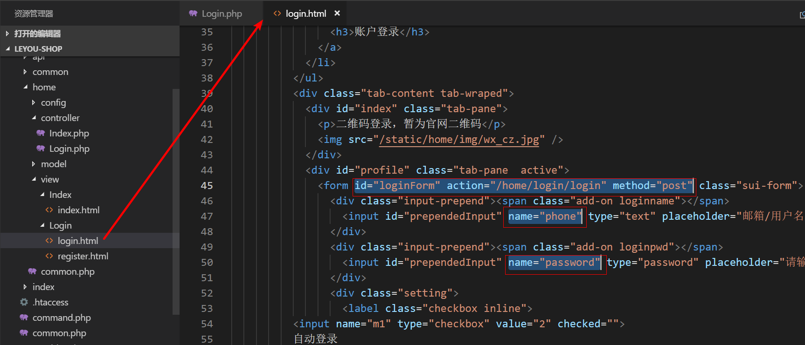

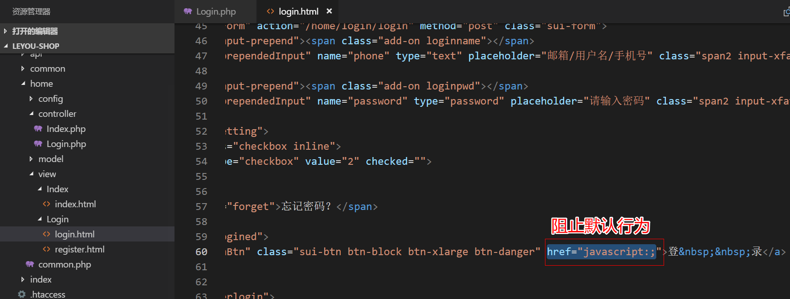

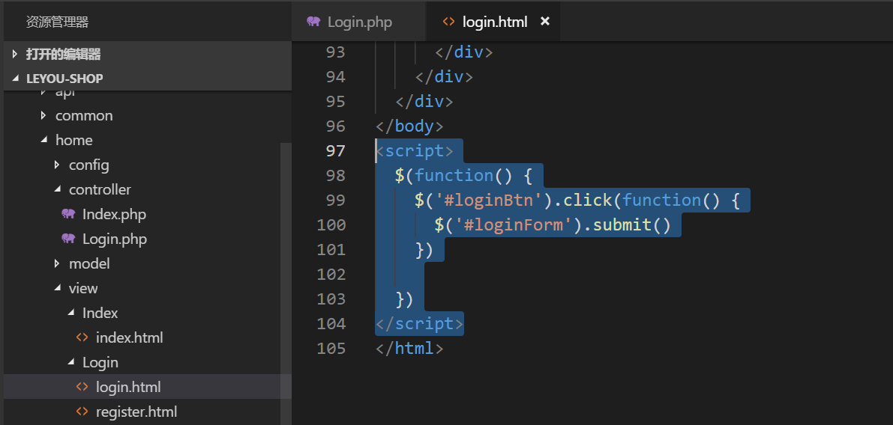

完整代码:

```html
<!DOCTYPE html>
<html>

<head>
	<meta charset="UTF-8">
	<meta http-equiv="X-UA-Compatible" content="IE=9; IE=8; IE=7; IE=EDGE">
	<meta http-equiv="X-UA-Compatible" content="IE=EmulateIE7" />
	<title>品优购，欢迎登录</title>

    <link rel="stylesheet" type="text/css" href="/static/home/css/all.css" />
    <link rel="stylesheet" type="text/css" href="/static/home/css/pages-login.css" />

	<script type="text/javascript" src="/static/home/js/all.js"></script>
	<script type="text/javascript" src="/static/home/js/pages/login.js"></script>
</head>

<body>
	<div class="login-box">
		<!--head-->
		<div class="py-container logoArea">
			<a href="" class="logo"></a>
		</div>
		<!--loginArea-->
		<div class="loginArea">
			<div class="py-container login">
				<div class="loginform">
					<ul class="sui-nav nav-tabs tab-wraped">
						<li>
							<a href="#index" data-toggle="tab">
								<h3>扫描登录</h3>
							</a>
						</li>
						<li class="active">
							<a href="#profile" data-toggle="tab">
								<h3>账户登录</h3>
							</a>
						</li>
					</ul>
					<div class="tab-content tab-wraped">
						<div id="index" class="tab-pane">
							<p>二维码登录，暂为官网二维码</p>
							
						</div>
						<div id="profile" class="tab-pane  active">
							<form id="loginForm" action="/home/login/login" method="post" class="sui-form">
								<div class="input-prepend"><span class="add-on loginname"></span>
									<input id="prependedInput" name="phone" type="text" placeholder="邮箱/用户名/手机号" class="span2 input-xfat">
								</div>
								<div class="input-prepend"><span class="add-on loginpwd"></span>
									<input id="prependedInput" name="password" type="password" placeholder="请输入密码" class="span2 input-xfat">
								</div>
								<div class="setting">
									<label class="checkbox inline">
          <input name="m1" type="checkbox" value="2" checked=""> 
          自动登录
        </label>
									<span class="forget">忘记密码？</span>
								</div>
								<div class="logined">
									<a id="loginBtn" class="sui-btn btn-block btn-xlarge btn-danger" href="javascript:;">登&nbsp;&nbsp;录</a>
								</div>
							</form>
							<div class="otherlogin">
								<div class="types">
									<ul>
										<li></li>
										<li></li>
										<li></li>
										<li></li>
									</ul>
								</div>
								<span class="register"><a href="register.html" target="_blank">立即注册</a></span>
							</div>
						</div>
					</div>
				</div>
			</div>
		</div>
		<!--foot-->
		<div class="py-container copyright">
			<ul>
				<li>关于我们</li>
				<li>联系我们</li>
				<li>联系客服</li>
				<li>商家入驻</li>
				<li>营销中心</li>
				<li>手机品优购</li>
				<li>销售联盟</li>
				<li>品优购社区</li>
			</ul>
			<div class="address">地址：北京市昌平区建材城西路金燕龙办公楼一层 邮编：100096 电话：400-618-4000 传真：010-82935100</div>
			<div class="beian">京ICP备08001421号京公网安备110108007702
			</div>
		</div>
	</div>
</body>
<script>
	$(function() {
		$('#loginBtn').click(function() {
			$('#loginForm').submit()
		})
		
	})
</script>
</html>
```

## 3.6.处理表单数据

```php
// 4. 登录
public function login(Request $request)
{
    if ($request->method() == 'GET') {
        // 渲染页面
        return view();
    }else if ($request->method() == 'POST') {
        // 处理数据
        $data = $request->param();

        // 验证密码
        $user = \think\Db::table('tb_user')
            ->where('phone', $data['phone'])
            ->find();

        if ($user) {
            if ($user['password'] == encrypt_password($data['password'], $user['salt'])){
                $this->success('登录成功', '/home/index/index');
            }else {
                $this->error('密码不正确', '/home/login/login');
            }
        }else {
            // 手机号不存在
            $this->error('手机号不存在, 请先注册', '/home/login/register');
        }
    }
}
```

## 3.7.使用会话

### 3.7.1.保存到session中

如果登录成功, 将数据保存到session中,

在TP中, 可以使用助手函数session()

参考文档: https://www.kancloud.cn/manual/thinkphp5_1/354117

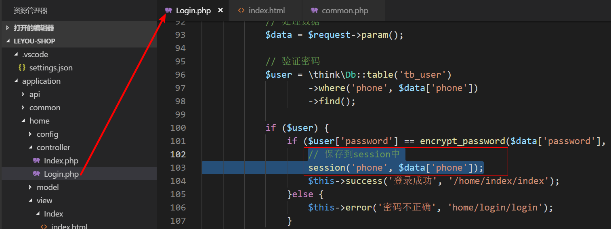

### 3.7.2.隐藏手机号中间4位

在common.php中, 定义一个函数

```php
if(!function_exists('encrypt_phone')){
  //定义手机号安全函数
  function encrypt_phone($phone) {
    //13098878677 => 130****8677
    return substr($phone, 0, 3) . '****' . substr($phone, 7);
  }
}
```

### 3.7.3.优化前台显示

在index.html中

在tp的模板中, 可以直接使用php的原生函数, 比如empty, isset

在tp的模板中, 可以直接`$Think.session操作系统变量($_POST,$_SERVER, $_SESSION, $_COOKIE)`

参考文档: https://www.kancloud.cn/manual/thinkphp5_1/354071

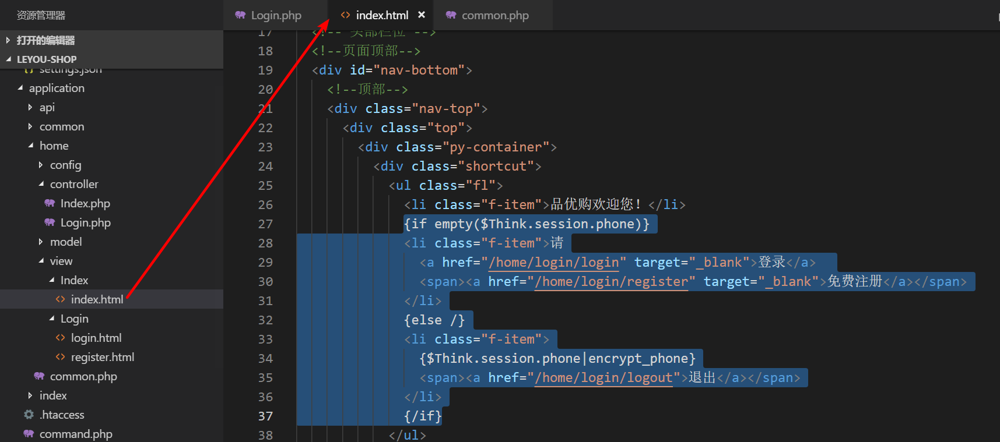

```html
{if empty($Think.session.phone)}
<li class="f-item">请
    <a href="/home/login/login" target="_blank">登录</a>　
    <span><a href="/home/login/register" target="_blank">免费注册</a></span>
</li>
{else /}
<li class="f-item">
    {$Think.session.phone|encrypt_phone}
    <span><a href="/home/login/logout">退出</a></span>
</li>
{/if}
```

其中, 

- $Think.session是在模板中获取session变量的方式
- {$Think.session.phone|encrypt_phone}: 使用encrypt_phone对手机号格式化

### 3.7.4.退出登录

在login.php中, 编写logout方法

```php
public function logout()
{
    // 1. 销毁session
    session('phone', null);
    // 2. 跳转
    $this->success('退出成功');
}
```

# 4.首页分类数据显示

## 4.1.需求分析

分类数据从数据库中查询并显示

## 4.2.思路分析

在index控制器中查询数据, 分配到视图中

在视图中显示三级分类信息

## 4.3.查询数据实现

```php
public function index()
{
    // 1.查询所有的分类数据
    $cates = \think\Db::table('tb_category')
        ->select();
    // 2.分配到视图中
    $this->assign('cates', $cates);            

    // 3. 调用基类的fetch方法
    return $this->fetch();
}
```

1. 在 Index.php控制器中, 调用模型获取数据
2. 调用assign分配数据到视图中

## 4.4.页面布局改造

由于分类/列表/详情的布局都由

头部, 内容, 底部组成

因此, 可以使用布局改造, 

参考文档: https://www.kancloud.cn/manual/thinkphp5_1/354079

在template.php配置文件中, 开启布局

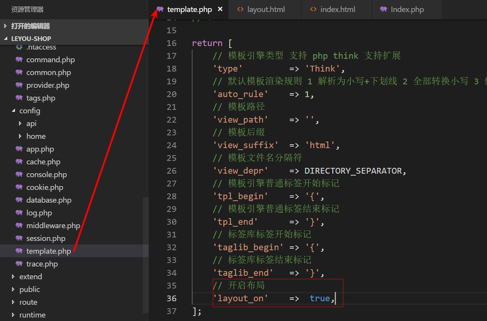

当开启布局后, 渲染视图时, 首先会加载/view下的layout.html, 将`{__CONTENT__}`的内容替换

将index.html中的内容, 复制到layout.html中, 并把内容部分使用`{__CONTENT__}`替换

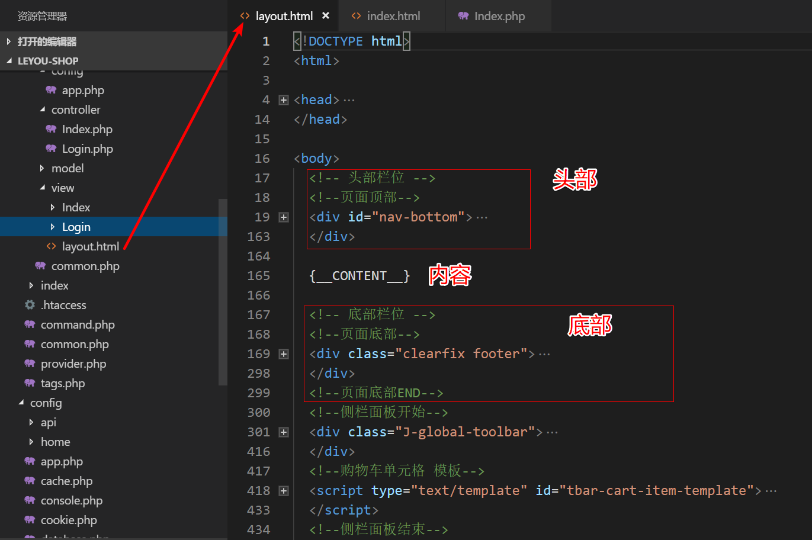

index.html中保留如下内容:

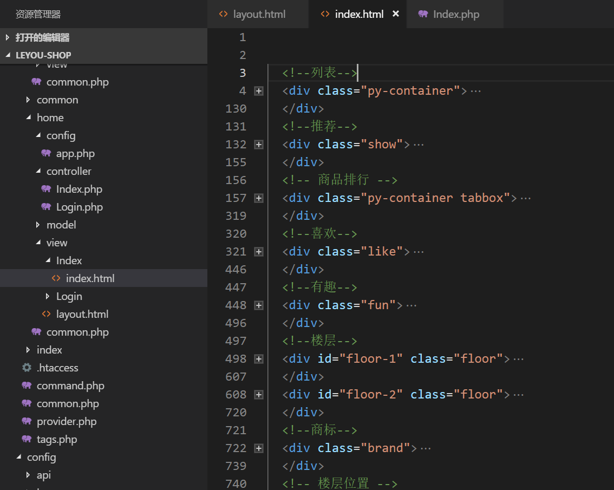

开启布局后, 存在一个问题, 就是之前写好的login.html和register.html是不需要使用布局的

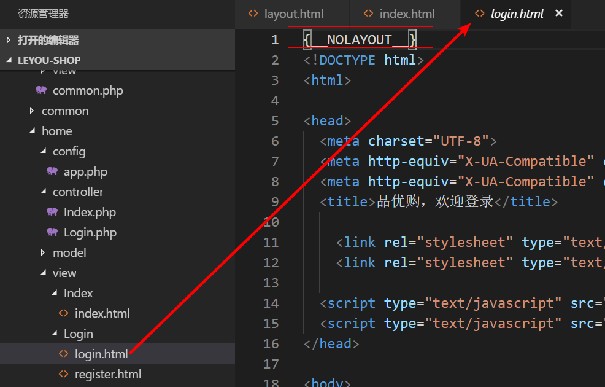

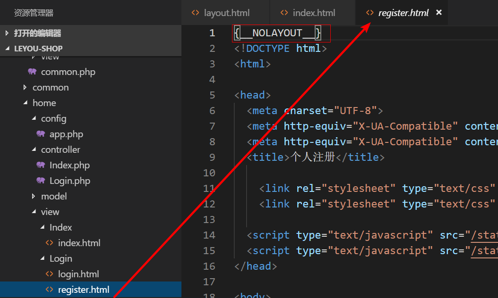

在login.html和register.html的最开始, 使用`{__NOLAYOUT}`就可以啦~

## 4.5.渲染三级分类

在layout.html中, 使用foreach遍历, 第一个item就是一个一级分类

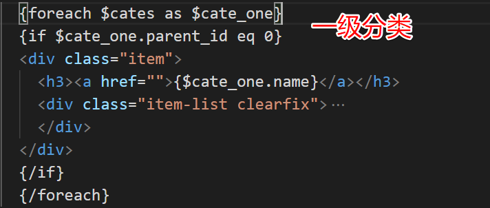

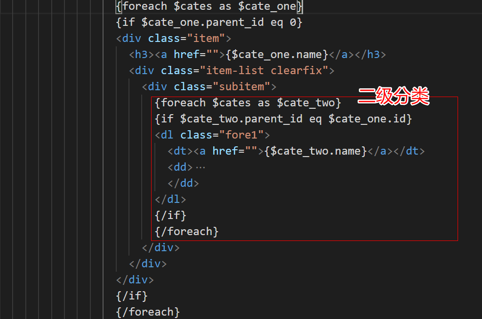

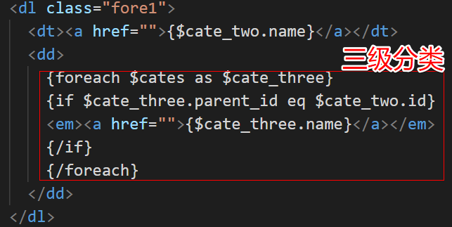

完整代码:

```html
<div class="sort">
    <div class="all-sort-list2">
        {foreach $cates as $cate_one}
        {if $cate_one.parent_id eq 0}
        <div class="item">
            <h3><a href="">{$cate_one.name}</a></h3>
            <div class="item-list clearfix">
                <div class="subitem">
                    {foreach $cates as $cate_two}
                    {if $cate_two.parent_id eq $cate_one.id}
                    <dl class="fore1">
                        <dt><a href="">{$cate_two.name}</a></dt>
                        <dd>
                            {foreach $cates as $cate_three}
                            {if $cate_three.parent_id eq $cate_two.id}
                            <em><a href="">{$cate_three.name}</a></em>
                            {/if}
                            {/foreach}
                        </dd>
                    </dl>
                    {/if}
                    {/foreach}
                </div>
            </div>
        </div>
        {/if}
        {/foreach}
    </div>
</div>
```

# 5.列表页

## 5.1.需求分析

通过三级分类的最后一级可以进入到该分类下的列表页面, 显示当前分类下的所有商品列表

## 5.2.思路分析

## 5.3.规划路由

``` php
/home/goods/lst/cid/{$cate_three.id}
```

## 5.4.控制器

### 5.4.1.创建控制器

执行如下命令

```php
php think make:controller home/Goods --plain
```

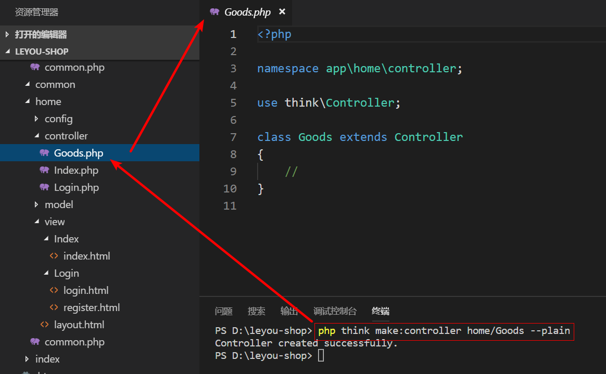

### 5.4.2.编写lst方法

```php
<?php

namespace app\home\controller;

use think\Controller;
// 1. 引入类元素
use think\Request;

class Goods extends Controller
{
    public function lst(Request $request, $cid)
    {
        // 2. 获取分页数据
        $spus = \think\Db::table('tb_spu')
                    ->where('cid3', $cid)
                    ->paginate(10);
        
        // 3. 渲染视图
        return view('lst', ['spus'=>$spus]);
    }
}
```

测试发现, 报错

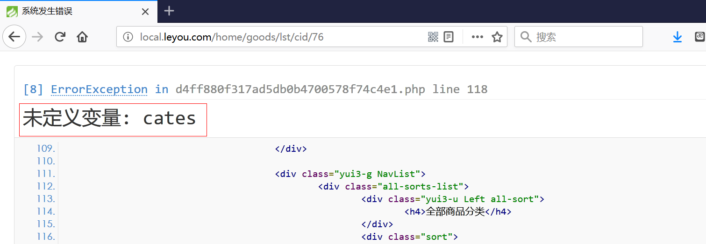

可以写一个父类控制器, 所有子控制器继承父类

### 5.4.3.解决cates报错

创建一个父类控制器

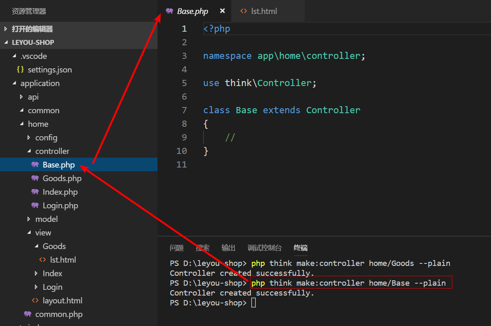

编写构造方法

```php
public function __construct()
{
    parent::__construct();

    // 1.查询所有的分类数据
    $cates = \think\Db::table('tb_category')
        ->select();
    // 2.分配到视图中
    $this->assign('cates', $cates);
}
```

让Index与Goods控制器都继承自Base

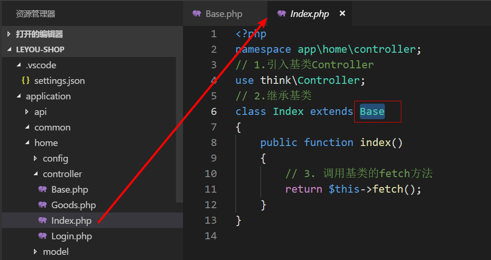

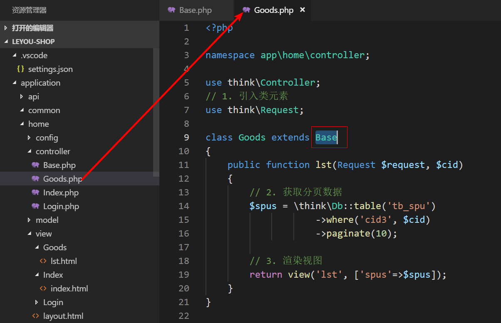

## 5.5.视图

### 5.5.1.创建视图

在view下, 创建Goods目录, 创建lst.html文件, 复制模板中的内容

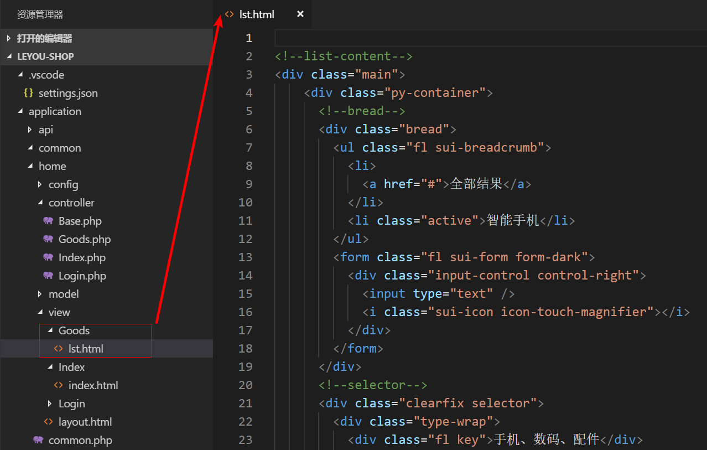

发现如下问题

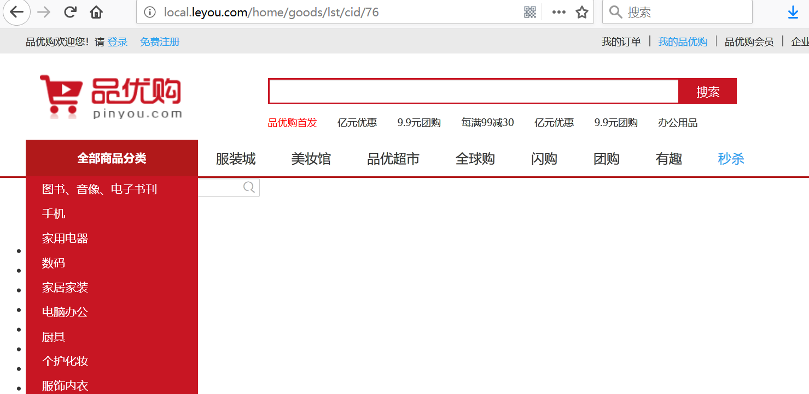

### 5.5.2.调整视图

将lst.html中的css加载进来. 

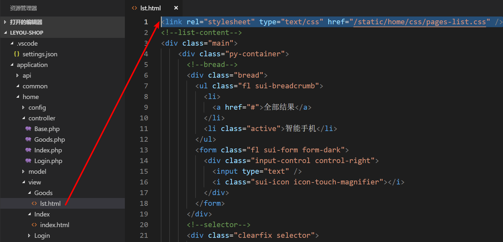

调整layout.html中的css与js

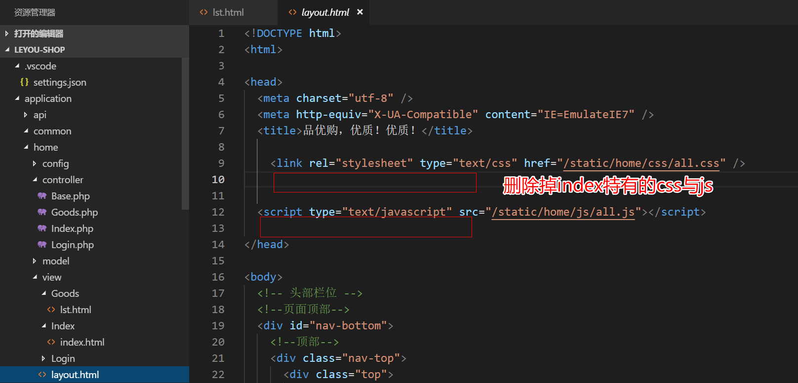

调整index.html的css与js

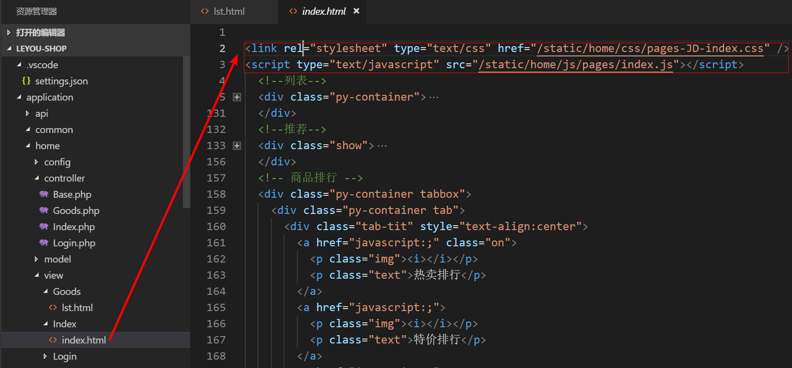

替换图片路径.


效果如下:


## 5.6.渲染商品

由于图片和价格在sku表中, 所以这里我们使用连表查询


在视图模板中, 使用foreach遍历

title使用函数格式化

参考文档: https://www.kancloud.cn/manual/thinkphp5_1/354074


## 5.7.分页显示

在tp中, 使用 paginate可以方便快速的完成分页功能. 在页面中, 通过render()方法就可以渲染出分页数据

参考文档: https://www.kancloud.cn/manual/thinkphp5_1/354120


在模板中使用`{$page|raw}`


### 5.7.1.具体实现

找到页面中需要显示分页页码的地方, 调用`render()`方法


为什么要加`|raw`, 如果不加, 就是以文本信息显示html的内容


### 5.7.2.解决显示不全的问题

受到css样式的影响, 不能完整显示整个分页页码, 修改宽度700就可以解决了

找到page-list.css, 搜索pagination

效果如下:


# 6.详情页

## 6.1.需求分析

当点击商品列表中的一个商品时, 能够显示该商品的详情页信息

## 6.2.思路分析

在商品列表页, 可以拿到具体每个商品的sku_id, 根据该id从数据库中查询spu表, sku表, spu_detail表找到需要的数据

## 6.3.规划路由

```php
/home/Goods/detail/id/{$spu.id}
```


## 6.4.控制器方法

在控制器方法, 通过id, 分别获取sku, spu, spu_detail的数据


## 6.5.渲染数据

### 6.5.1.渲染标题, 卖点, 价格


### 6.5..2.渲染特有属性

思考一下, 特有属性如何渲染?


数据是保存在own_spec中, 而own_spec是一个json格式的数据, 可以先将json数据转换成数组, 进而遍历该数组就可以渲染了


在detail.html中使用foreach遍历


### 6.5.3.渲染商品介绍等信息


