# 1.购物流程

购物车作用：存放想要购买的商品，最后一次性结算。

电商网站购物流程如下图:

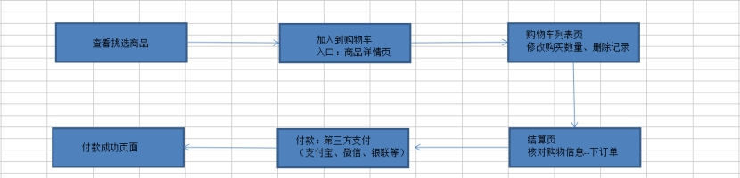

1. 用户根据自己的需要, 搜索需要的商品
2. 挑选商品后, 加入到购物车
3. 查看购物车页面, 修改购买数量, 或者从购物车中移除
4. 在购物车中勾选本次需要购买的商品, 去结算
5. 跳转到第三方支付平台(支付宝/微信/银联)
6. 跳转回来, 显示付款成功或者失败

# 2.购物车原理

## 2.1.需求

需求描述：

- 用户可以加商品添加到购物车
- 用户可以使用购物车一起结算下单
- 用户可以查询自己的购物车
- 用户可以在购物车中可以修改购买商品的数量。
- 用户可以在购物车中删除商品。

## 2.1 购物车的数据保存在哪里

要实现购物车, 我们需要思考的第一个问题就是购物车的数据应该保存在哪里?

- 本地浏览器
  - cookie
  - web本地存储
- 服务器
  - session
  - 数据库(Mysql, Redis)

## 2.2 技术对比

Cookie存储在本地浏览器中, 可以长时间存储, 直到过期或者被用户清除

优点:

- 简单, 方便

缺点:

- 大小有限制, 最大是4K
- 类型有限制, 只能是简单数据类型, 不能保存数组/对象, 需要先转换成字符串
- 每次请求, 都要在请求中携带, 浪费带宽

---------

session存储在服务器中, 无法长久存储，关闭网站或浏览器，sessid被清空

优点:

- 支持复杂的数据类型

缺点:

- 持久化还是需要基于cookie
- 会在服务端保存很多垃圾文件

---------

数据库存储相对复杂, 实现不如cookie和session方便. 不过真实的电商项目一般购物车数据是保存到数据库中的, 而且一般会使用Redis

最后, 就只剩下web本地存储

## 2.3 web本地存储

### 2.3.1.什么是web本地存储？

web存储是W3C标准Html5中提出的存储方式, 很好的解决了cookie的问题, 几乎没有什么缺点

参考文档: http://www.w3school.com.cn/html5/html_5_webstorage.asp

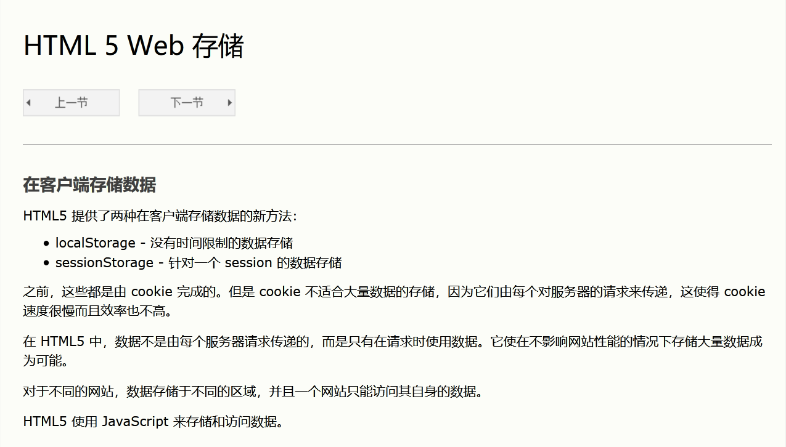

web本地存储主要有两种方式：

- LocalStorage：localStorage 方法存储的数据没有时间限制。第二天、第二周或下一年之后，数据依然可用。 
- SessionStorage：sessionStorage 方法针对一个 session 进行数据存储。当用户关闭浏览器窗口后，数据会被删除。 

### 2.3.2.localStorage用法

打开一个页面, 可以直接使用localStorage来保存或者读取数据

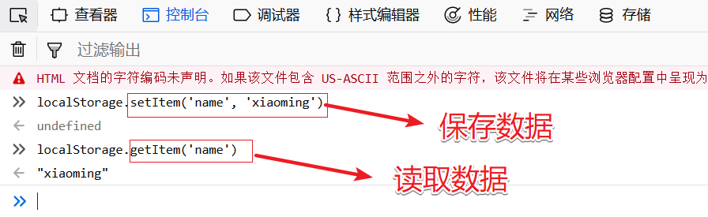

语法

```js
// 设置
localStorage.setItem('变量名', '变量值')
// 读取
localStorage.getItem('变量名')
```

在存储中可以查看到保存的数据内容

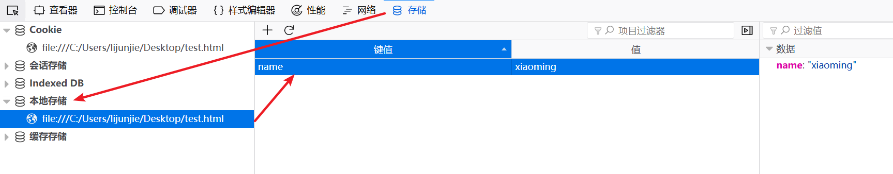

注意：**localStorage和SessionStorage都只能保存字符串**。

# 3.实现加入购物车

这里可以使用jquery操作DOM, 但是既然咱们学了vue, 完全可以使用vue来实现这部分的功能.

> jquery能实现的页面效果, 使用vue都能更简单的实现!!!

## 3.1 vue的三步曲

### 1) 引入vue.js

将准备好的vue.js文件复制到项目中

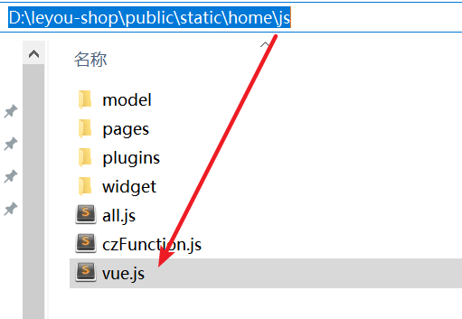

在detail.html中引入vue.js

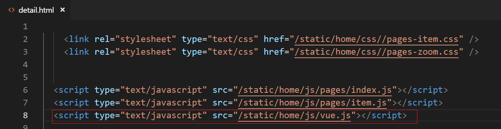

### 2) 加入div元素


### 3) 编写vue实例

``` vue
<script>
    const vm = new Vue({
			el: '#app',
			data: {},
			methods: {}
		})
</script>
```

## 3.2 模拟数据

在data中, 定义一个sku属性, 用来保存商品信息

```js
data: {
    sku: {
        id: '2868393',
        title: '三星 Galaxy C5（SM-C5000）4GB+32GB 枫叶金 移动联通电信4G手机 双卡双待',
        images: 'http://local.leyou.com/images/12/15/1524297315534.jpg',
        price: '119900',
        own_spec: {"机身颜色":"金","内存":"4GB","机身存储":"32GB"},
        number:1,
        selected: false
    }
},
```

- id: 对应sku数据表中的id字段
- title: 对应sku数据表中title字段
- image: 对应sku数据表中images字段
- price: 对应sku数据表中price字段
- own_spec: 对应sku数据表中own_spec字段
- number: 选择商品的数量**
- selected: 购物车中是否选中状态, 默认是false, 没有选中状态**

数据是可以通过tp的模板变量获取

```js
data: {
    sku: {
        id: '{$sku.id}',
        title: '{$sku.title}',
        images: '{$sku.images}',
        price: '{$sku.price}',
        own_spec: JSON.parse('{$sku.own_spec|raw}'),
        number:1,
        selected: false
    }
},
```

首先tp渲染html页面, 将所有模板变量替换为数据(字符串), 将html发送给浏览器

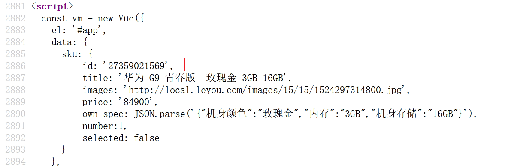

然后浏览器在收到html页面后, 使用vue.js解析

## 3.3 绑定属性方法

### 1) 绑定+-属性和方法

将number框和number属性双向绑定

将+操作和plus方法绑定

将-操作和mins方法绑定

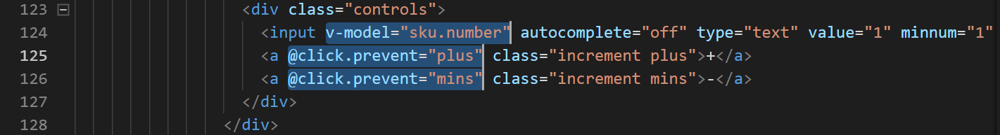

在methods中实现plus()方法和mins()方法

```js
plus() {
    this.sku.number++
},
mins() {
    if (this.sku.number > 1) this.sku.number--
},
```

### 2) 绑定add方法

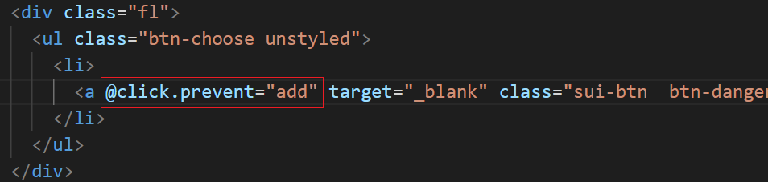

- .prevent的作用: 阻止默认行为

在methods中编写add方法

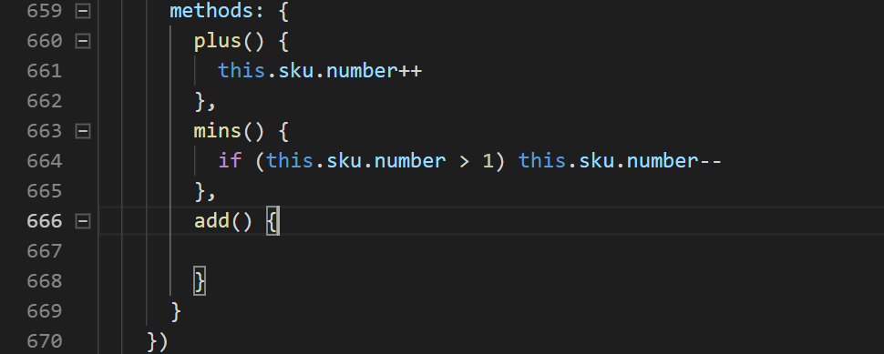

### 思路分析

1.还原之前的购物车数据

2.判断添加还是合并

3.保存新的购物车数据

### 具体实现

1. 从localStorage中读取skus数组信息, 该数组保存的就是购物车中的数据, 每个对象就是一条记录

   ```js
   add() {
       var skus = []
       // 读取原来的信息, skus是一个数组
       if (localStorage.getItem('skus') != null) {
           // 将json字符转换为json对象
           skus = JSON.parse(localStorage.getItem('skus'))
       }
   
       console.log(skus)
   }
   ```

2. 如果没有数据, 就是第一次添加购物车, 如果有数据就先还原之前的数据

3. 判断新添加到购物车的商品是否存在于之前的数据中, 如果存在就合并(改number的值), 如果不存在就添加

   ```js
   add() {
       var skus = []
       // 读取原来的信息, skus是一个数组
       if (localStorage.getItem('skus') != null) {
           skus = JSON.parse(localStorage.getItem('skus'))
       }
       var flag = false
       for (let i=0; i<skus.length; i++) {
           // 如果id在原来的skus数组中, 找到该元素, 把num相加
           if (skus[i].id == this.sku.id) {
               skus[i].number += this.sku.number
               flag = true
               break
           }
       }
   
       // 如果id不在原来的skus数组中, 就把sku对象添加到skus数组
       if (flag == false) {
           skus.push(this.sku)
       }
   }
   ```

4. 将新的skus数据保存到localStorage中

   ```js
   // 保存新的信息
   localStorage.setItem('skus', JSON.stringify(skus))
   ```

5. 跳转到购物车列表页面

   ```js
   window.location.href = '/home/Cart/lst'
   ```

# 4.实现购物车列表

## 4.1 创建控制器

在vscode中使用ctrl+`打开命令行, 执行命令, 创建home模块下的Cart控制器

```php
php think make:controller home/Cart --plain
```

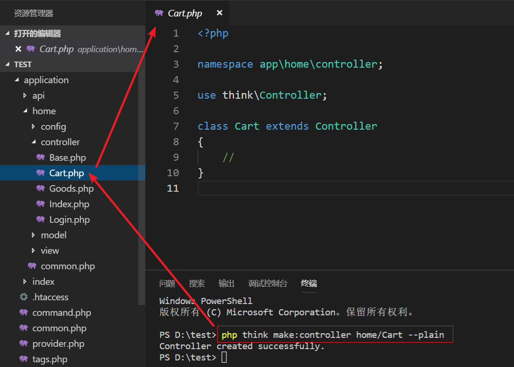

## 4.2 编写方法

编写lst方法, 在lst方法中渲染购物车页面

在lst方法调用助手函数view(), 默认渲染view/Cart/lst.html页面

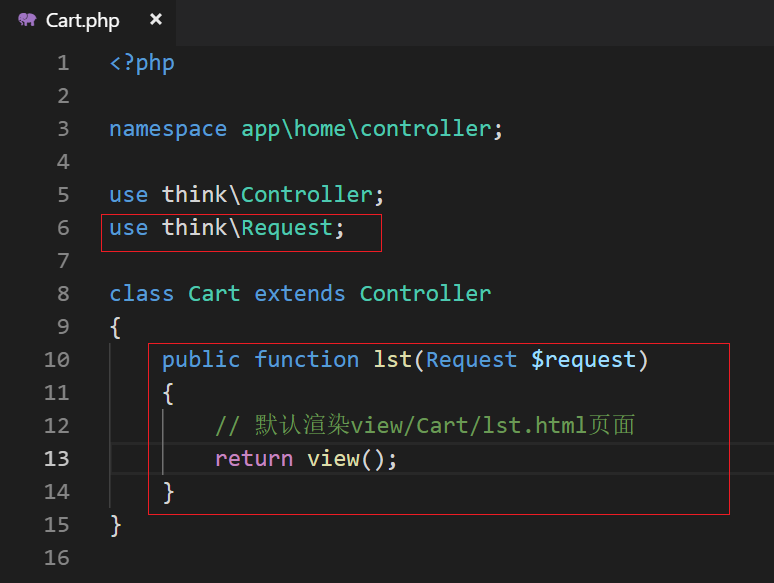

## 4.3 编写页面

### 1)  创建并复制模板文件

在view目录下创建Cart目录, 再创建lst.html

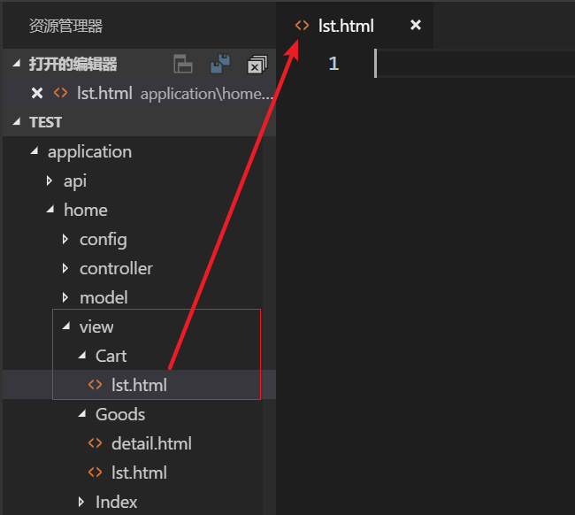

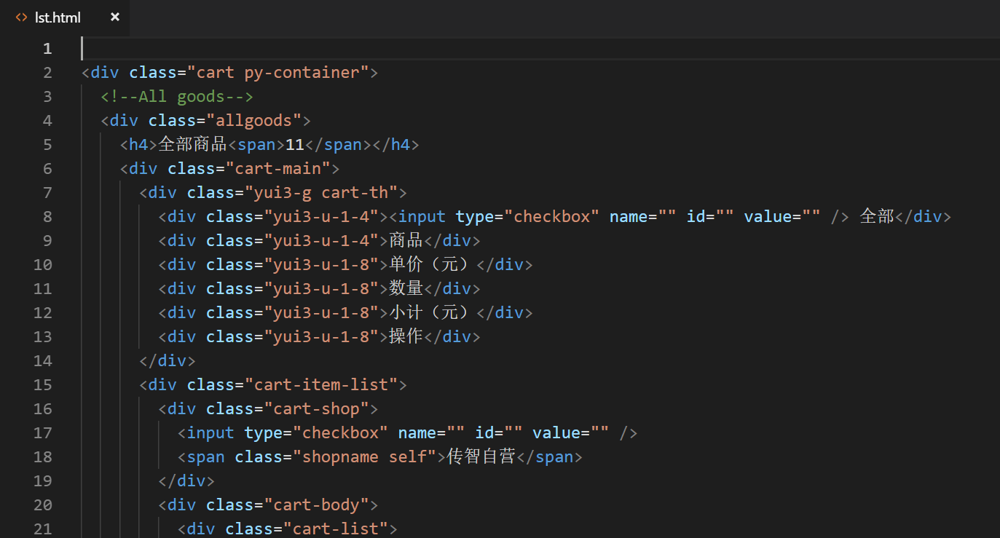

### 2) 加入特有资源并修改路径

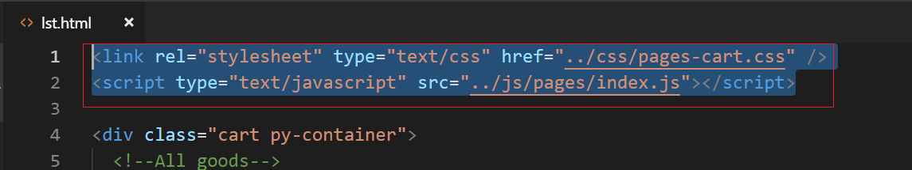

使用`ctrl+h`快捷键, 查找并替换

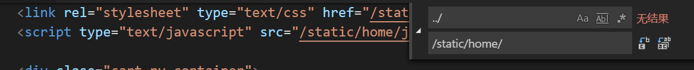

## 4.4 测试

当点"添加到购物车"时, 报错如下:

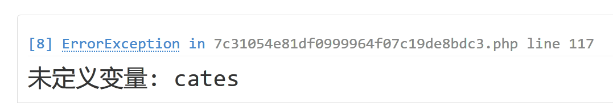

原因分析: 我们使用了layout布局, Cart控制器需要继承Base

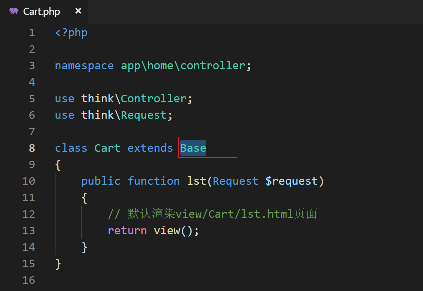

## 4.5 vue的三步曲

### 1) 引入vue.js

```html
<script src="/static/home/js/vue.js"></script>
```

### 2) 加入div元素

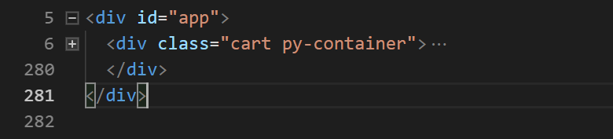

### 3) 编写vue实例

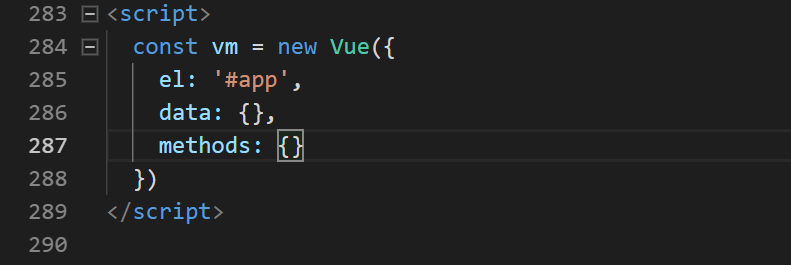

示例代码

```html
<script>
  const vm = new Vue({
    el: '#app',
    data: {},
    methods: {}
  })
</script>
```

## 4.6 初始化数据

### 1) 在data中定义skus保存购物车数据

```js
data: {
    skus: [], // 购物车数据
},
```

### 2) 使用created初始化skus数据

```js
created() {
    if (localStorage.getItem('skus') != null) {
        this.skus = JSON.parse(localStorage.getItem('skus'))
    }
},
```

### 3) 在页面中渲染购物车列表

使用v-for遍历skus, 输出列表信息


依次渲染图片, 标题, 价格等数据

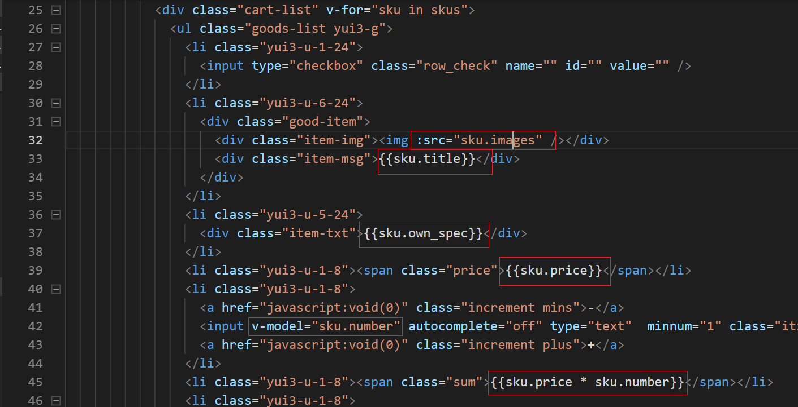

示例代码:

```html
<div class="cart-list" v-for="sku in skus">
    <ul class="goods-list yui3-g">
        <li class="yui3-u-1-24">
            <input type="checkbox" class="row_check" name="" id="" value="" />
        </li>
        <li class="yui3-u-6-24">
            <div class="good-item">
                <div class="item-img"></div>
                <div class="item-msg">{{sku.title}}</div>
            </div>
        </li>
        <li class="yui3-u-5-24">
            <div class="item-txt">{{sku.own_spec}}</div>
        </li>
        <li class="yui3-u-1-8"><span class="price">{{sku.price}}</span></li>
        <li class="yui3-u-1-8">
            <a href="javascript:void(0)" class="increment mins">-</a>
            <input v-model="sku.number" autocomplete="off" type="text"  minnum="1" class="itxt current_number" />
            <a href="javascript:void(0)" class="increment plus">+</a>
        </li>
        <li class="yui3-u-1-8"><span class="sum">{{sku.price * sku.number}}</span></li>
        <li class="yui3-u-1-8">
            <a href="#none" class="delete">删除</a><br />
            <a href="#none">移到我的关注</a>
        </li>
    </ul>
</div>
```

### 4) 测试效果


## 4.7 价格计算功能

当点击+ -时, 数量会变化, 价格也会随着变化

### 1) 绑定+-操作方法

```html
 <li class="yui3-u-1-8">
     <a @click.prevent="mins(sku.id)" class="increment mins">-</a>
     <input v-model="sku.number" autocomplete="off" type="text"  minnum="1" class="itxt current_number" />
     <a @click.prevent="plus(sku.id)" class="increment plus">+</a>
</li>
```

因为需要知道修改的具体是哪一个商品的数量, 所以带一个参数, 将sku的id传过去

### 2)实现两个方法

```js
mins(id) {
    this.skus.find((v, i, arr) => {
        if (v.id == id && v.number > 1) {
            v.number--
        }
    })
},
```

依次查找skus中的每个元素, 如果id和传递过来的id相等, 就将数量--

但是number不能减到1以下, 最少值为1

```js
plus(id) {
    this.skus.find((v, i, arr) => {
        if (v.id == id) {
            v.number++
        }
    })
}
```

依次查找skus中的每个元素, 如果id和传递过来的id相等, 就将数量++

## 4.8 计算总价

总价的变化是随着商品数量的变化而变化的, 因此, 我们可以watch(监听)skus, 当skus的值改变时, 计算总价

在data中, 定义一个属性total, 用来保存总价

```js
data: {
    skus: [], // 购物车数据
    total: 0, // 总价
},
```

在使用watch监听skus的值

```js
watch: {
    skus: {
        deep: true,
        handler() {
            var tmp = 0
            this.skus.forEach(item => {
                tmp += item.price * item.number 
            })
            this.total = tmp;
        }
    }
},
```

将total的值渲染到模板中

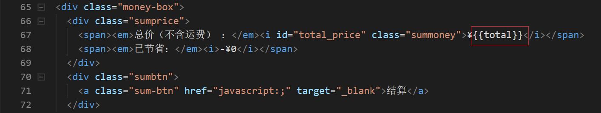

## 4.9 删除购物车中的商品

购物车中的每一个商品对应代码中的一个sku对象, 删除购物车中的商品就相当于删除一个对象

具体实现

### 1) 给"删除"绑定事件

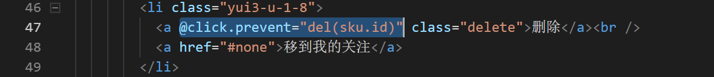

由于需要知道具体删除哪一个对象, 可以定义一个参数, 将id值传递过去

### 2) 编写del方法

```js
del(id) {
    this.skus.find((v, i, arr) => {
        if (v.id == id) {
            this.skus.splice(i, 1)
        }
    })
}
```

- splice: JS中删除数组元素的函数

  用法参考: http://www.w3school.com.cn/jsref/jsref_splice.asp

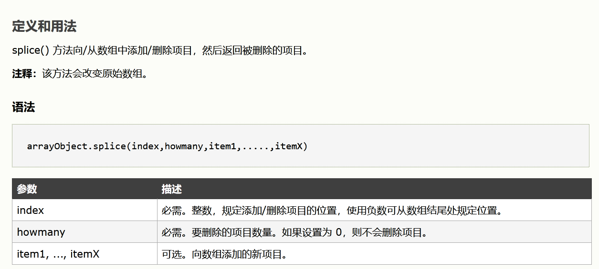

## 4.10 选中商品功能

需求: 

1. 只有选中的商品才计算总价
2. 选中商品后可以批量删除

在我们设计sku对象时, 设计了一个字段selected, 就是用来表明选中状态的

### 1) 给checkbox绑定方法

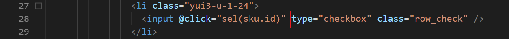

### 2) 编写sel方法

```js
sel(id) {
    this.skus.find((v, i, arr) => {
        if (v.id == id) {
            v.selected = !v.selected
        }
    })
}
```

这里不是单纯给selected赋值为true或者false, 而是**取非操作**

如果原来是true点击后就变成false, 如果原来是false, 点击后就是true

### 3) 重新计算总价

在计算总价时, 做判断, 如果selected为true才累加

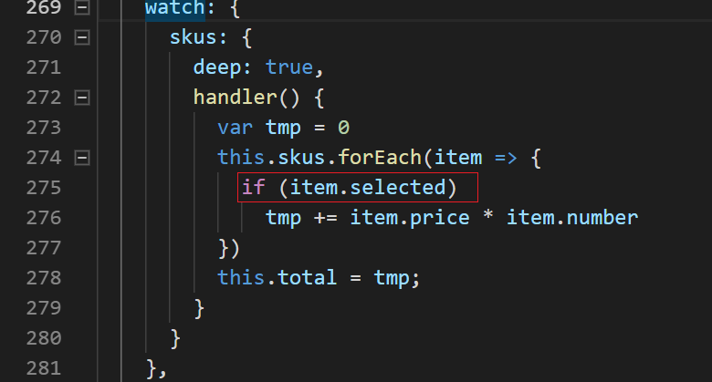

### 4) 批量删除

绑定批量删除方法

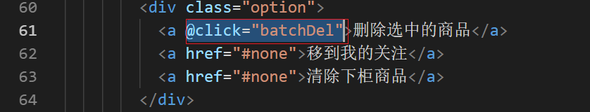

```js
batchDel() {
    this.skus.find((v, i, arr) => {
        if (v.selected) {
            this.skus.splice(i, 1)
        }
    })
},
```

遍历, 删除选中状态的数据

测试发现当有多条记录时, 发生了混乱, 出现了bug

## 4.11 解决bug

思考一下, 其实我们在改变skus的值时, 并没有同步到localStorage保存, 这样刷新页面的时候, 数据就丢失了, 那么如何解决呢?

事实上, 我们每次改变skus的值时, 都需要同步保存到localStorage中, 在数据修改后, 在渲染到页面之前, 需要重新从localStorage中获取数据

最好的解决方式就是使用生命周期函数


当data发生改变时, 会调用beforeUpdate(), 在该函数中, 我们可以将数据保存到localStorage中

在数据保存完, 重新渲染到页面时, 会调用updated(), 在该函数中, 我们可以将数据从localStorage中读取, 赋值给skus属性

### 1) 封装保存/读取方法

在mothods中定义两个方法save和get

```js
save() {
    localStorage.setItem('skus', JSON.stringify(this.skus))
},
    
```
- JSON.stringify: 将json对象转换成字符串, 因为在localStorage里只能保存字符串数据
- localStorage.setItem: 向localStorage中保存数据

```js
get() {
    if (localStorage.getItem('skus') != null) {
        this.skus = JSON.parse(localStorage.getItem('skus'))
    }
}
```

- JSON.parse: 将字符串转换成json对象, 因为在localStorage里只能保存字符串数据
- localStorage.getItem: 读取localStorage中的数据, 转换成json对象, 赋值给skus

### 2) 使用生命周期函数

```js
created() {
    this.get()
},
beforeUpdate() {
	this.save()
},
Updated() {
	this.get()
},
```

- beforeUpdate(): skus的值发生改变, 就将skus的值同步保存到localStorage中
- Updated(): 保存完数据后, 将localStorage中的数据同步更新到skus中

## 4.12 刷新页面之后勾选状态的bug

原因: checkbox的选中状态checked没有跟sku的selected属性绑定.

解决方案:

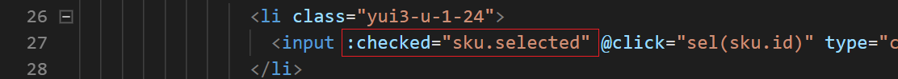

## 4.13 批量删除的bug

在batchDel删除时, 使用forEach

```js
batchDel() {
    this.skus.forEach((v, i) => {
        if (v.selected == true) {
            this.skus.splice(i, 1)
        }
    })
},
```

## 4.14 全选功能

分析: 使用一个flag标记全选状态/全不选状态

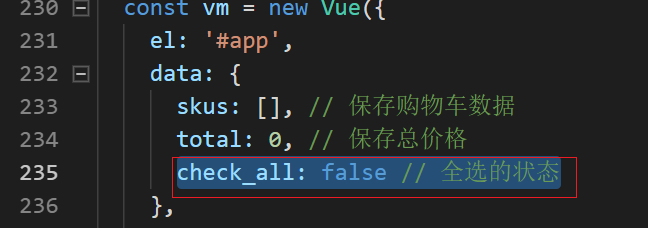

如果check_all为false, 表明全不选的状态, 把每一个skus里的对象selected属性设置为false

如果check_all为true, 表明全选的状态, 把每个skus里的对象selected属性设置为true

```js
selall() {
    this.check_all = !this.check_all

    this.skus.forEach(item => {
        if (this.check_all) {
            item.selected = true
        }else {
            item.selected = false
        }
    })
}
```


# 5.支付宝支付

常见支付方式：微信支付、支付宝支付、银行卡支付。

 

支付宝支付接口的类型：（商家的集成方案）

担保交易接口  用户支付的资金先进入担保账户，确认收货后才进入商家的账户

**即时到帐接口**  用户支付的资金立即进入商家账户

担保交易接口在2016年8月已经停止申请。

## 5.1 应用申请

支付宝开放平台： <https://open.alipay.com>

使用自己的支付宝账号登录平台

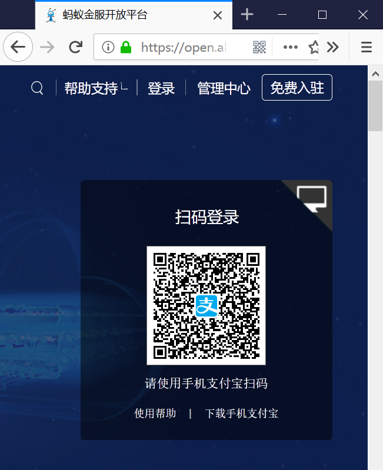

选择开发者中心->网页&移动应用

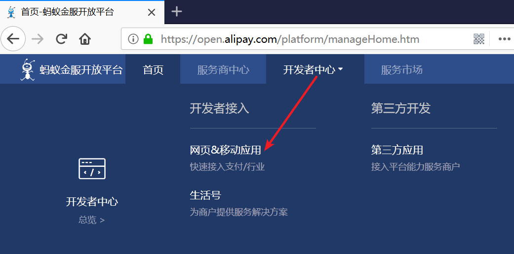

进一步, 添加"自定义接入"

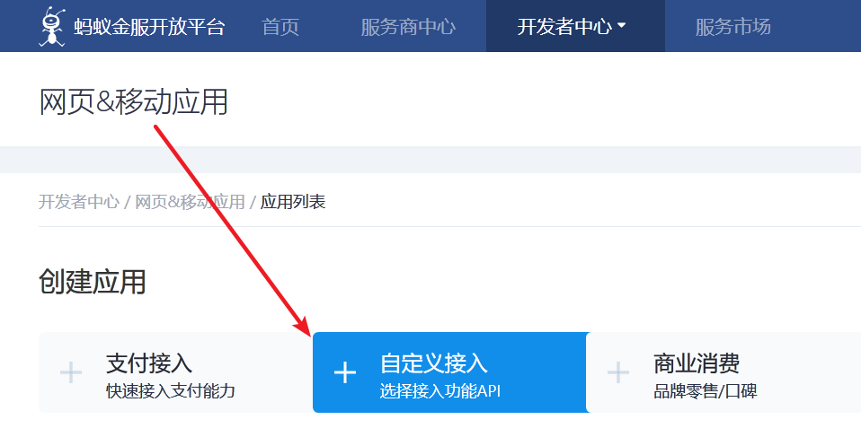

输入应用的名称

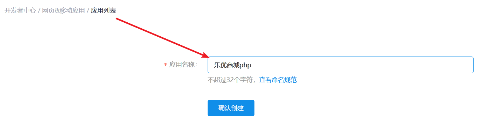

添加功能

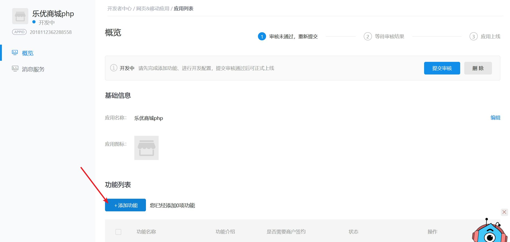

选择"支付收单->电脑网站支付"


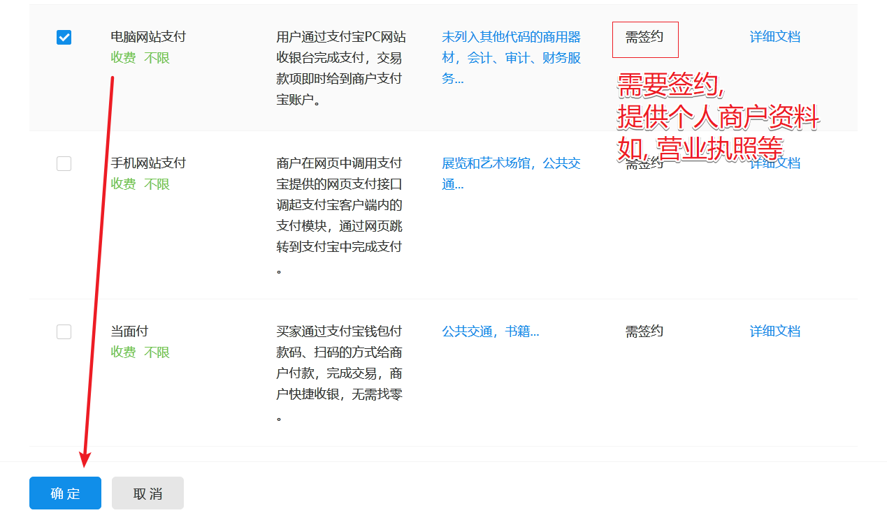

在真实环境中, 使用这个功能需要先"签约". 而我们做为开发者没有对应的营业执照, 怎么办?

支付宝为没有个体商户资质的开发测试人员提供了一个测试环境，即沙箱应用。

## 5.2 沙箱应用

在开发者中心下, 可以找到研发服务----**沙箱**

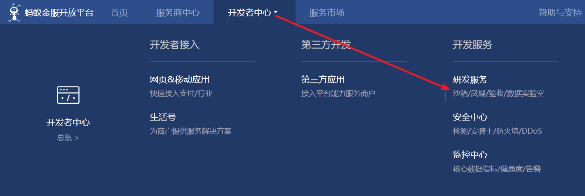

进入到沙箱首页

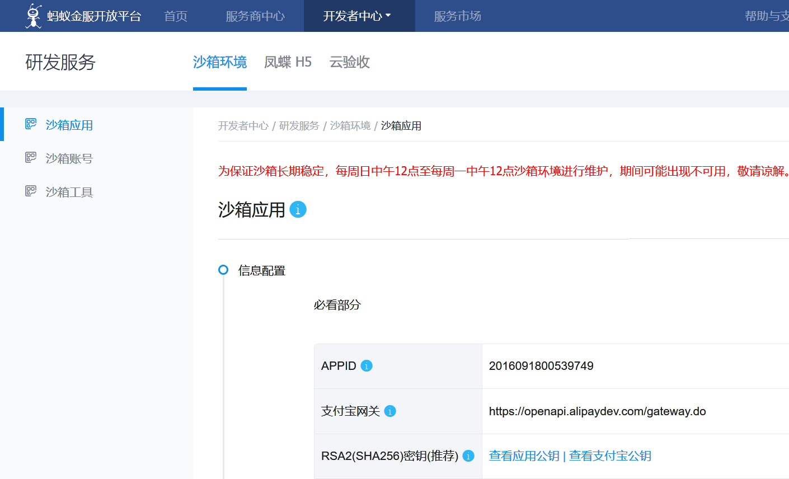

### 1) 必看部分

在沙箱环境可以看到appid、测试支付宝网关、密钥信息

1. APPID是我们这个沙箱应用的唯一标识

推荐大家把这个值复制下来, 后面在调试接口时会需要使用到

```json
APPID：2016091800539749
```

2. 支付宝网关（gateway）

这个是测试环境, 注意在域名中带有dev, 表示是开发环境

```
https://openapi.alipaydev.com/gateway.do
```

3. 秘钥（公钥、私钥）

第一次创建沙箱应用时, 显示"生成公钥", 后面是"查看公钥"

说明: 什么叫公钥, 什么叫私钥

通俗的理解, 公钥是公开的, 所有人都知道, 通过公钥可以换取唯一的私钥, 私钥才是真正的密码, 但是只有自己知道

这里注意一个东西, 叫"支付宝公钥"

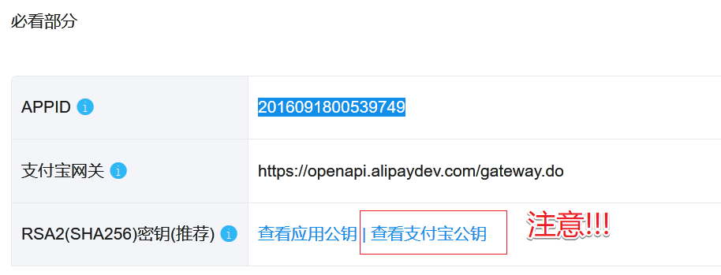

应用公钥和支付宝公钥不一样!!!

在对接支付宝的时候, 我们可能会用到"支付宝公钥". 初学的时候格外注意不要配错!!!

### 2) 沙箱帐号

的沙箱账号里边可以看到 商家信息  和  买家信息

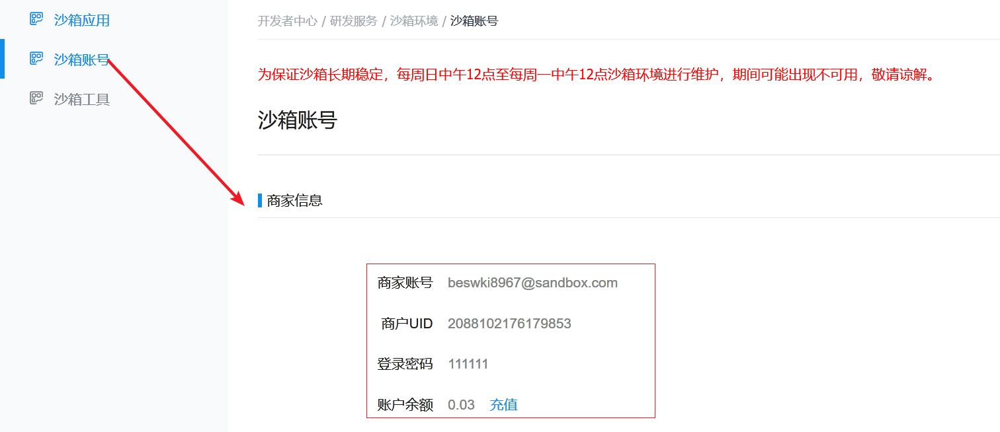

进行付款的时候，就使用**买家**帐号

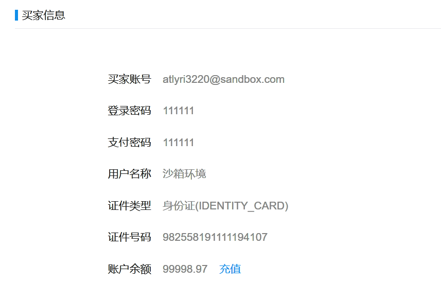

为了后面调试的方便, 把买家账号放在下面

```
atlyri3220@sandbox.com
111111
```

## 5.3 配置密钥

支付宝接口使用时，需要配置密钥

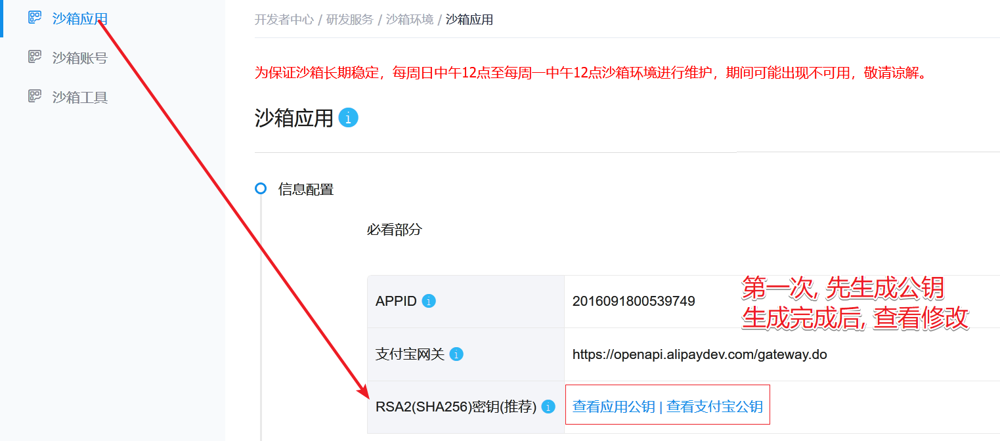

查看应用公钥

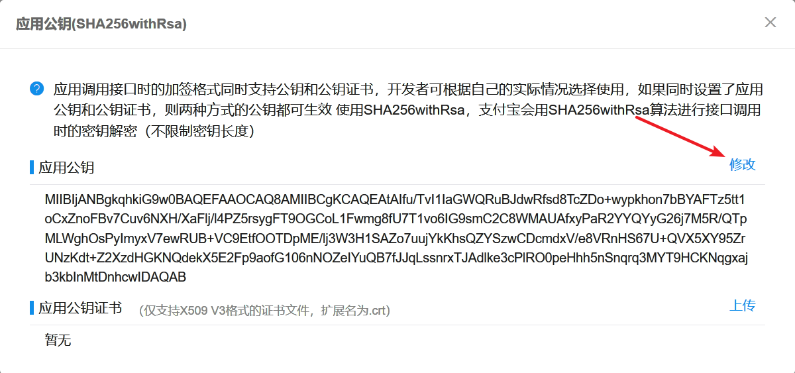

点"修改"

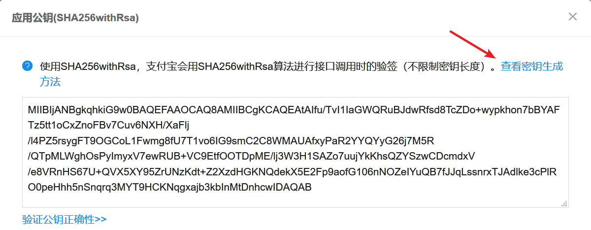

查看密钥生成的方法, 跳转到下面这个页面

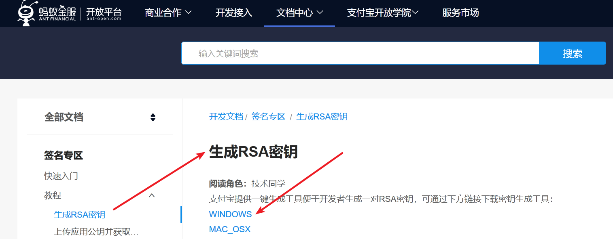

根据自己的操作系统选择下载

在这里, 已经给大家准备好了

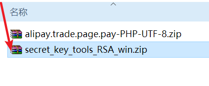

解压运行验签工具.bat

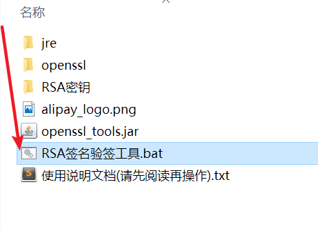

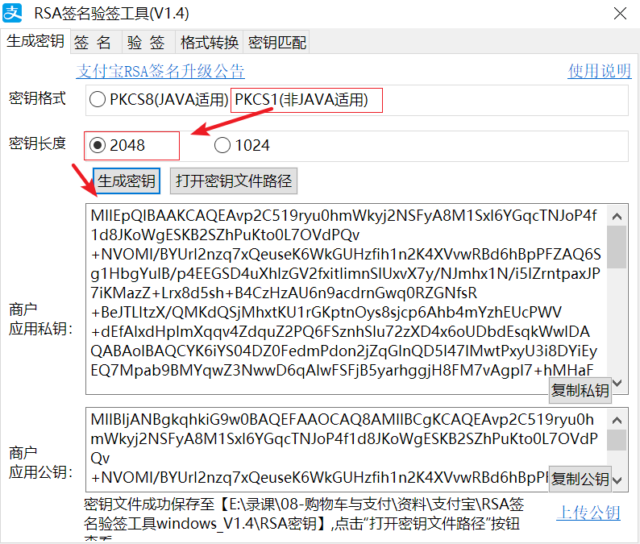

选择非java适用-2048-生成密钥, 可以看到生成了"应用公钥"和"应用私钥".

在本地目录也会生成一个文件夹保存公钥和私钥


将"应用公钥"复制到配置页面

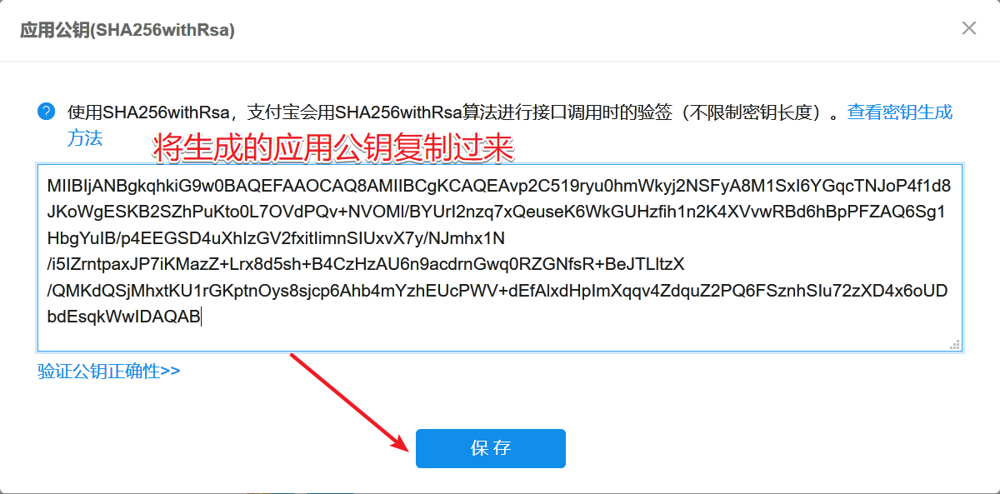

保存之后，可以重新进行查看。除了“应用公钥”，还自动生成了“支付宝公钥”

将支付宝公钥保存下来, 后面会用到

```
MIIBIjANBgkqhkiG9w0BAQEFAAOCAQ8AMIIBCgKCAQEAs5Hof0sU0CMnlqnA+RW22kuCs+ep1oGSzNNKFl9e5FS7iCzWw4RxmgKmDxcjNGCN+OlVJ68y/O1bLvuSlej6PddeHBYHUwnufqGU6Bkl2mCoGILtl2O70ROYxPCGtpK52b4L2mn+noeSYaIUfvp2lOjEcBFRXuTQXyPFwkO5X9IvB/3i28ctLYv9LJCUGf5oEUcSftvbNPcgqDky0HCzS2U69G7UC9myzsBAeW42Eqxqt3kIwNJtI+54CP9WVkyXNCo15e7/5iTpHLsPWhJbydstTQNOlRGeIb1gtFIho7r+gHPDpqqLzLBfZbo/OiCKm7QnyW44iQqQ+DQvYGMNGwIDAQAB
```


## 5.4 SDK配置

### 1) 下载SDK

下载地址: https://docs.open.alipay.com/270/106291/


这里已经给大家准备好了, 在资料中

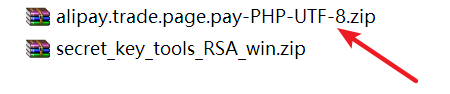

### 2)  解压

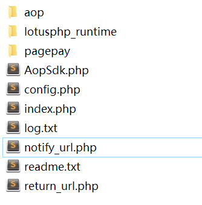

- config.php: 配置文件，配置支付宝参数
- index.php: demo示例文件(支付宝效果体现)
- notify_url.php: 异步回调地址（通知页面），支付宝以post隐藏方式向商家发起请求，用于处理业务逻辑：比如商家在该请求里可以修改订单状态
- return_url.php: 同步回调**地址（跳转页面），**支付宝通过get显示方式向商家发起请求，用于页面展示

----------

notify_url和return_url的区别:

- notify_url是必须是外网可以访问的地址, 有公网ip和域名, 能够被支付宝访问到
- return_url可以是本地地址, 只要可以被本地浏览器解析就可以, 用于页面的跳转.

我们是测试环境, 没有公网ip和域名, 所以**主要使用return_url**

----------

### 3) 配置

把解压后的目录移动到项目目录中public目录下并改名为alipay, 方便测试

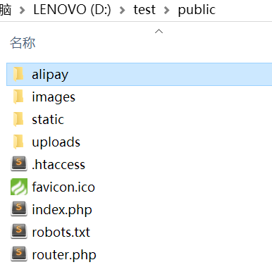

在浏览器中, 访问 http://local.leyou.com/alipay/index.php

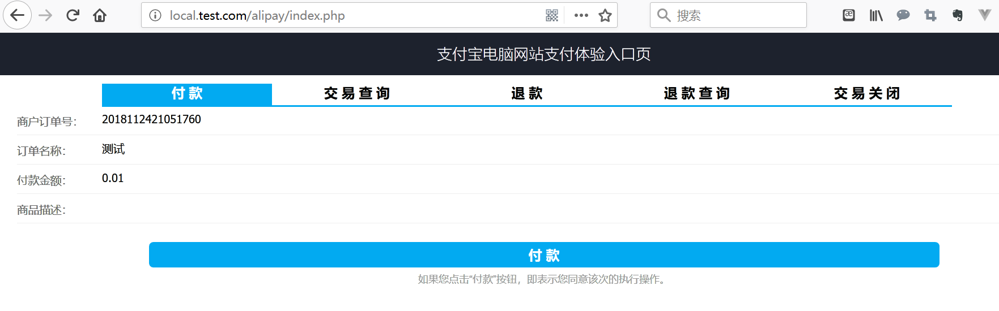

想要使用, 需要先完成配置

- APPID
- 支付宝网关
- 支付宝公钥
- 应用私钥

在配置文件: public/alipay/config.php中, 配置上述内容

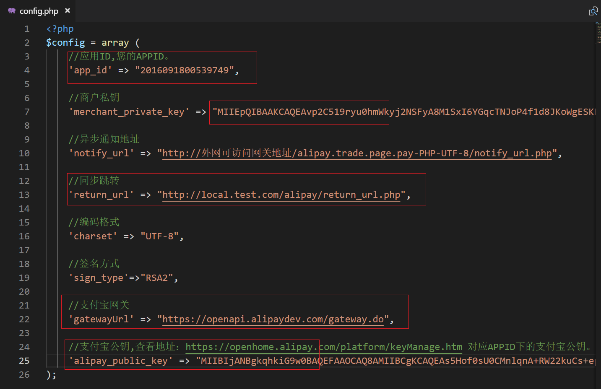

APPID: 在沙箱应用页面可以找到, 我们已经复制下来了,在文档中

商户私钥: 可以在本地的文件中查看

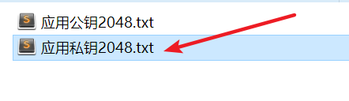

同步跳转地址:

对于大家来说, 这里应该配置为

```
http://local.leyou.com/alipay/return_url.php
```

支付宝网关: 在沙箱应用页面可以找到, 我们已经复制下来, 注意域名中带有dev

支付宝公钥: 

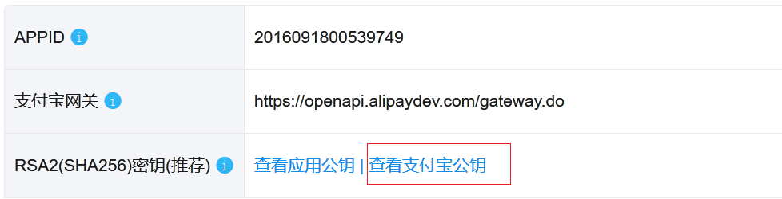

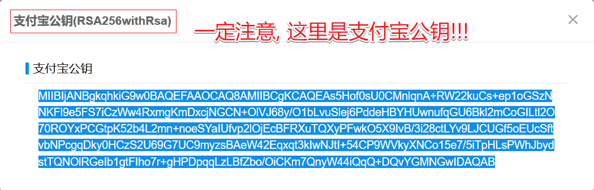

### 4) 测试

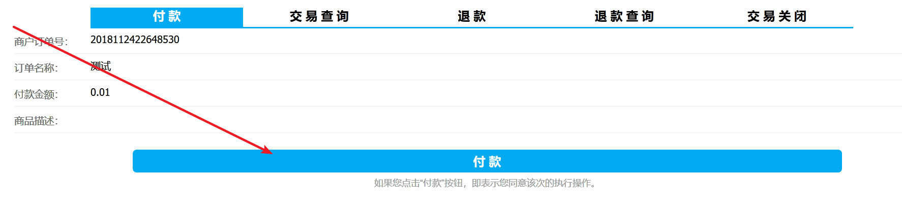

点"付款", 跳转到支付页面

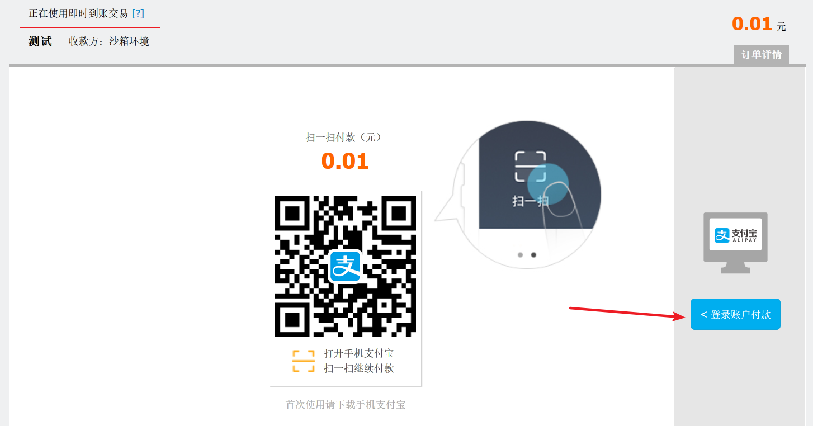

使用"账户登录"

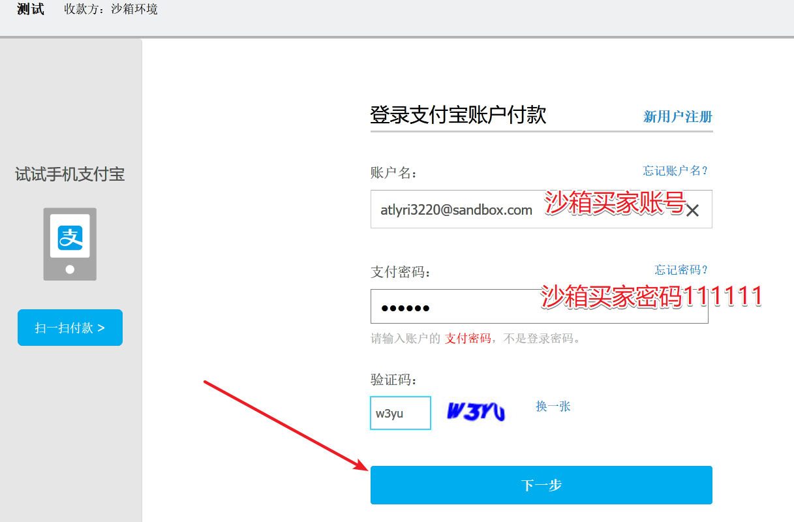

输入沙箱买家账号与密码, 下一步

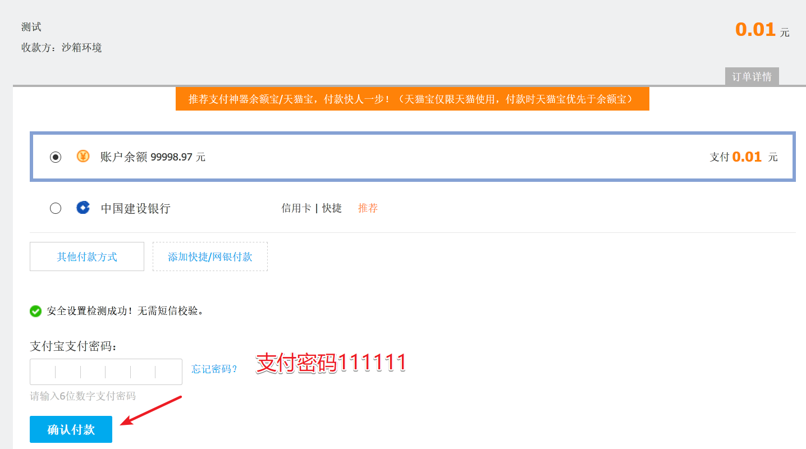

输入支付密码: 111111

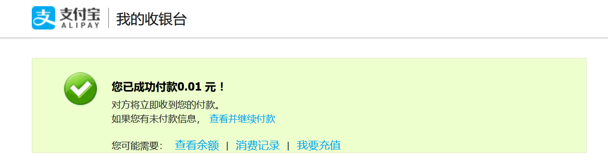

支付宝会根据配置的回调地址return_url, 跳转回商户页面

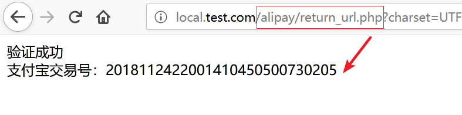

## 5.5 集成到项目中

### 1) 写一个form表单

我们可以看到, 在index.php中, 主要是通过一个form表单, 提交给pagepay/pagepay.php页面, 由pagepay.php去调用支付宝接口, 因此, 我们在需要支付的页面, 隐藏一个form表单同样向pagepay提交即可.

```html
<form id='alipayment' action='/alipay/pagepay/pagepay.php' method='post'>
    <input id='WIDout_trade_no' name='WIDout_trade_no' />
    <input id='WIDsubject' name='WIDsubject' />
    <input id='WIDtotal_amount' name='WIDtotal_amount' />
    <input id='WIDbody' name='WIDbody' />
</form>
```

这个表单在页面中不显示, 可以加上display:none

为了方便调试, 咱们先不隐藏

### 2) 绑定数据

在data里定义一个order和表单的元素绑定

```js
data: {
      skus: [], // 购物车数据
      total: 0, // 总价
      order: {
        trade_no: 0, // 订单号
        subject: '', // 订单名称
        amount: 0, // 订单金额
        body: '' // 商品描述
      }
},
```

在form中使用v-model双向绑定

```html
<form id='alipayment' action='/alipay/pagepay/pagepay.php' method='post'>
    <input id='WIDout_trade_no' name='WIDout_trade_no' v-model="order.trade_no"/>
    <input id='WIDsubject' name='WIDsubject' v-model="order.subject"/>
    <input id='WIDtotal_amount' name='WIDtotal_amount' v-model="order.amount"/>
    <input id='WIDbody' name='WIDbody' v-model="order.body"/>
</form>
```

### 3) 监听skus的变化

监听skus的变化, 在计算购物车总价时, 更新form表单的值

```js
watch: {
      skus: {
        deep: true,
        handler() {
          var tmp = 0
          this.skus.forEach(item => {
            if (item.selected)
              tmp += item.price * item.number 
          })
          this.total = tmp;

          // 给表单赋值
          var vNow = new Date();
          var sNow = "";
          sNow += String(vNow.getFullYear());
          sNow += String(vNow.getMonth() + 1);
          sNow += String(vNow.getDate());
          sNow += String(vNow.getHours());
          sNow += String(vNow.getMinutes());
          sNow += String(vNow.getSeconds());
          sNow += String(vNow.getMilliseconds());
          
          this.order.trade_no = sNow
          this.order.subject = "乐优订单"
          this.order.amount = this.total
          this.order.body = "乐优商品"
        }
      }
},
```

### 4) 绑定方法


由于需要使用vue操作form, 所以使用ref属性, 而不是id

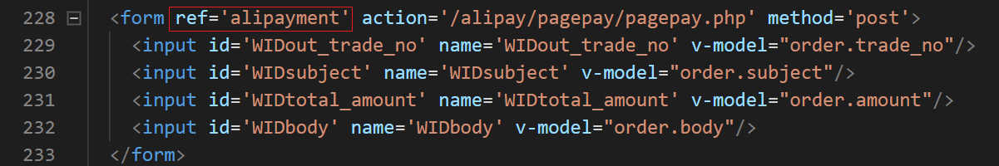

在methods中定义submit方法

```js
submit() {
    this.$refs.alipayment.submit()
}
```

### 5) 调试

在pagepay.php中加入调试信息, 确认数据有提交过来

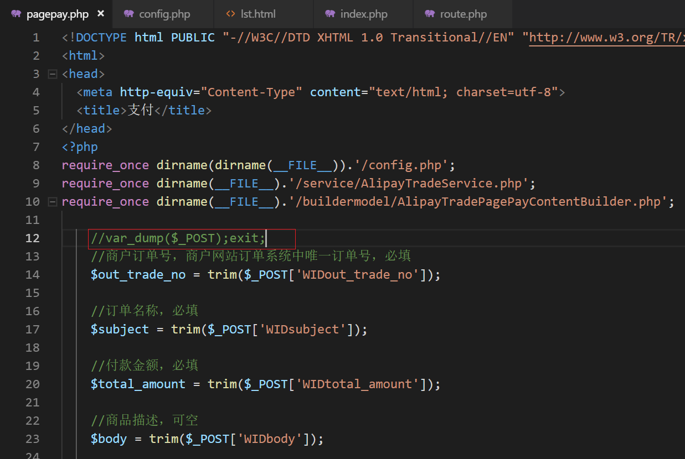

## 5.6 验签

当支付完成后, 支付宝会跳转到return_url所指定的本地地址, 因此, 我们需要在return_url中判断, 并提示支付成功或者失败

### 1) 配置return_rul

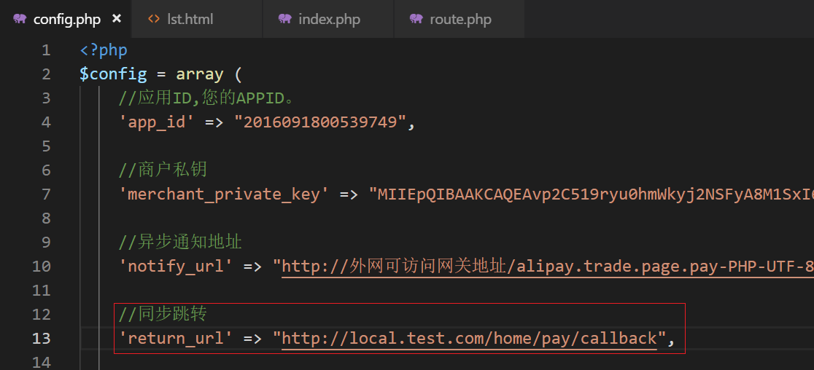

### 2) 创建控制器方法

使用命令创建控制器

```
php think make:controller home/Pay --plain
```

并编写如下内容

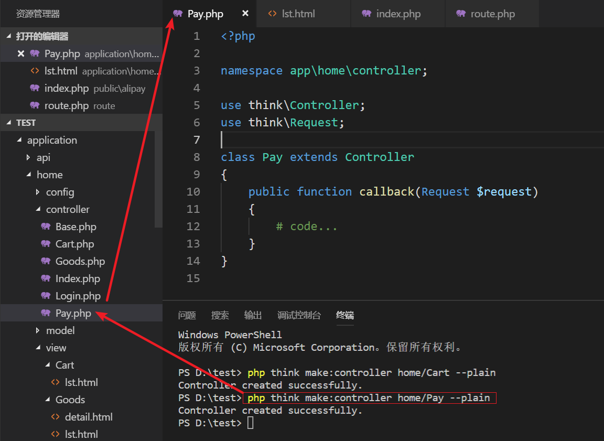

### 3) 编写callback方法

可参考alipay/return_url.php中的写法

```php
public function callback(Request $request)
{
    // 1. 获取参数
    $data = $request->param();

    // 2. 包含文件
    require_once('./alipay/config.php');
    require_once('./alipay/pagepay/service/AlipayTradeService.php');

    // 3. 实例化对象
    $alipaySevice = new \AlipayTradeService($config); 
    $result = $alipaySevice->check($data);

    if ($result) {
        //验签成功
        return view('paysuccess');
    }else {
        return view('payfail');
    }
}
```

1. 通过param()获取参数
2. 包含文件
3. 实例化TradeService对象
4. 调用check方法验证
5. 判断

补充:

微信的测试号网址: **http://mp.weixin.qq.com/debug/cgi-bin/sandbox?t=sandbox/login**

