# TP中的关联关系模型

# 一. 表与表之间的关系

两张表之间, 排列组合, 一共有4种关系

- 一对一
- 一对多
- 多对一
- 多对多

# 二. 案例分析

表一: 用户表(it_user)主表

表二: 用户详情表(it_user_info)

表三: 文章表(it_article)

表四: 国家表(it_country)

表五: 用户角色表(it_role)

##  2.1 一对一

用户表(表一)与详情表(表二)就是一对一的关系

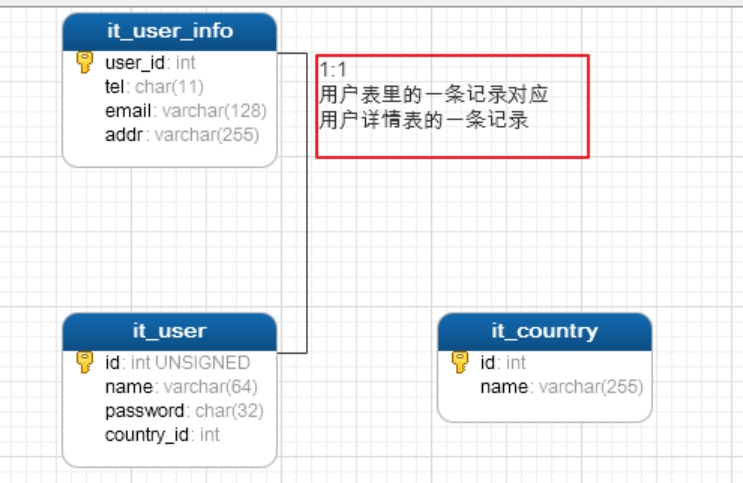 

## 2.2 一对多

用户表(表一)与文章表(表三)就是一对多的关系

文章表与用户表是多对一的关系

什么叫外键:

子表(多)与父表(一), 在子表中建立一个字段, 指向父表的主键, 那么子表中的这个字段就叫外键

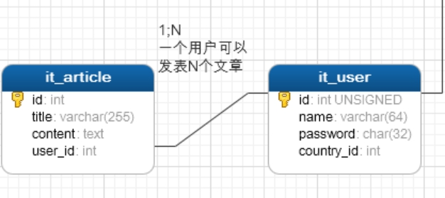 

## 2.3 多对一

用户表(表一)与国家表(表四)就是多对一的关系

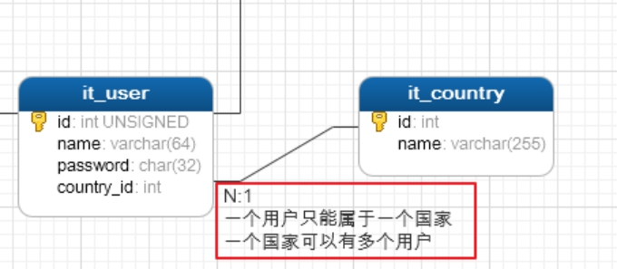 

## 2.4 多对多

用户表(表一)与角色表(表五)就是多对多的关系, 通过一张中间表(user_role)来维护

用户表和中间表之间, 一对多关系, 所以中间表里user_id是外键, 跟user表的id字段关联

角色表和中间表之间, 一对多关系, 所以中间表里role_id是外键, 跟role表的id字段关联

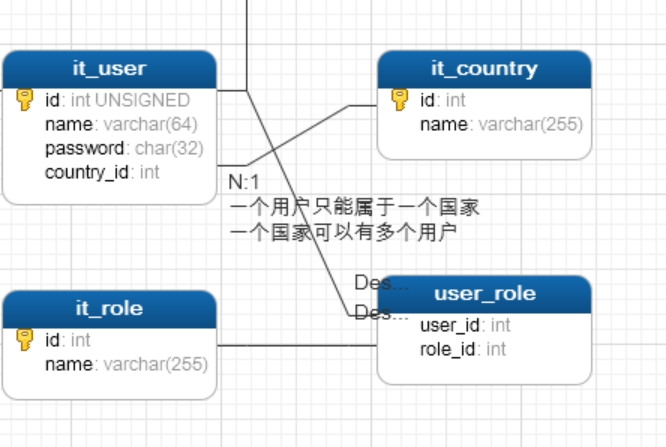

# 三. 建库建表

## 3.1 建库

创建数据库: relation

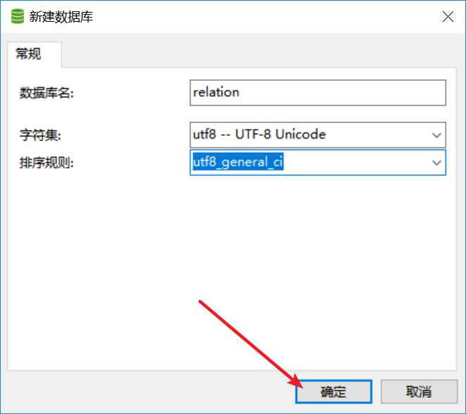 

## 3.2 导入表数据

将relation.sql导入到数据库. 

会看到如下数据表

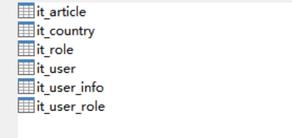

# 四. 项目准备

## 4.1 创建tp工程

使用composer创建一个新的tp项目tp_relation来测试

```
composer create-project topthink/think tp_relation
```

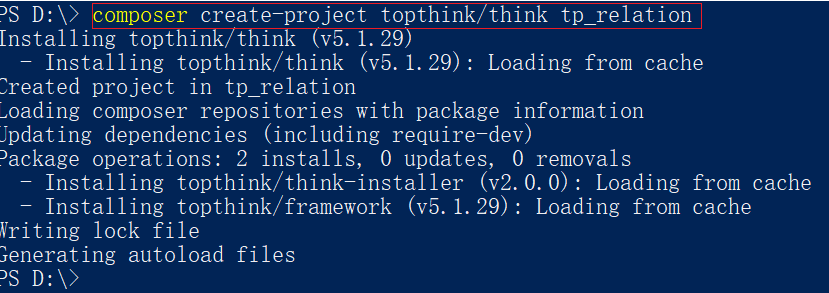

## 4.2 配置虚拟主机

### 1) 配置vhosts.conf

```
<VirtualHost *:80>
    DocumentRoot "D:\tp_relation\public"
    ServerName local.relation.com
    ServerAlias
  <Directory "D:\tp_relation\public">
      Options FollowSymLinks ExecCGI
      AllowOverride All
      Order allow,deny
      Allow from all
      Require all granted
  </Directory>
</VirtualHost>
```

### 2) 配置hosts

```
127.0.0.1	     local.relation.com
```

### 3) 重启apache

## 4.3 开启一些配置项

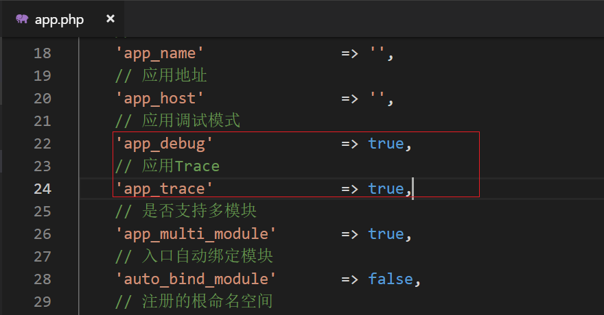

为了方便调试, 打开app_debug和app_trace

隐藏入口文件:

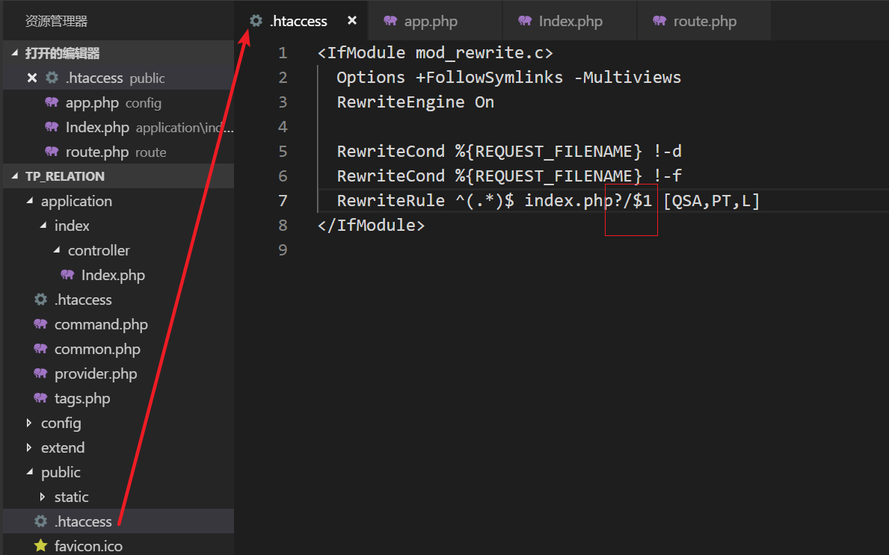

## 4.4 数据库配置

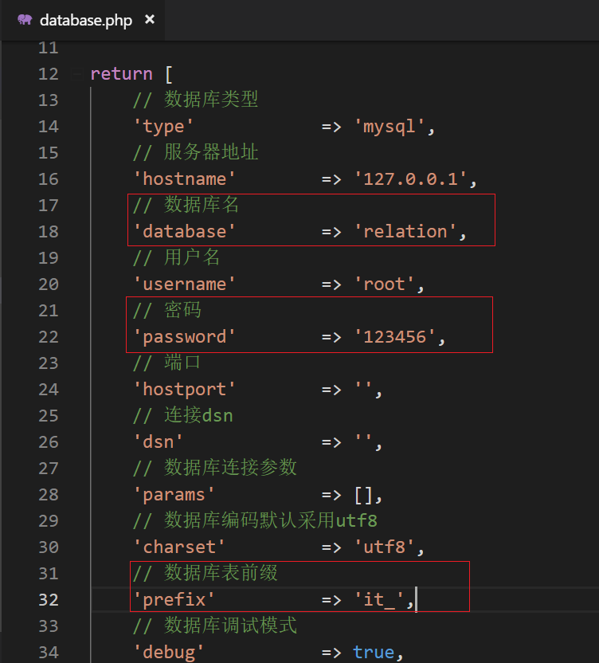

## 4.5 测试

访问local.relation.com

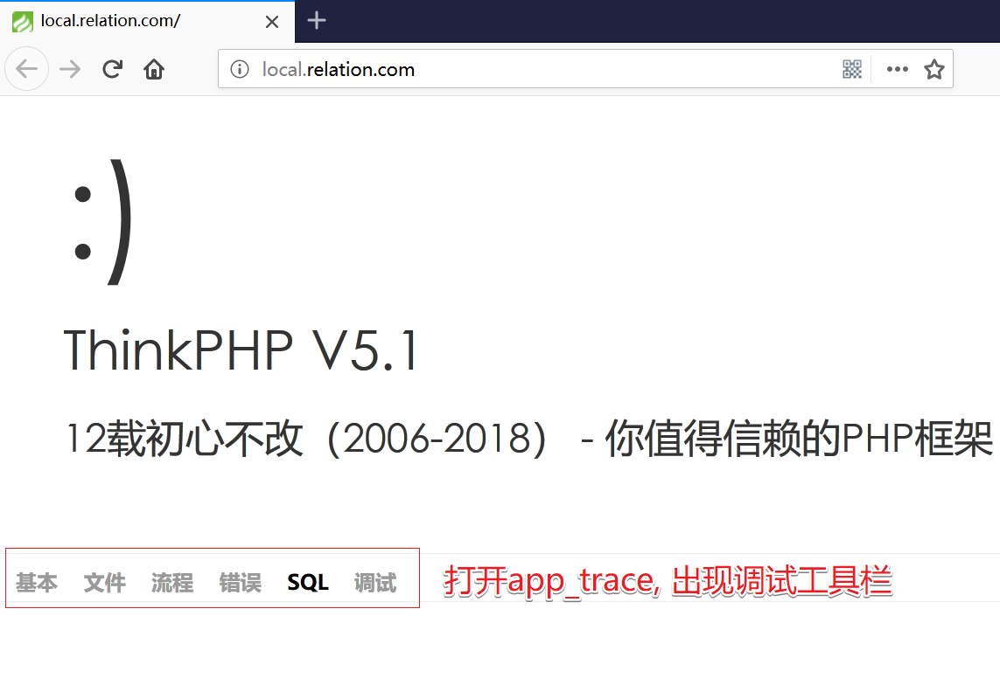

# 五. 一对一关系

## 5.1 创建模型

### 1) 为user表创建对应的模型

```
php think make:model index/User
```

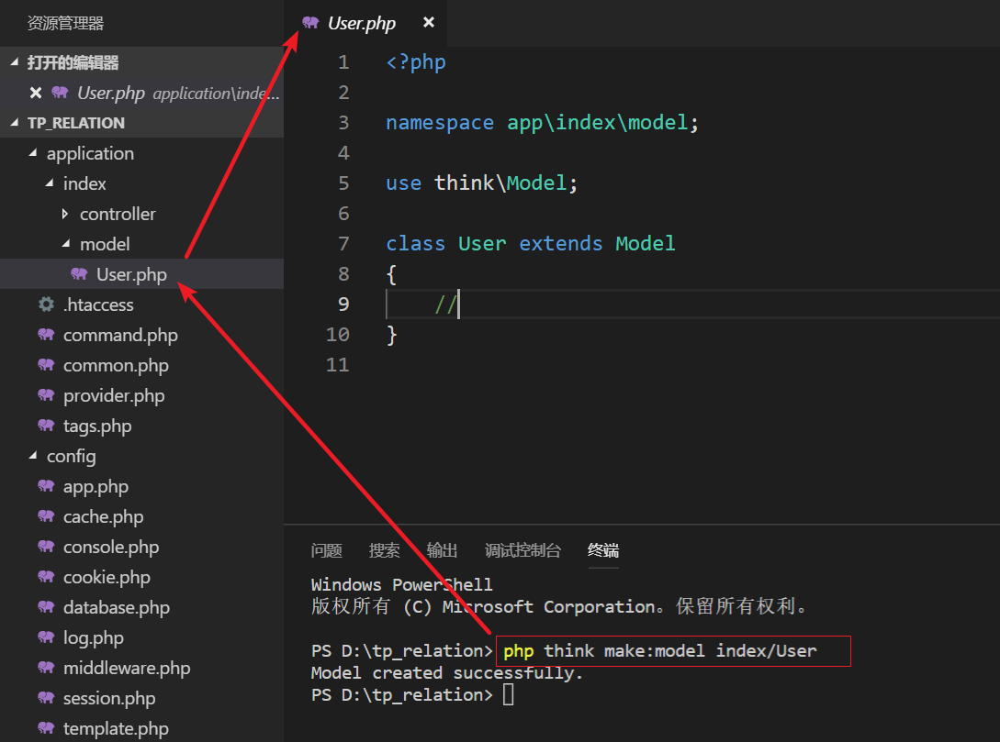

这里, 创建模型时, 使用tp的默认规则, User模型类对应it_user表

参考文档: https://www.kancloud.cn/manual/thinkphp5_1/354041

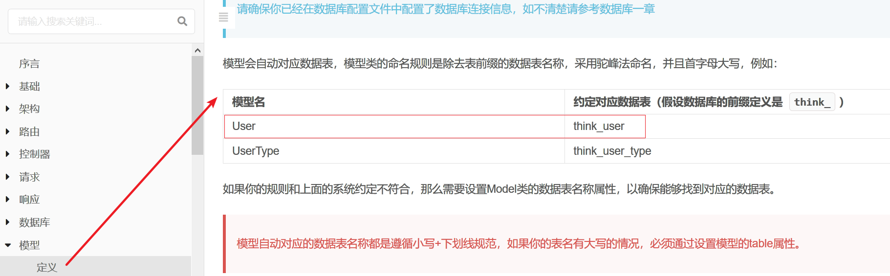

### 2) 为user_info表创建对应的模型


这里, 创建模型时, 使用tp的默认规则, UserInfo模型类对应it_user_info表

## 5.2 创建方法

### 1)  引入模型类

```php
// 引入模型类
use app\index\model\User;
use app\index\model\UserInfo;
```

### 2) 编写一个方法

```php
// 一对一关系
public function one_one()
{
    $user = User::find(1);
    dump($user);
}
```

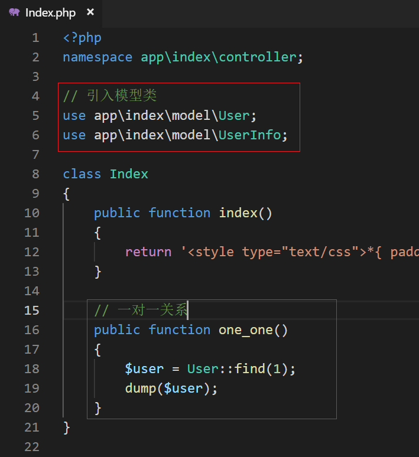

### 3) 测试

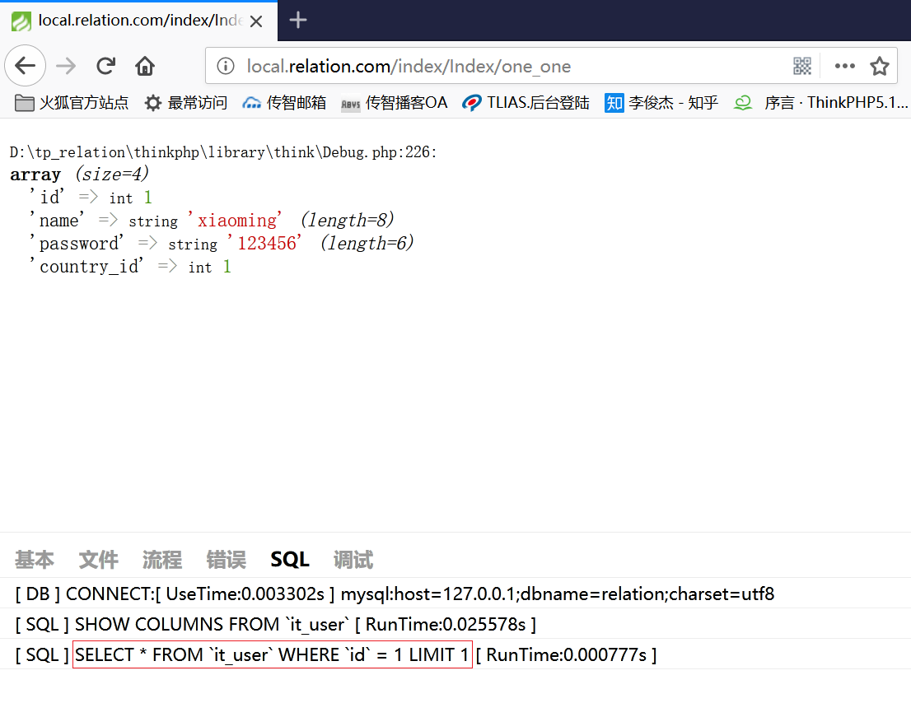

- find()方法返回一个数组, 对应user表里id=1的记录

- 执行的sql语句如下

  ```sql
  SELECT * FROM `it_user` WHERE `id` = 1 LIMIT 1
  ```

## 5.3 获取用户详细信息

在不使用关联关系模型时, 如果想获取用户的详细信息怎么处理?

需求: 查找xiaoming的手机号

分为两步

1. 根据name查找user表, 找id
2. 根据id查找user_info表, 条件是user_info表中的user_id=id

```php
// 一对一关系
public function one_one()
{
    $user = User::find(1);
    //dump($user);

    // 获取用户详细信息
    // 条件: user_info中的user_id字段=user表中的id字段
    $user_info = UserInfo::where('user_id', $user['id'])->find();
    dump($user_info);
}
```

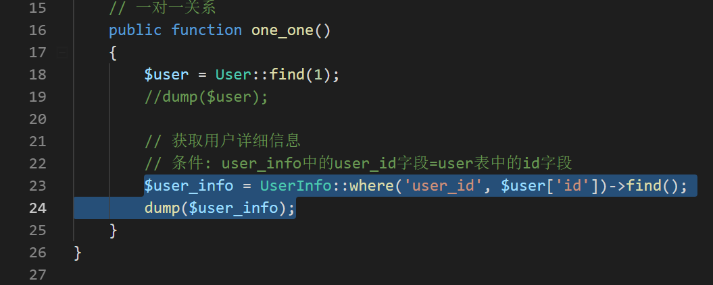

测试:

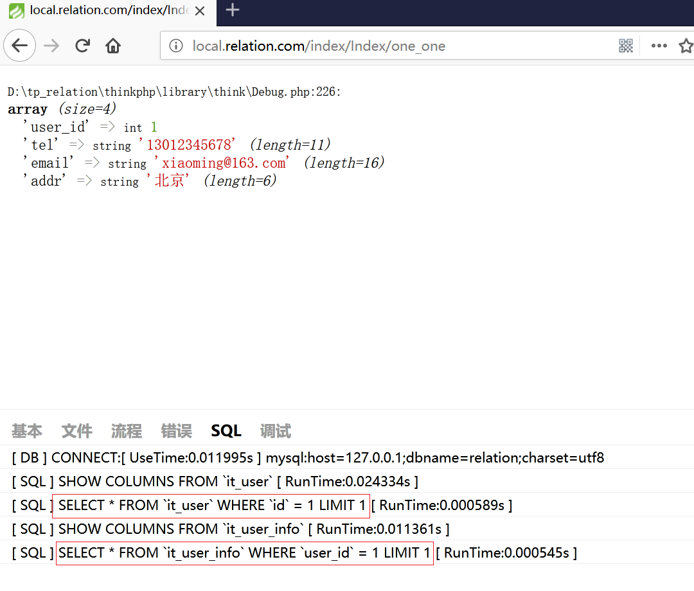

需要执行两条SQL语句, 最终返回的是一条user_info表中的数据

## 5.4 关联查询

### 1) 在user模型中编写userInfo方法

在userInfo方法中, 调用hasOne(), 带3个参数

https://www.kancloud.cn/manual/thinkphp5_1/354057

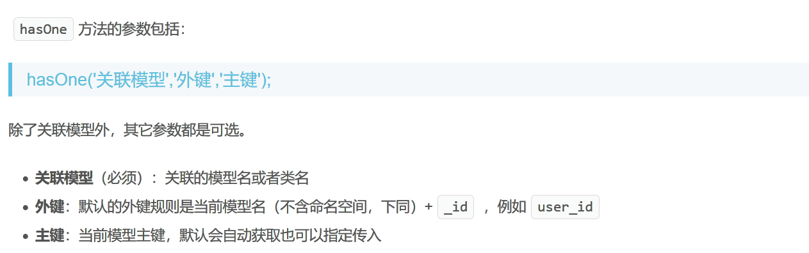

```php
public function userInfo()
{
    /**
    * 第一个参数: 要关联的模型类名
    * 第二个参数: 外键名, 要关联的表中的字段
    * 第三个参数: 主键名, 本表中跟关联表对应的字段
    */
    return $this->hasOne('UserInfo', 'user_id', 'id');
}
```

### 2) 在控制器中调用

在控制器中调用时,  user_info可以做为user模型的一个属性来查询

关联方法命名是驼峰法,userInfo, 关联属性则是小写+下划线user_info

https://www.kancloud.cn/manual/thinkphp5_1/354057

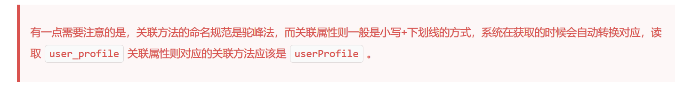

```php
// 使用关联模型
public function one_one_yes()
{
    $user = User::find(1);
    dump($user);
    dump($user->user_info);
}
```

### 3) 测试

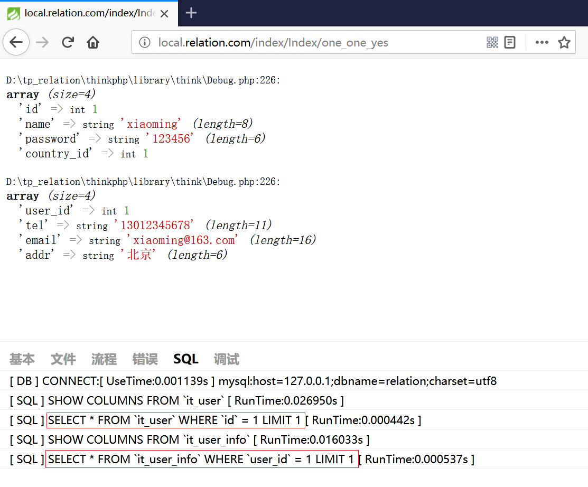

执行的sql语句跟之前一致

## 5.5 根据关联表查本表

需求, 查询手机号为18973245670的用户密码

分析: 手机号保存在关联表user_info中, 密码在本表user中

一般的思路是: 

- 先从user_info表中查找, 条件是tel=18973245670, 找到user_id(3)
- 再根据user_id到user表中查找, 条件是id=user_id(3)

### 1) 不使用关联关系

```php
public function info2user()
{
    //不使用关联关系
    $tel = '18973245670';
    $user_id = UserInfo::where('tel', $tel)->value('user_id');
    $user = User::find($user_id);
    echo $user->password;
}
```

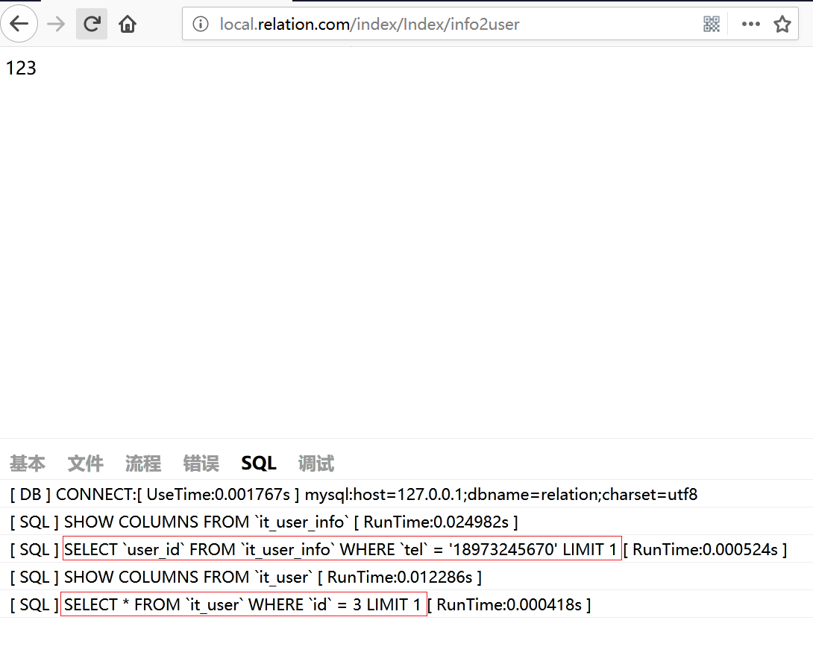

 也可以使用一条sql语句, 连表查询

```sql
select it_user.password from it_user join it_user_info on it_user_info.user_id =it_user.id where it_user_info.tel='18973245670';
```

### 2) 使用关联关系

```php
public function info2user()
{
    // 使用关联关系
    $tel = '18973245670';
    // 第一个参数是关联方法名(不是关联模型名)
    $user = User::hasWhere('userInfo', ['tel'=>$tel])->find();
    echo $user->password;
}
```

说明:

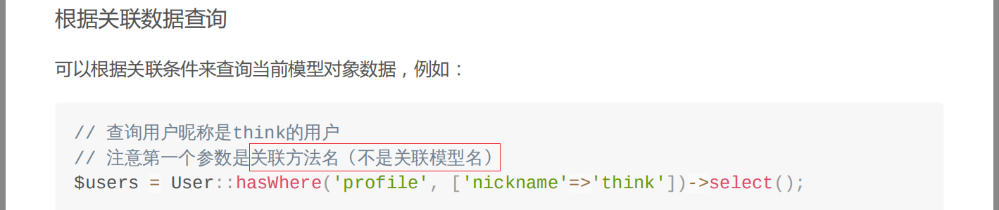

执行的sql语句:

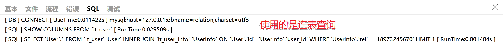

N+1问题: 

需求, 查询xiaoming用户发表的所有文章的标题

1. 根据xiaoming查找user表, 查询1次, 这个就是N+1中的1
2. 根据id查找article表, 查询到N条文章记录
3. 遍历文章记录, 依次取出标题

第二种方式

1. 根据xiaoming查找user表, 查询1次, 这个就是1
2. where in (1,2,3), 这个只需要查询1条sql语句, 一共执行1+1=2条sql语句

## 5.6 关联自动写入

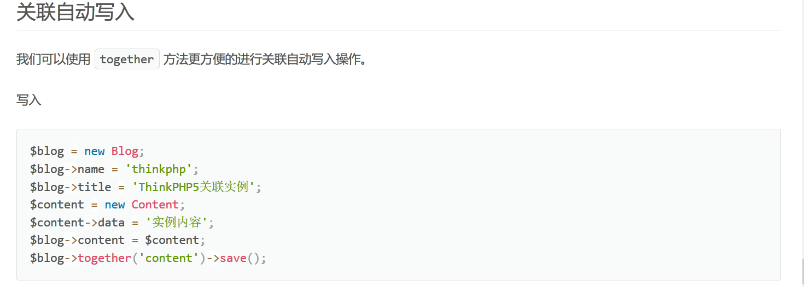

分别创建两个模型, 在写入数据库时, 使用together

### 1) 关联新增

应用场景, 在添加用户的同时, 添加用户的详情

案例:

```php
public function add()
{
    $user = new User;
    $user->name = 'xiaozhang';
    $user->password = '123456';

    $user_info = new UserInfo;
    $user_info->tel = '13909876543';
    $user_info->email = 'xiaozhang@163.com';
    $user_info->addr = '南京';

    // 建立关联关系
    $user->user_info = $user_info;
    // 这里必须指定关联属性名, user_info跟上面的关联属性保持一致
    $user->together('user_info')->save();
}
```

测试


### 2) 关联更新

需求, 更新id为7的用户的密码和手机号

密码是保存在本表user中

手机号是保存在关联表user_info中

使用关联更新, 同时更新两张表

```php
public function upd()
{
    $user = User::find(7);
    $user->password = '777';
    $user->user_info->tel = '77777777';

    $user->together('user_info')->save();
}
```

执行的sql语句

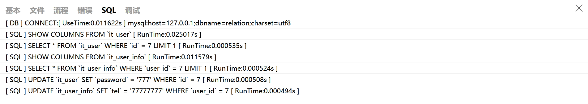

### 3) 关联删除

需求: 删除id为8的用户时, 同时删除详情

```php
public function del()
{
    $user = User::get(8, 'userInfo');

    $user->together('user_info')->delete();
}
```

这个地方, tp好像有bug, 完全按照手册的写法写, 但是依然出问题

# 六. 一对多关系

用户表(it_user)和文章表(it_article)之间就是一对多关系

## 6.1 创建模型

### 1) 为article表创建对应的模型

```
php think make:model index/Article
```

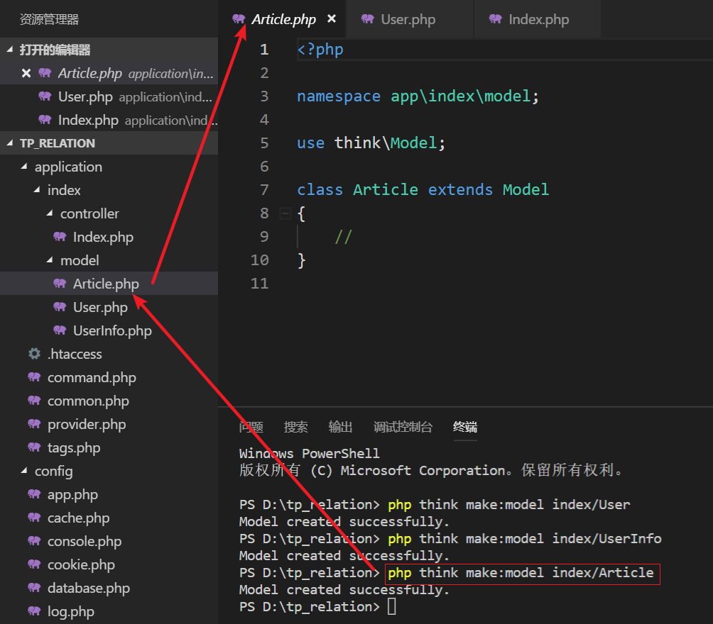

## 6.2 建立关联关系

在user模型中, 定义一个方法articles

```php
public function articles()
{
    /**
    * 第一个参数: 要关联的模型名
    * 第二个参数: 外键名, 要关联的表中的字段
    * 第三个参数: 主键名, 本表中跟关联表对应的字段
    */
    return $this->hasMany('Article', 'user_id', 'id');
}
```

## 6.3 关联查询

```php
public function article()
{
    $user = User::find(1);
    // 将模型中的方法做为属性来使用
    dump($user->articles);
}
```

效果

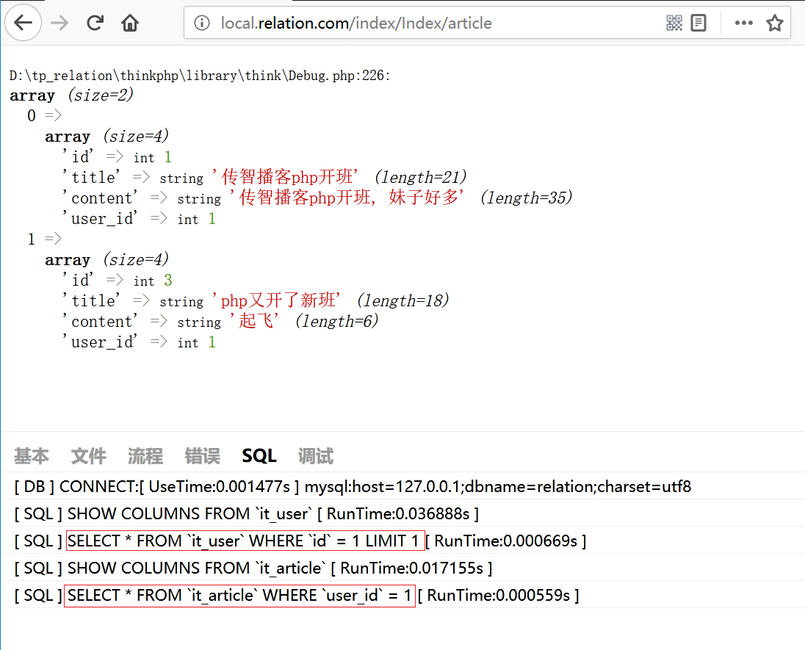

## 6.4 关联新增

```php
public function article_add()
{
    $data = [
        'title'=>'新增的文章',
        'content'=>'新增的文章'
    ];

    $user = User::find(1);
    // 这里的articles必须加(), 表示调用模型的方法
    $user->articles()->save($data);
}
```

执行的sql语句

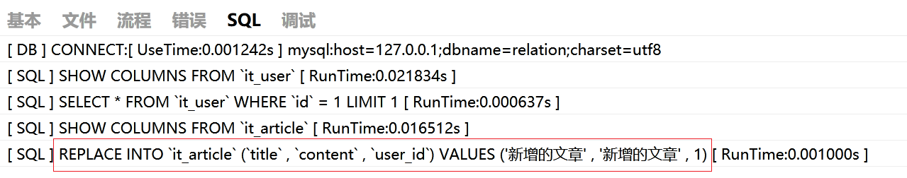

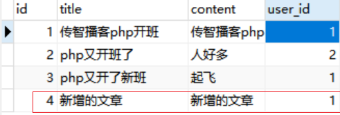

## 6.5 关联删除

```php
public function article_del()
{
    $user = User::get(1, 'articles');
    $user->together('articles')->delete();
}
```

执行的sql语句

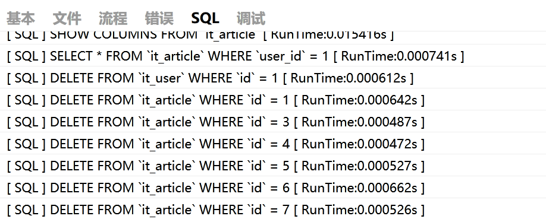

# 七. 多对一关系

一对多关系反过来就是多对一关系

用户表(it_user)与国家表(it_country)之间就是多对一关系

## 7.1 创建模型

### 1) 为country表创建对应的模型

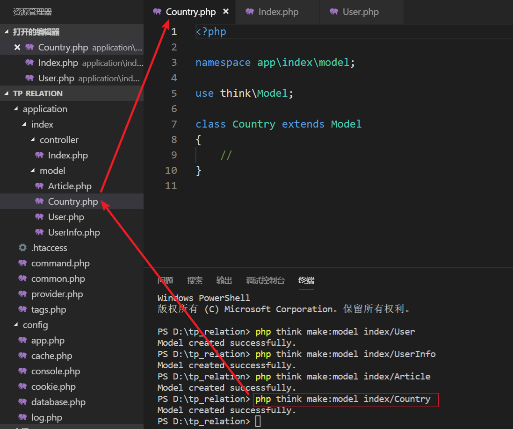

## 7.2 建立关联关系

在用户模型(user)中, 定义一个方法country

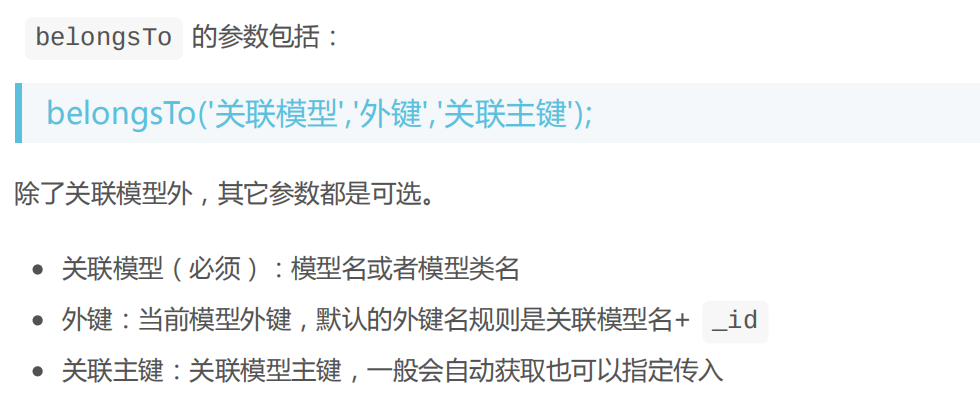

```php
public function country()
{
    /**
    * 第一个参数: 要关联的模型类名
    * 第二个参数: 外键名, 由于本表是子表, 外键字段在本表中
    * 第三个参数: 主键名, 需要关联的模型的主键
    */
    return $this->belongsTo('Country', 'country_id', 'id');
}
```

## 7.3 关联查询

```php
public function country()
{
    $user = User::find(1);
    dump($user->country);
}
```

# 八. 多对多关系

用户表(it_user)与角色表(it_role)是多对多的关系

对于多对多关系, 需要一张中间表(it_user_role)

## 8.1 创建模型

### 1) 创建角色表(role)对应的模型

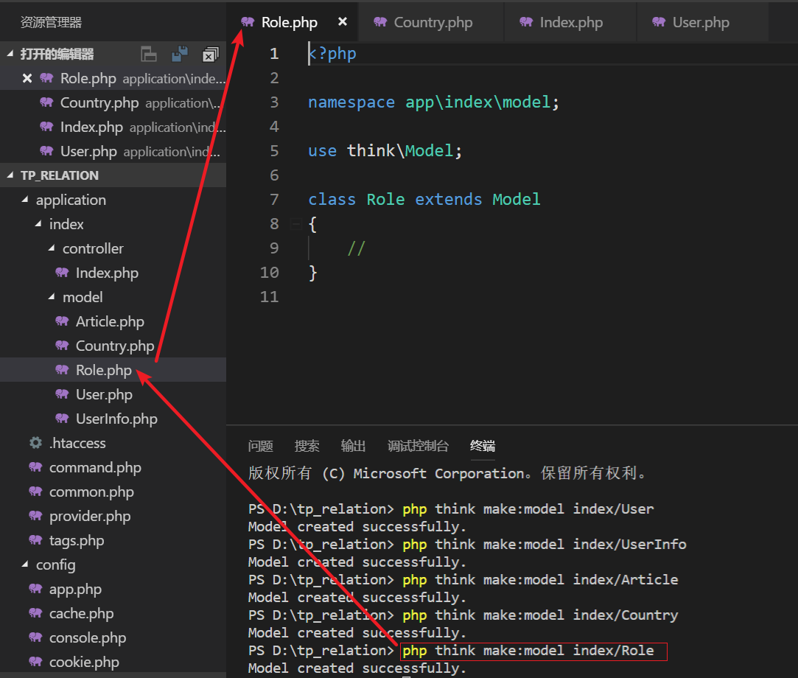

### 2) 创建中间表(user_role)对应的模型

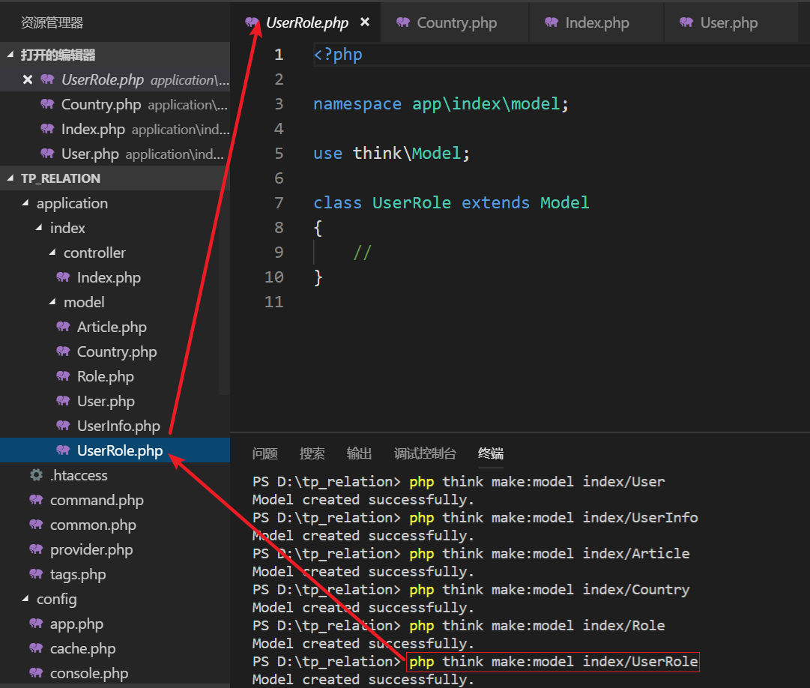

## 8.2 建立关联关系

在User模型中, 定义一个roles方法

```php
public function roles()
{
    /**
    * 第一个参数: 要关联的模型类名
    * 第二个参数: 中间表名
    * 第三个参数: 外键, 中间表的当前模型外键
    * 第四个参数: 关联键, 中间表的当前模型关联键名
    */
    return $this->belongsToMany('Role', 'user_role', 'user_id', 'role_id');
}
```

使用belongsToMany()函数

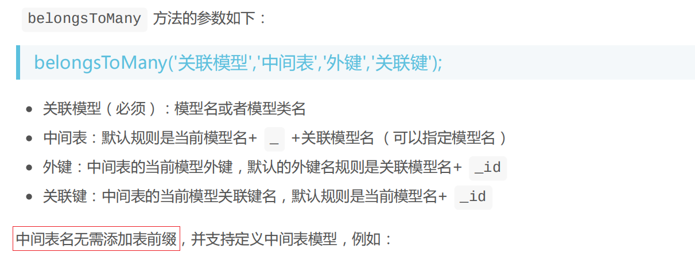

## 8.3 关联查询

```php
public function role()
{
    $user = User::find(1);
    dump($user->roles);
}
```

可以直接获取id为1的用户的角色信息

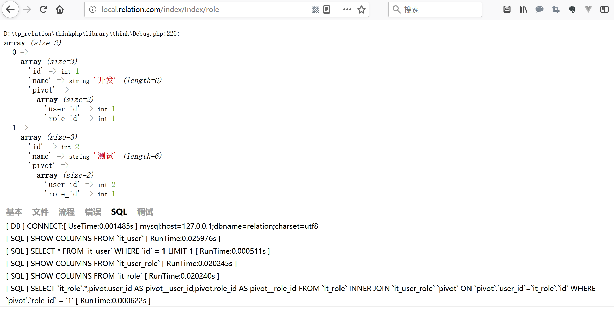

## 8.4 关联新增

```php
public function role_add()
{
    $user = User::find(1);

    $user->roles()->save(['name'=>'管理员']);
}
```

这里执行了两个操作

1. 向关联的角色表里添加了一条记录
2. 向中间表添加了一条记录

不用手动的维护中间表, 这个还不错~~

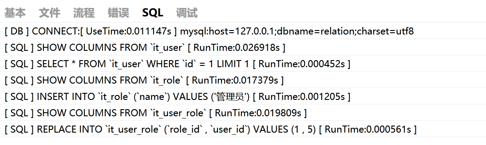