# 1、开通阿里云

## 1.1 注册登录

访问阿里云主页：[阿里云](https://www.aliyun.com/)

注册：

 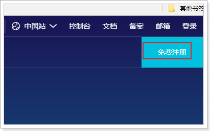

登录：

 

进入云通信：

 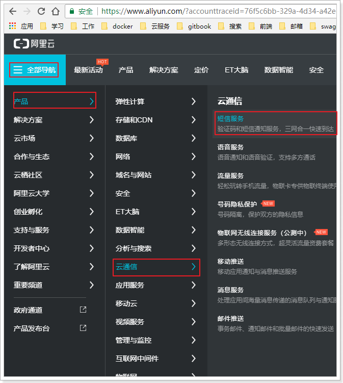

进入短信服务控制台：

选择：已阅读协议，然后立即开通

然后在控制台，即可查看新手帮助：

## 1.2 完整流程

查看新手帮助的完整流程：

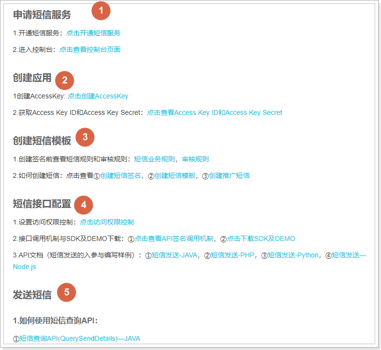

申请短信服务我们已经完成，下一步就是创建应用：

## 1.3 创建AccessKey

首先，生成AccessKey：

 

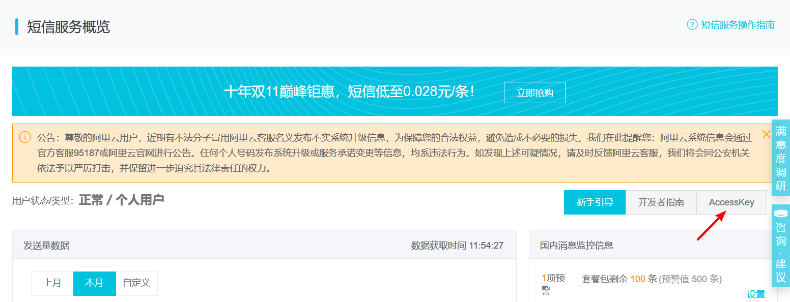

- 继续使用

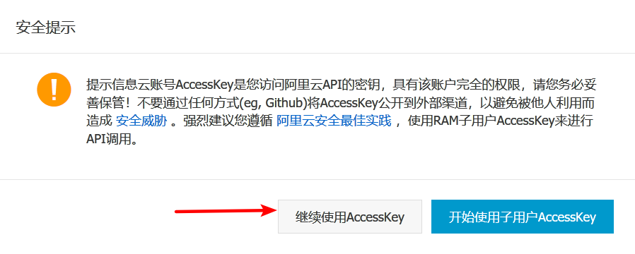

- 在验证手机成功：

   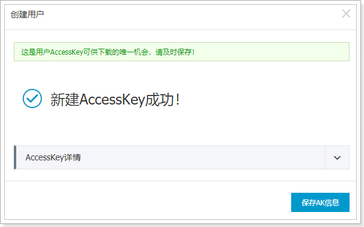

- 在弹出的对话框中，展开**AccessKey详情**查看查看AcessKeyId和AccessKeySecret。然后单击**保存AK信息**，下载AccessKey信息。

   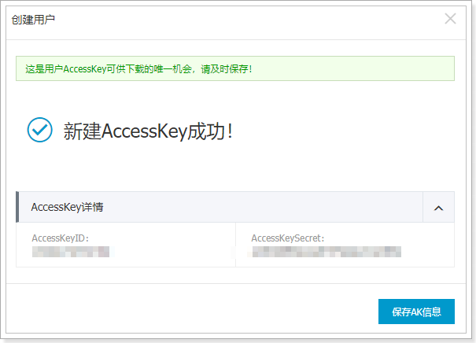

## 1.4 创建短信签名

短信签名就是短信内容头部的标签，标注短信发送者的身份。

点击管理界面的签名管理：

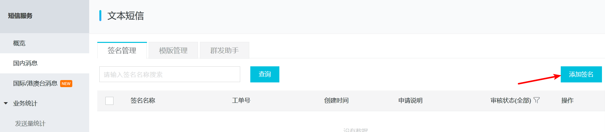

点击添加签名：

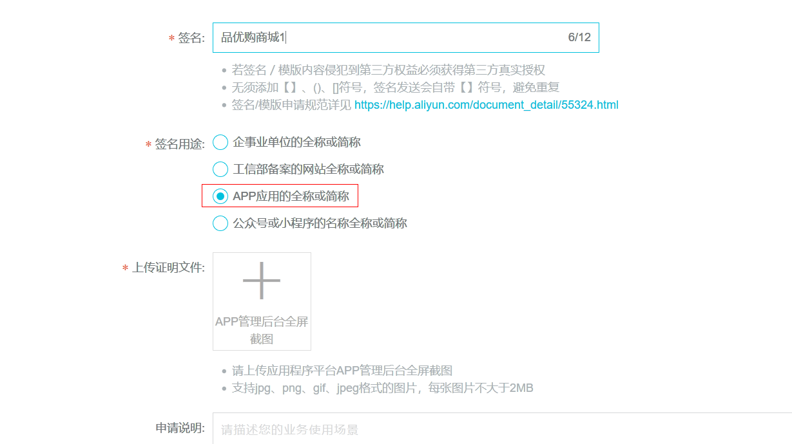

这里选择App应用

填写信息后点击确定，进入审核状态：

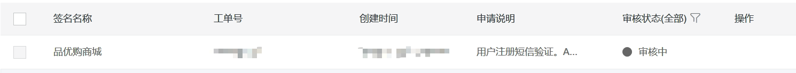

## 1.5 申请模板

在右侧点击模板管理：然后添加模板

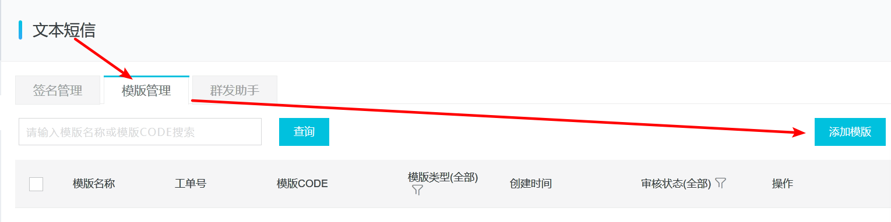

填写模板信息：

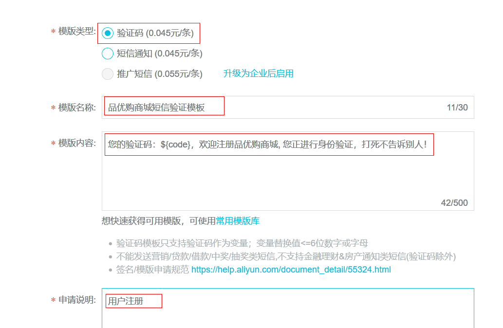

进入审核状态：

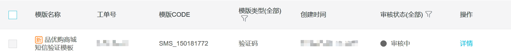

# 2、PHP客户端

我们通过官网提供的帮助来完成PHP客户端学习：

 https://help.aliyun.com/document_detail/55451.html?spm=a2c4g.11186623.4.2.22334175kdH2jp

## 2.1.下载SDK工具包

https://help.aliyun.com/document_detail/55359.html?spm=a2c4g.11174283.6.594.a37b2c42RXiTDs

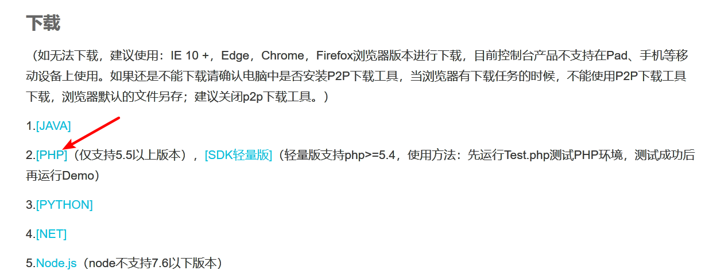

下载完成后得到压缩包：

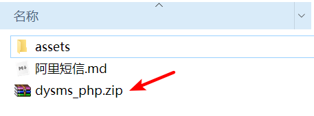

解压后目录结构：

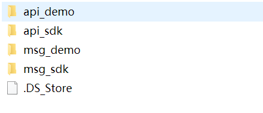 

## 2.2.使用api_demo

复制到本地Apache环境

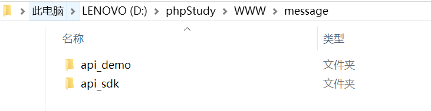

配置AppKey和AppSecret

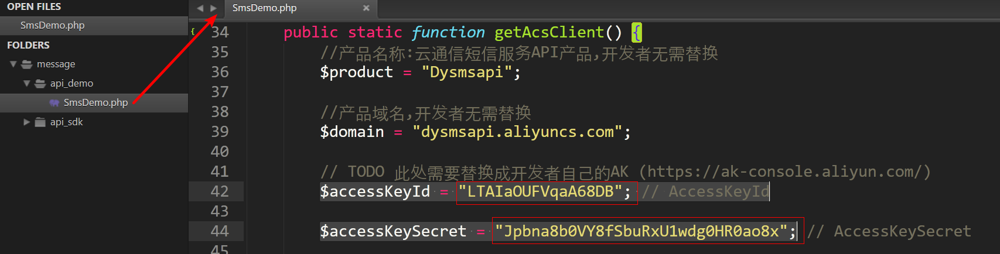

配置要发送的手机号, 签名和模块

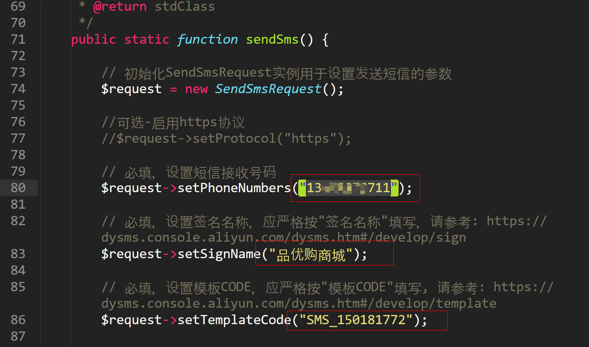

## 2.3.测试

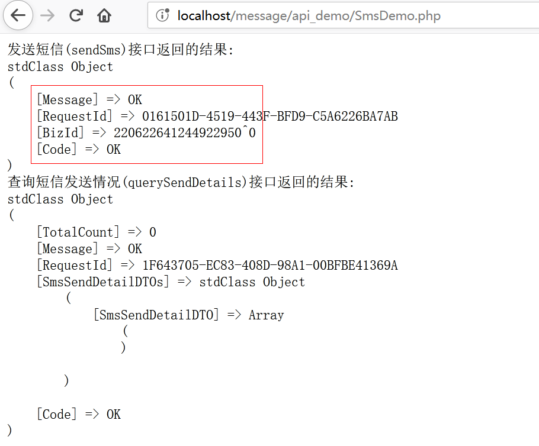

手机收到的消息如图:

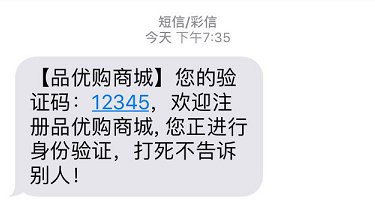