# 1.Vue初步

## 1.1 使用npm安装vue

### 1.1.1.安装node

找到软件包中的node-v8.12.0-x64.msi, 双击安装


下一步, 到安装完成. 安装完成后, 可以使用如下命令测试


> node是一个js的运行环境, 这里我们安装node主要是需要其中的npm包管理工具

### 1.1.2.配置npm镜像

npm默认的仓库地址是在国外网站，速度较慢，建议大家设置到淘宝镜像。但是切换镜像是比较麻烦的。推荐一款切换镜像的工具：nrm

我们首先安装nrm，这里`-g`代表全局安装

```
npm install nrm -g
```

全局安装后, 会在如下目录, 产生如下文件


然后, 我们就可以使用nrm命令了


通过`nrm ls`命令查看npm的仓库列表,带*的就是当前选中的镜像仓库：


通过`nrm use taobao`来指定要使用的镜像源：


注意：

- 有教程推荐大家使用cnpm命令，但是我使用发现cnpm有时会有bug，不推荐。

### 1.1.3.创建项目

在D盘, 新建一个文件夹code. 打开, 按住shift+鼠标右键, 打开sh窗口

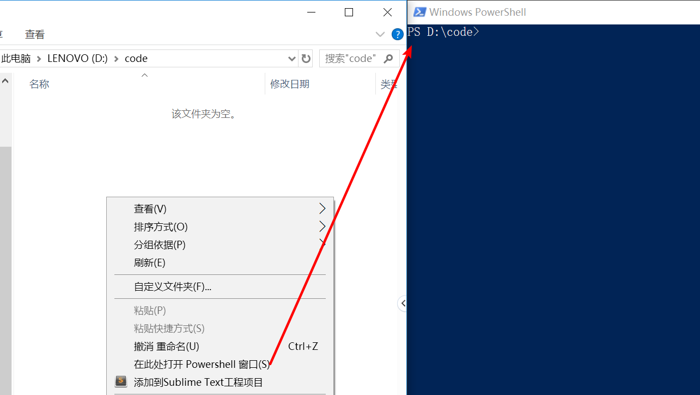

注意: 路径中不要出现中文

### 1.1.4.初始化

使用如下指令初始化

```
npm init -y
```

发现在目录下会多一个文件package.json, 这个文件用来管理该项目使用了哪些包


### 1.1.5.安装vue

执行如下命令安装vue

```
npm install vue --save
```

以上命令可以简写为

```
npm i vue -S
```

在项目目录会产生一个文件夹node_modules和一个文件package-lock.json


在package.json文件中, 会多如下内容


在node_modules里就是vue了

### 小结

总结起来, 使用npm安装一共是两步

1.初初始化:	npm init -y

2.安装		npm install vue --save

## 1.2 Vue中的MVVM模型

MVVM由Model(数据模型) View(视图) 和VM(ViewModel)的组成, 

其核心思想是实现数据与视图的**双向绑定**

----

三个组件各自的作用

Model(数据模型): 	操作数据

View(视图): 显示数据

VM: 模型与视图间的双向操作

---

在MVVM之前, 开发人员需要从后端获取数据,  然后通过DOM操作Model渲染到View中.

当用户操作了视图, 再通过DOM获取View中的数据, 同步到Model中

而VM的作用就是把DOM操作完全的封装起来, 开发人员不用再关心Model和View之间如何影响

- 只要Model发生改变, View就可以自然的表现出来
- 只要用户操作了View, Model中的数据也会跟着变化	

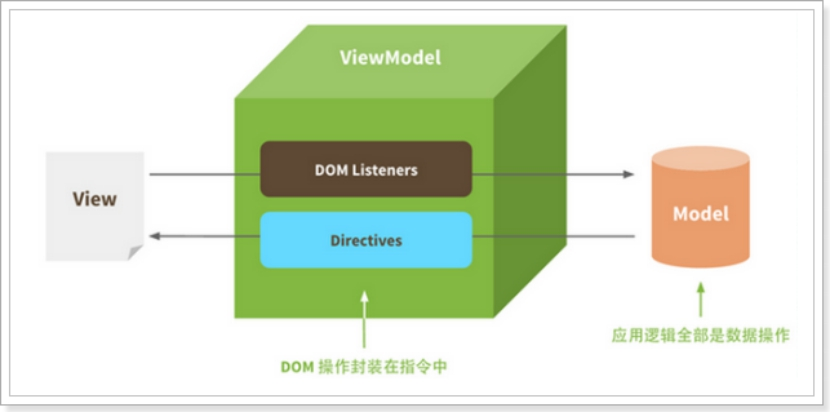 

对应代码MVVM.html

需求: 实现如下效果, 当在输入框中输入字符时, 同步显示到页面中

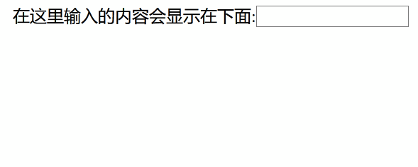

### 1.2.1.创建MVVM.html

前端项目一般推荐大家使用vscode编辑器

在项目目录中创建一个文件MVVM.html

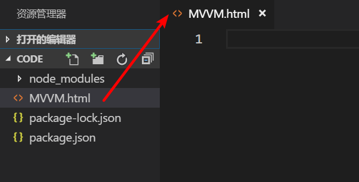

### 1.2.2.完成vue3步曲

引入vue.js(推荐插件: Path Intellisense)

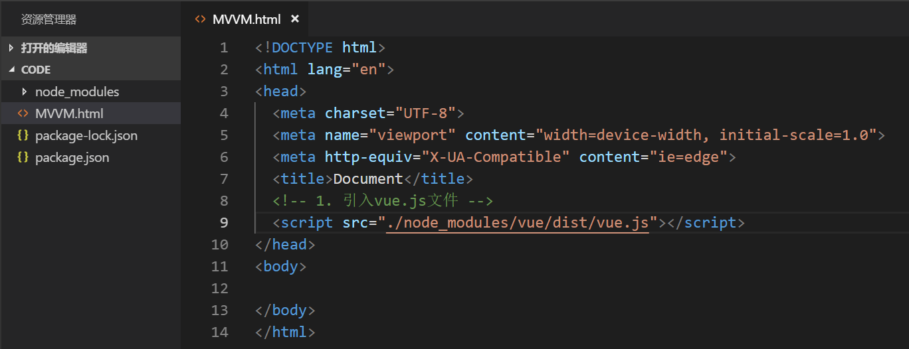

编写一个div元素, id为app, 所有视图部分将在这部分渲染

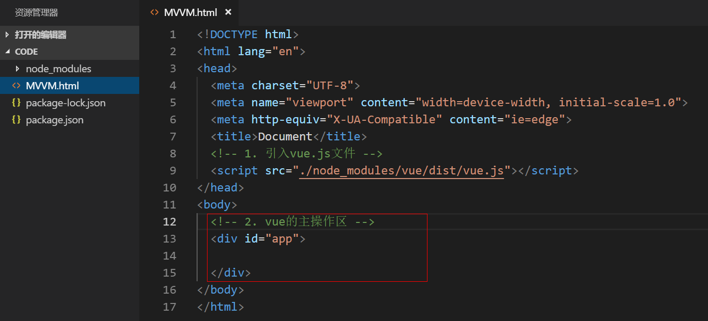

编写vue实例

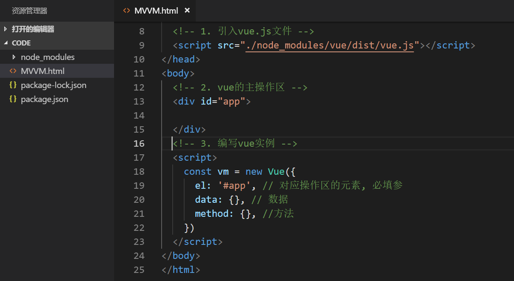

示例代码:

```vue
<!-- 3. 编写vue实例 -->
<script>
    const vm = new Vue({
        el: '#app', // 对应操作区的元素, 必填参
        data: {
            msg: ''
        }, // 数据
        method: {}, //方法
    })
</script>
```

### 1.2.3.编写视图

视图由文字, input框, 内容显示三部分组成

```vue
<!-- 2. vue的主操作区 -->
<div id="app">
    在这里输入的内容会在下面显示: <input v-model="msg" type="text">
    <h3>{{ msg }}</h3>
</div>
```

- v-model表示双向绑定, 将输入框中的内容和vue实例中的msg属性绑定
- {{}}是插值表达式, 用来显示msg的数据

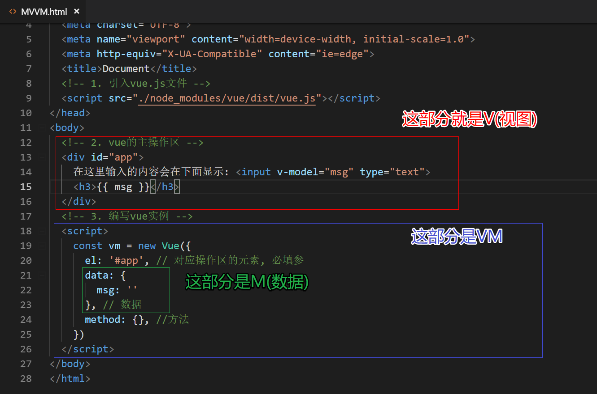

### 1.2.4.测试

右键, 使用Open In Default Browser测试(使用到的插件: open in browser)

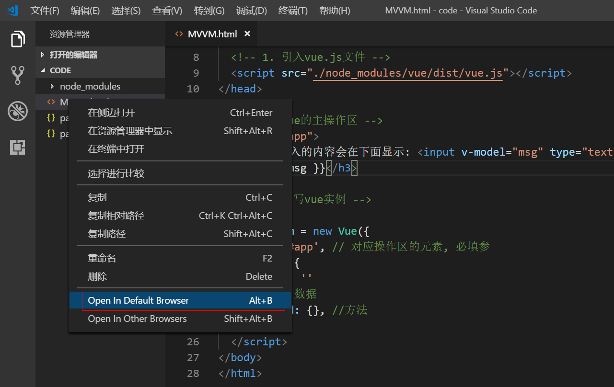

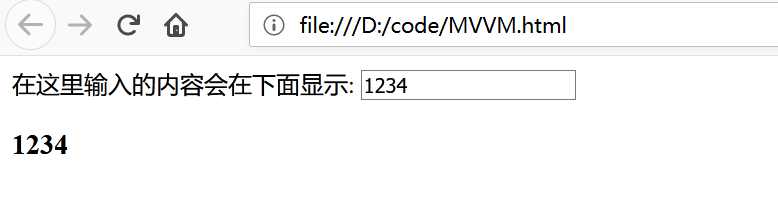

### 1.2.5.调试工具

为了方便调试vue, 可以在浏览器中安装vue-devtools, 由于chrome浏览器需要翻墙, 

这里强烈推荐使用Firefox, Firefox对中文的支持要好很多!!!

Step1. 找到”附加组件”

打开浏览器”选项”->”附加组件”, 安装vue devtools

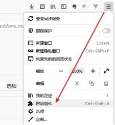 

Step2. 搜索vue devtools

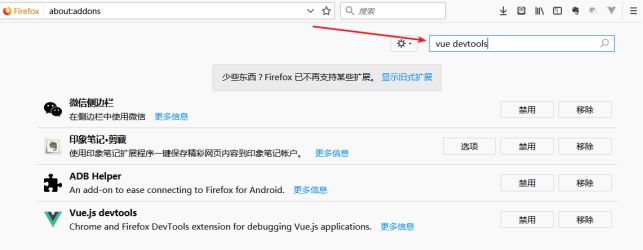 

Step3. 安装

找到vue devtools完成安装

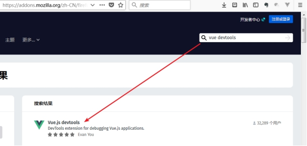 

安装完成后, 按F12, 打开web调试工具, 会出现

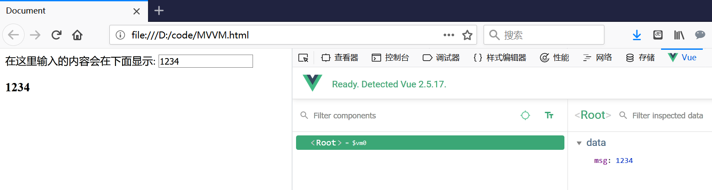 

### 小结

1. vue使用的三步曲(引入vue.js div元素 vue实例)
2. data中的内容就是M(模型), div中的内容是V(视图), vue实例是VM

## 1.3 Vue实例

Vue应用的核心就是Vue实例, 一个基本的Vue实例包括如下图所示:

```vue
new Vue({
    el: '#app',
    data: {},
    methods: {}
})
```

- el: 表示要操作的元素
- data: 数据, 可以理解为PHP面向对象中的"**属性**"
- methods: 方法, 可以理解为PHP面向对象中的"**方法**"

> 属性

当Vue实例创建时, 会获取data中的数据, 并渲染到视图中, 并监视data中数据的变化, 当data中的数据改变时, 重新渲染视图

属性就是: 用来保存数据的!!

> 方法

方法就是: 响应视图中的事件, 并修改data里的数据

案例: 实现一个简单的加法器

两个输入框,填写两个数字, 点击=号时, 计算结果 

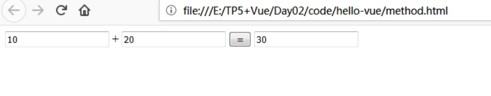

### 1.3.1.创建method.html

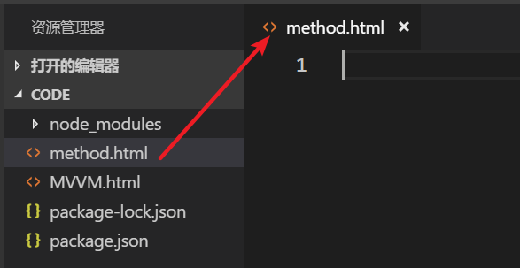

### 1.3.2.完成vue3步曲

```vue
<!DOCTYPE html>
<html lang="en">
<head>
  <meta charset="UTF-8">
  <meta name="viewport" content="width=device-width, initial-scale=1.0">
  <meta http-equiv="X-UA-Compatible" content="ie=edge">
  <title>Document</title>
  <!-- 1. 引入vue.js -->
  <script src="./node_modules/vue/dist/vue.js"></script>
</head>
<body>
  <!-- 2. 编写div元素 -->
  <div id="app">

  </div>
  <!-- 3. vue实例 -->
  <script>
    const vm = new Vue({
      el: '#app', // 元素
      data: {}, // 属性
      methods: {} // 方法
    })
  </script>
</body>
</html>
```

- 引入vue.js
- 编写div元素
- 创建vue实例

### 1.3.3.编写视图

分析页面: 由两个input框和一个按钮, 再加一个input框组成

```vue
<div id="app">
    <input type="text">+<input type="text">
    <button>=</button>
    <input type="text">
</div>
```

### 1.3.4.绑定数据

html部分

```vue
<div id="app">
    <input v-model="first" type="text">+<input v-model="second" type="text">
    <button>=</button>
    <input v-model="result" type="text">
</div>
```

使用v-model绑定属性

js部分

```js
const vm = new Vue({
    el: '#app', // 元素
    data: {
        first: 0,
        second: 0,
        result: 0
    }, // 属性
    methods: {} // 方法
})
```

### 1.3.5.绑定方法

html部分

```html
<button @click="add">=</button>
```

使用@click绑定方法

```js
 methods: {
     add() {
         this.result = parseInt(this.first) + parseInt(this.second)
     }
 } // 方法
```

add() 是ES6中的新写法, 也是后面常用的写法

### 小结

data保存数据

methods改变数据

## 1.4 组件的概念

组件可以理解成项目的”零件”. **一个项目就是由若干个组件组成的**!

举例: 一个房子是一个Vue应用, 那么客厅/卧室/厨房/卫生间就是组件

 一个电脑是一个Vue应用, 那么硬盘/内存/主板/显示器/键盘就是组件

组件分为

- 全局组件
- 局部组件

## 1.5 全局组件

### 1.1.1.创建component.html

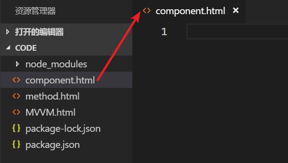

### 1.1.2.完成vue3步曲

```vue
<!DOCTYPE html>
<html lang="en">
<head>
  <meta charset="UTF-8">
  <meta name="viewport" content="width=device-width, initial-scale=1.0">
  <meta http-equiv="X-UA-Compatible" content="ie=edge">
  <title>Document</title>
  <!-- 1. 引入vue.js -->
  <script src="./node_modules/vue/dist/vue.js"></script>
</head>
<body>
  <!-- 2. 编写div元素 -->
  <div id="app">

  </div>
  <!-- 3. 实例化vue对象 -->
  <script>
    const vm = new Vue({
      el: '#app', // 元素
      data: {}, // 属性
      methods: {}, //方法
    })
  </script>
</body>
</html>
```

### 1.1.3.定义组件

```js
// 语法---Vue.component('组件名', {组件参数})
Vue.component('com1', {
    template: '<button @click="count++">你点了我{{count}}次</button>',
    data() {
        return {
            count: 0
        }
    }
})
```

- 组件没有el参数, 原因是组件不会和具体的页面元素绑定
- 组件必须有template参数, 原因是组件需要渲染页面, template就是需要渲染的html
- 组件也是一个Vue的实例, 所以在组件中也有data/methods等
- data必须是一个函数, 并返回一个对象

### 1.1.4.引用组件

在html中, 通过组件名引用组件

```html
<!-- 2. 编写div元素 -->
<div id="app">
    <!-- 引用组件 -->
    <com1></com1>
    <com1></com1>
    <com1></com1>
</div>
```

### 1.1.5.测试

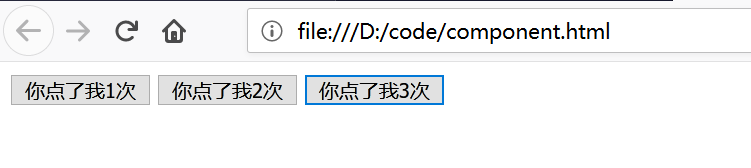

你会发现每个组件互不干扰，都有自己的count值。怎么实现的？

> **组件中的data属性必须是函数**！

当我们定义这个 `<counter>` 组件时，它的data 并不是像这样直接提供一个对象：

```js
data: {
  count: 0
}

```

取而代之的是，一个组件的 data 选项必须是一个函数，因此每个实例可以维护一份被返回对象的独立的拷贝：

```js
data: function () {
  return {
    count: 0
  }
}
```

如果 Vue 没有这条规则，点击一个按钮就会影响到其它所有实例！

### 小结

定义组件

引用组件

## 1.6.局部组件

一般在单页面应用(SPA)中使用较多的是局部组件, 局部组件属于某一个Vue实例, 通过comopnents添加(挂载)

通常将组件参数单独定义, 方便工程化时管理

通常将组件模板单独定义, 方便工程化时管理

### 1.6.1.创建component1.html

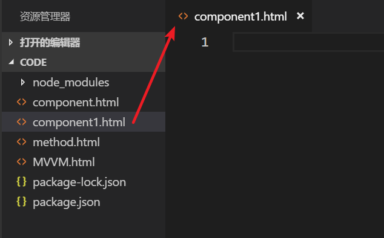

### 1.6.2.完成vue3步曲

```vue
<!DOCTYPE html>
<html lang="en">
<head>
  <meta charset="UTF-8">
  <meta name="viewport" content="width=device-width, initial-scale=1.0">
  <meta http-equiv="X-UA-Compatible" content="ie=edge">
  <title>Document</title>
  <!-- 1. 引入vue.js -->
  <script src="./node_modules/vue/dist/vue.js"></script>
</head>
<body>
  <!-- 2. 编写div元素 -->
  <div id="app">

  </div>
  <!-- 3. 实例化vue对象 -->
  <script>
    const vm = new Vue({
      el: '#app', // 元素
      data: {}, // 属性
      methods: {}, //方法
    })
  </script>
</body>
</html>
```

### 1.6.3.定义组件

```js
// 定义组件参数
const com1 = {
    template: '#tmp', // 定义组件模板
    data() { // 定义属性
        return {
            count: 0
        }
    }
}
```

- `#tmp`标识要渲染的模板内容

对应的模板内容

```html
<template id="tmp">
    <button @click="count++">
        你点了我{{count}}次
    </button>
</template>
```

这样写的好处:

1. 便于工程化管理, 单独出来形成独立的文件
2. 有格式化提示

### 1.6.4.挂载组件

```js
const vm = new Vue({
    el: '#app', // 元素
    data: {}, // 属性
    methods: {}, //方法
    components: {
        //组件名: 组件参数
        son: com1
    }
})
```

在vue对象中使用components属性添加局部组件

### 1.6.5.引用组件

```html
<!-- 2. 编写div元素 -->
<div id="app">
    <!-- 引用组件 -->
    <son></son>
</div>
```

### 小结

定义组件参数

挂载组件

引用组件

## 1.7 组件通信

通常一个单页应用(SPA)会以一棵嵌套的组件树的形式来组织

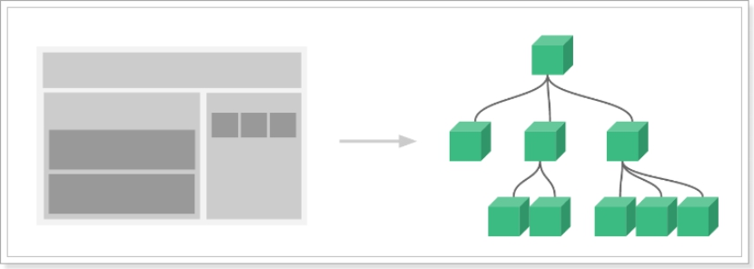 

\-   页面首先分成了顶部导航、左侧内容区、右侧边栏三部分

\-   左侧内容区又分为上下两个组件

\-   右侧边栏中又包含了3个子组件

各个组件之间以嵌套的关系组合在一起，那么这个时候不可避免的会有组件间通信的需求

主要分为两种情况:

- 父向子传递数据
- 子向父传递数据

## 1.8 父组件向子组件传递数据

父组件向子组件传递数据, 通过props

基本语法

在子组件中通过props接受父组件传递的数据

### 1.8.1.创建father2son.html

### 1.8.2.完成Vue3步曲

```vue
<!DOCTYPE html>
<html lang="en">
<head>
  <meta charset="UTF-8">
  <meta name="viewport" content="width=device-width, initial-scale=1.0">
  <meta http-equiv="X-UA-Compatible" content="ie=edge">
  <title>Document</title>
  <!-- 1. 引入vue.js -->
  <script src="./node_modules/vue/dist/vue.js"></script>
</head>
<body>
  <!-- 2. 编写div元素 -->
  <div id="app">

  </div>
  <!-- 3. 实例化vue对象 -->
  <script>
    const vm = new Vue({
      el: '#app', // 元素
      data: {}, // 属性
      methods: {}, //方法
    })
  </script>
</body>
</html>
```

### 1.8.3.创建一个局部组件

在vue对象中, 使用components定义一个局部组件

```js
components: {
    // 组件名: {组件参数}
    son: {
        template: '<h3></h3>',
    }
}
```

### 1.8.4.引用组件

在html中通过组件名, 以标签的方式引用组件

```html
<div id="app">
    <son></son>
</div>
```


### 1.8.5.传递数据

父组件向子组件传递数据的步骤　

1. 修改html, 在组件标签中添加一个属性f2s

   ```html
   <div id="app">
       <!-- 1. 在son标签中, 添加一个属性 -->
       <son f2s='父组件给子组件的数据'></son>
   </div>
   ```

2. 修改js, 在子组件中使用props接收

   ```js
   components: {
       son: {
           template: '<h3></h3>',
           props: ['f2s']
       }
   }
   ```

3. 在子组件的模板中使用

   ```js
   components: {
       son: {
           template: '<h3>{{ f2s }}</h3>',
               props: ['f2s']
       }
   }
   ```

### 1.8.6.使用数据绑定

也可以和父组件中的一个数据绑定起来使用

```html
<div id="app">
    <!-- 1. 在son标签中, 添加一个属性 -->
    <son :f2s="msg"></son>
</div>
```

### 小结

1. 在标签中添加属性
2. 在子组件中使用props接收, 然后使用

## 1.9 子组件向父组件传递数据

方式: 子组件内部调用父组件中的方法，同时把数据传递给父组件使用

### 1.9.1.创建son2father.html文件

### 1.9.2.完成vue3步曲

```vue
<!DOCTYPE html>
<html lang="en">
<head>
  <meta charset="UTF-8">
  <meta name="viewport" content="width=device-width, initial-scale=1.0">
  <meta http-equiv="X-UA-Compatible" content="ie=edge">
  <title>Document</title>
  <!-- 1. 引入vue.js -->
  <script src="./node_modules/vue/dist/vue.js"></script>
</head>
<body>
  <!-- 2. 编写div元素 -->
  <div id="app">

  </div>
  <!-- 3. 实例化vue对象 -->
  <script>
    const vm = new Vue({
      el: '#app', // 元素
      data: {}, // 属性
      methods: {}, //方法
    })
  </script>
</body>
</html>
```

### 1.9.3.创建并引用子组件

### 1.9.4.在父组件中绑定一个方法

1. 修改js代码, 在父组件中定义一个方法getMsg

   ```js
   methods: {
       getMsg(msg){
           alert('收到子组件的数据'+msg)
       }
   },
   ```

2. 修改html代码, 在子组件标签中, 使用事件绑定

   ```html
   <div id="app">
       <!-- 2. 引用组件 -->
       <son @fun="getMsg"></son>
   </div>
   ```

3. 修改js代码, 在子组件中, 使用this.$emit(‘事件名’, 参数)调用父组件的方法

   ```js
   components: {
       //1. 定义组件
       son: {
           template: '<button @click="send">点我</button>',
               methods: {
                   send(){
                       this.$emit('fun', "子组件->父组件")
                   }
               }
       }
   }
   ```

   子组件就是一个按钮, 当点击按钮时, 触发按钮的点击事件, 调用子组件的send方法

   在send方法中通过this.$emit()调用父组件的方法, 并将数据做为参数传递过去


